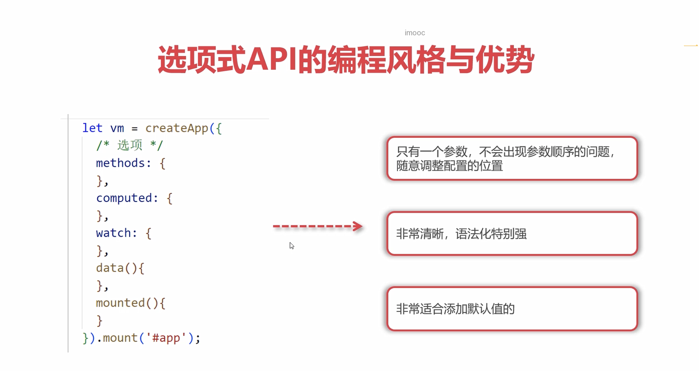

# 核心思想

## MVC

- Model：数据模型，一般用来存储数据，操作数据
- View：视图，一般用来展示数据
- Controller：控制器，一般用来处理数据，操作数据

## MVVM

- Model：数据模型，一般用来存储数据，操作数据
- View：视图，一般用来展示数据
- ViewModel：视图模型，用来连接Model和View，一般用来处理数据，操作数据

## 选项式 API

## 声明式渲染及响应式数据实现原理 

## 指令系统、事件方法及数据传参