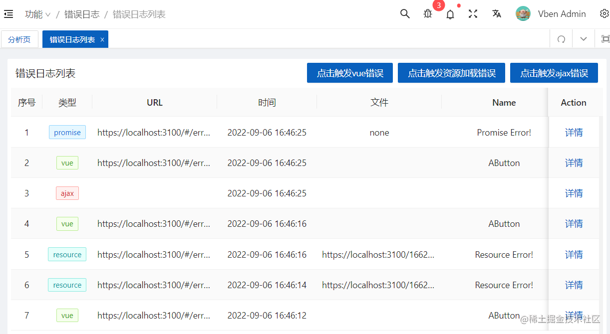
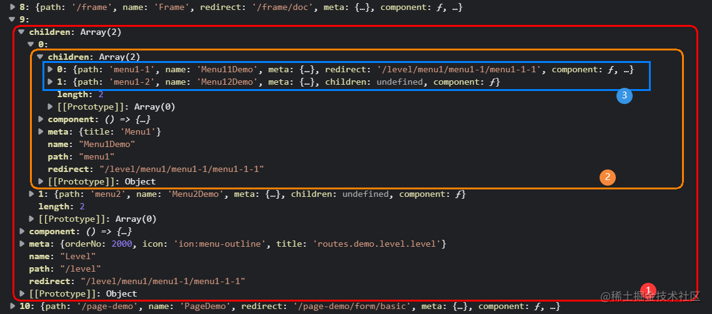
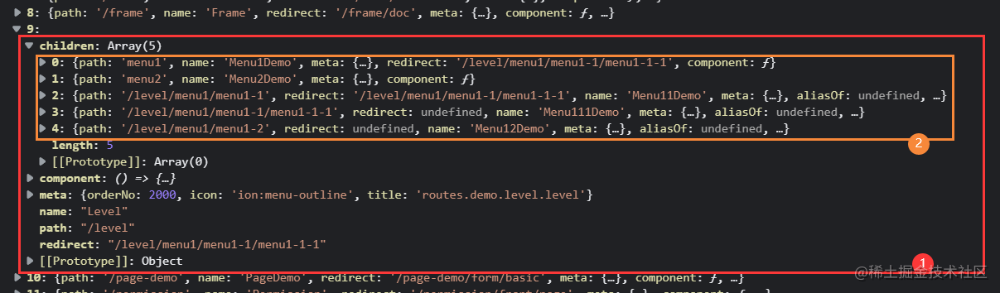

# 角色权限：permission.ts

官方文档：<https://doc.vvbin.cn/guide/auth.html>

## 主体分析

文件 src\store\modules\permission.ts 声明导出一个 store 实例 usePermissionStore 、一个方法 usePermissionStoreWithOut()用于没有使用 setup 组件时使用。

```ts
// 角色权限信息存储
export const usePermissionStore = defineStore({
  id: 'app-permission',
  state: { /*...*/ },
  getters: { /*...*/ }
  actions：{ /*...*/ }
});

export function usePermissionStoreWithOut() {
  return usePermissionStoreWithOut(store);
}

```

### state

```ts
// 权限状态
interface PermissionState {
  permCodeList: string[] | number[]; // 权限代码列表
  isDynamicAddedRoute: boolean; // 是否动态添加路由
  lastBuildMenuTime: number; // 菜单最后更新时间
  backMenuList: Menu[]; // 后端角色权限菜单列表
  frontMenuList: Menu[]; // 前端角色权限菜单列表
}

// 状态定义及初始化
state: (): PermissionState => ({
  permCodeList: [],
  isDynamicAddedRoute: false,
  lastBuildMenuTime: 0,
  backMenuList: [],
  frontMenuList: [],
}),
```

### getters

```ts
getters: {
  getPermCodeList(): string[] | number[] {
    return this.permCodeList; // 获取权限代码列表
  },
  getBackMenuList(): Menu[] {
    return this.backMenuList; // 获取后端角色权限菜单列表
  },
  getFrontMenuList(): Menu[] {
    return this.frontMenuList; // 获取前端角色权限菜单列表
  },
  getLastBuildMenuTime(): number {
    return this.lastBuildMenuTime; // 获取菜单最后更新时间
  },
  getIsDynamicAddedRoute(): boolean {
    return this.isDynamicAddedRoute; // 获取是否动态添加路由
  },
},
```

### actions

```ts
// 更新属性 permCodeList
setPermCodeList(codeList: string[]) {
  this.permCodeList = codeList;
},
// 更新属性 backMenuList
setBackMenuList(list: Menu[]) {
  this.backMenuList = list;
  list?.length > 0 && this.setLastBuildMenuTime(); // 记录菜单最后更新时间
},
// 更新属性 frontMenuList
setFrontMenuList(list: Menu[]) {
  this.frontMenuList = list;
},
// 更新属性 lastBuildMenuTime
setLastBuildMenuTime() {
  this.lastBuildMenuTime = new Date().getTime(); // 一个代表时间毫秒数的数值
},
// 更新属性 isDynamicAddedRoute
setDynamicAddedRoute(added: boolean) {
  this.isDynamicAddedRoute = added;
},
// 重置状态属性
resetState(): void {
  this.isDynamicAddedRoute = false;
  this.permCodeList = [];
  this.backMenuList = [];
  this.lastBuildMenuTime = 0;
},

```

### changePermissionCode

方法 changePermissionCode 模拟从后台获得用户权限码,常用于后端权限模式下获取用户权限码。项目中使用了本地 Mock 服务模拟。

```ts
async changePermissionCode() {
  const codeList = await getPermCode();
  this.setPermCodeList(codeList);
},

// src\api\sys\user.ts
enum Api {
  GetPermCode = '/getPermCode',
}
export function getPermCode() {
  return defHttp.get<string[]>({ url: Api.GetPermCode });
}

```

使用到的 mock 接口和模拟数据。

```ts
// mock\sys\user.ts
{
  url: '/basic-api/getPermCode',
  timeout: 200,
  method: 'get',
  response: (request: requestParams) => {
    const token = getRequestToken(request);
    if (!token) return resultError('Invalid token');
    const checkUser = createFakeUserList().find((item) => item.token === token);
    if (!checkUser) {
      return resultError('Invalid token!');
    }
    const codeList = fakeCodeList[checkUser.userId];

    return resultSuccess(codeList);
  },
},

const fakeCodeList: any = {
  '1': ['1000', '3000', '5000'],
  '2': ['2000', '4000', '6000'],
};
```

## 动态路由&权限过滤

方法 buildRoutesAction 用于动态路由及用户权限过滤，代码逻辑结构如下：

```TypeScript
async buildRoutesAction(): Promise<AppRouteRecordRaw[]> {
  const { t } = useI18n(); // 国际化
  const userStore = useUserStore(); // 用户信息存储
  const appStore = useAppStoreWithOut(); // 项目配置信息存储

  let routes: AppRouteRecordRaw[] = [];
  // 用户角色列表
  const roleList = toRaw(userStore.getRoleList) || [];
  // 获取权限模式
  const { permissionMode = projectSetting.permissionMode } = appStore.getProjectConfig;

  // 基于角色过滤方法
  const routeFilter = (route: AppRouteRecordRaw) => { /*...*/ };
  // 基于 ignoreRoute 属性过滤
  const routeRemoveIgnoreFilter = (route: AppRouteRecordRaw) => { /*...*/ };


  // 不同权限模式处理逻辑
  switch (permissionMode) {
    // 前端方式控制(菜单和路由分开配置)
    case PermissionModeEnum.ROLE: /*...*/
    // 前端方式控制(菜单由路由配置自动生成)
    case PermissionModeEnum.ROUTE_MAPPING: /*...*/
    // 后台方式控制
    case PermissionModeEnum.BACK: /*...*/
  }

  routes.push(ERROR_LOG_ROUTE); // 添加`错误日志列表`页面路由

  // 根据设置的首页path，修正routes中的affix标记（固定首页）
  const patchHomeAffix = (routes: AppRouteRecordRaw[]) => { /*...*/ };
  patchHomeAffix(routes);

  return routes; // 返回路由列表
},

```

页面“错误日志列表”路由地址/error-log/list，功能如下：



### 权限模式

框架提供了完善的前后端权限管理方案，集成了三种权限处理方式：

- ROLE 通过用户角色来过滤菜单(前端方式控制)，菜单和路由分开配置。
- ROUTE_MAPPING 通过用户角色来过滤菜单(前端方式控制)，菜单由路由配置自动生成。
- BACK 通过后台来动态生成路由表(后端方式控制)。

```ts
// src\settings\projectSetting.ts
// 项目配置
const setting: ProjectConfig = {
  permissionMode: PermissionModeEnum.ROUTE_MAPPING, // 权限模式  默认前端模式
  permissionCacheType: CacheTypeEnum.LOCAL, // 权限缓存存放位置 默认存放于localStorage
  // ...
};

// src\enums\appEnum.ts
// 权限模式枚举
export enum PermissionModeEnum {
  ROLE = "ROLE", // 前端模式（菜单路由分开）
  ROUTE_MAPPING = "ROUTE_MAPPING", // 前端模式（菜单由路由生成）
  BACK = "BACK", // 后端模式
}
```

前端权限模式提供了 ROLE 和 ROUTE_MAPPING 两种处理逻辑。

在前端会固定写死路由的权限，指定路由有哪些权限可以查看。系统定义路由记录时指定可以访问的角色 RoleEnum.SUPER。

```ts
// src\router\routes\modules\demo\permission.ts
{
  path: 'auth-pageA',
  name: 'FrontAuthPageA',
  component: () => import('/@/views/demo/permission/front/AuthPageA.vue'),
  meta: {
    title: t('routes.demo.permission.frontTestA'),
    roles: [RoleEnum.SUPER],
  },
},

```

系统使用 meta 属性在路由记录上附加自定义数据，它可以在路由地址和导航守卫上都被访问到。本方法中使用到的配置属性如下：

```ts
export interface RouteMeta {
  // 可以访问的角色，只在权限模式为Role的时候有效
  roles?: RoleEnum[];
  // 是否固定标签
  affix?: boolean;
  // 菜单排序，只对第一级有效
  orderNo?: number;
  // 忽略路由。用于在ROUTE_MAPPING以及BACK权限模式下，生成对应的菜单而忽略路由。
  ignoreRoute?: boolean;
  // ...
}
```

### 前端：ROLE

初始化通用的路由表 asyncRoutes，获取用户角色后，通过角色去遍历路由表，获取该角色可以访问的路由表，然后对其格式化处理，将多级路由转换为二级路由，最终返回路由表。

```ts
// 前端方式控制(菜单和路由分开配置)
import { asyncRoutes } from '/@/router/routes';

// ...

case PermissionModeEnum.ROLE:
  // 根据角色过滤路由
  routes = filter(asyncRoutes, routeFilter);
  routes = routes.filter(routeFilter);
  // 将多级路由转换为二级路由
  routes = flatMultiLevelRoutes(routes);
  break;

// src\router\routes\index.ts
export const asyncRoutes = [PAGE_NOT_FOUND_ROUTE, ...routeModuleList];

```

在路由钩子内动态判断，调用方法返回生成的路由表，再通过 router.addRoutes 添加到路由实例，实现权限的过滤。

```ts
// src/router/guard/permissionGuard.ts
const routes = await permissionStore.buildRoutesAction();
routes.forEach((route) => {
  router.addRoute(route as unknown as RouteRecordRaw);
});
// ....
```

过滤方法 routeFilter 通过角色去遍历路由表，获取该角色可以访问的路由表。

```ts
const userStore = useUserStore(); // 用户信息存储
const roleList = toRaw(userStore.getRoleList) || []; // 用户角色列表

const routeFilter = (route: AppRouteRecordRaw) => {
  const { meta } = route;
  const { roles } = meta || {};
  if (!roles) return true;
  return roleList.some((role) => roles.includes(role));
};
```

方法 flatMultiLevelRoutes 将多级路由转换为二级路由，下图是未处理前路由表信息:



下图是格式化后的二级路由表信息:



### 前端：ROUTE_MAPPING

ROUTE_MAPPING 跟 ROLE 逻辑一样，不同之处会根据路由自动生成菜单。

```ts
// 前端方式控制(菜单由路由配置自动生成)
case PermissionModeEnum.ROUTE_MAPPING:
  // 根据角色过滤路由
  routes = filter(asyncRoutes, routeFilter);
  routes = routes.filter(routeFilter);
  // 通过转换路由生成菜单
  const menuList = transformRouteToMenu(routes, true);
  // 移除属性 meta.ignoreRoute 路由
  routes = filter(routes, routeRemoveIgnoreFilter);
  routes = routes.filter(routeRemoveIgnoreFilter);
  menuList.sort((a, b) => {
    return (a.meta?.orderNo || 0) - (b.meta?.orderNo || 0);
  });

  // 通过转换路由生成菜单
  this.setFrontMenuList(menuList);
  // 将多级路由转换为二级路由
  routes = flatMultiLevelRoutes(routes);
  break;
```

调用方法 transformRouteToMenu 将路由转换成菜单，调用过滤方法 routeRemoveIgnoreFilter 忽略设置 ignoreRoute 属性的路由菜单。

```ts
const routeRemoveIgnoreFilter = (route: AppRouteRecordRaw) => {
  const { meta } = route;
  const { ignoreRoute } = meta || {};
  return !ignoreRoute;
};
```

系统示例，路由下不同的路径参数生成一个菜单。

```ts
// src\router\routes\modules\demo\feat.ts
{
  path: 'testTab/:id',
  name: 'TestTab',
  component: () => import('/@/views/demo/feat/tab-params/index.vue'),
  meta: {
    hidePathForChildren: true,
  },
  children: [
    {
      path: 'testTab/id1',
      name: 'TestTab1',
      component: () => import('/@/views/demo/feat/tab-params/index.vue'),
      meta: {
        ignoreRoute: true,
      },
    },
    {
      path: 'testTab/id2',
      name: 'TestTab2',
      component: () => import('/@/views/demo/feat/tab-params/index.vue'),
      meta: {
        ignoreRoute: true,
      },
    },
  ],
},

```

### 后端：BACK

跟 ROUTE_MAPPING 逻辑处理相似，只不过路由表数据来源是调用接口从后台获取。

```ts
// 后台方式控制
case PermissionModeEnum.BACK:
  let routeList: AppRouteRecordRaw[] = []; // 获取后台返回的菜单配置
  this.changePermissionCode();  // 模拟从后台获取权限码
  routeList = (await getMenuList()) as AppRouteRecordRaw[]; // 模拟从后台获取菜单信息
  // 基于路由动态地引入相关组件
  routeList = transformObjToRoute(routeList);
  // 通过路由列表转换成菜单
  const backMenuList = transformRouteToMenu(routeList);
  // 设置菜单列表
  this.setBackMenuList(backMenuList);

  // 移除属性 meta.ignoreRoute 路由
  routeList = filter(routeList, routeRemoveIgnoreFilter);
  routeList = routeList.filter(routeRemoveIgnoreFilter);

  // 将多级路由转换为二级路由
  routeList = flatMultiLevelRoutes(routeList);
  routes = [PAGE_NOT_FOUND_ROUTE, ...routeList];
  break;

```
