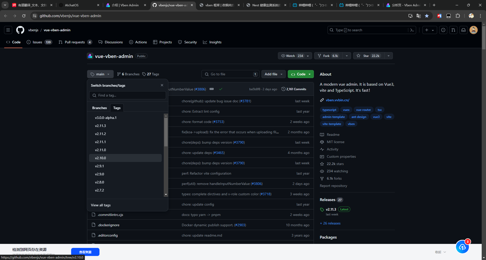
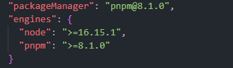
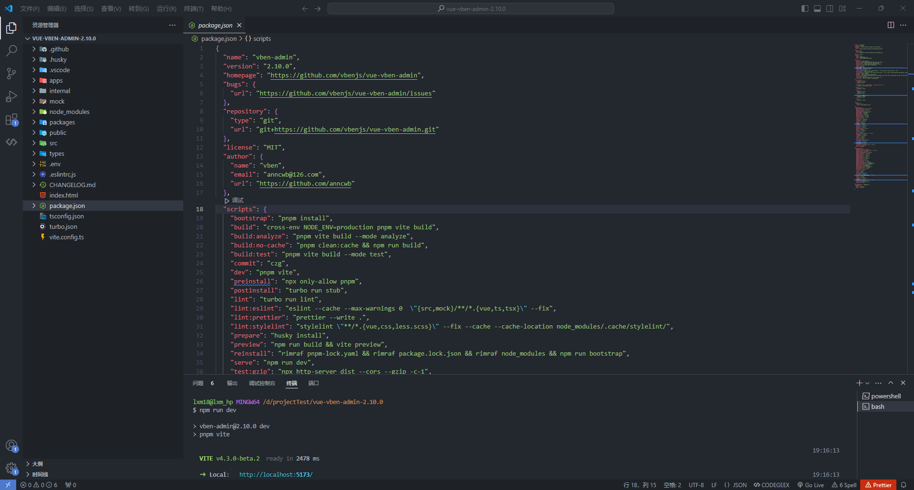
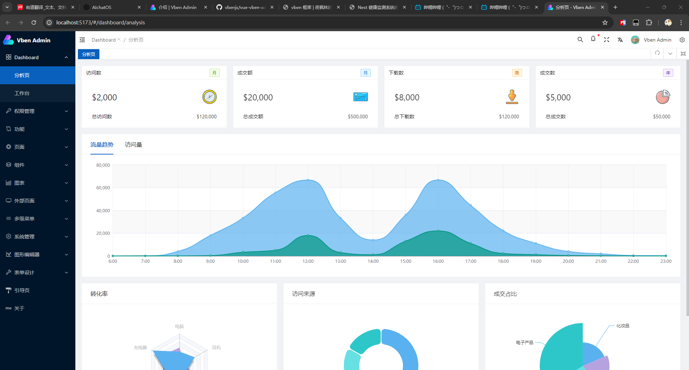
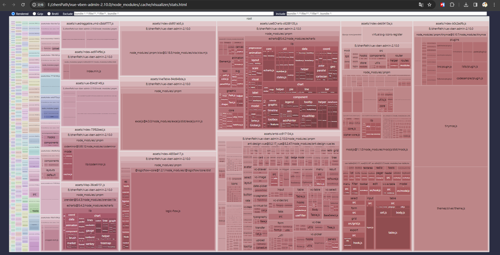
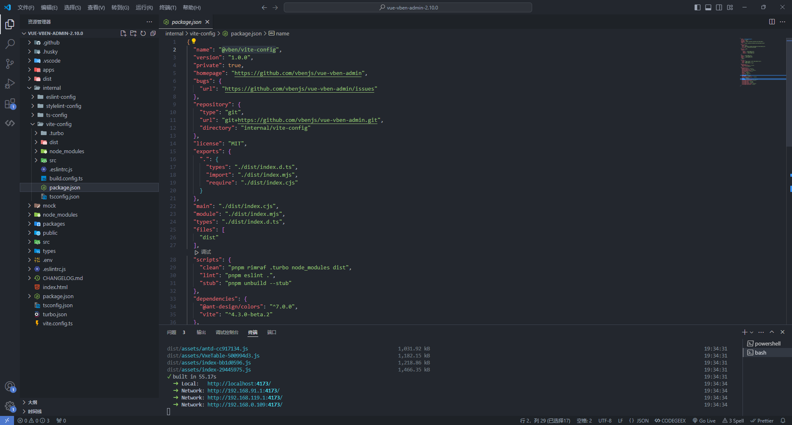
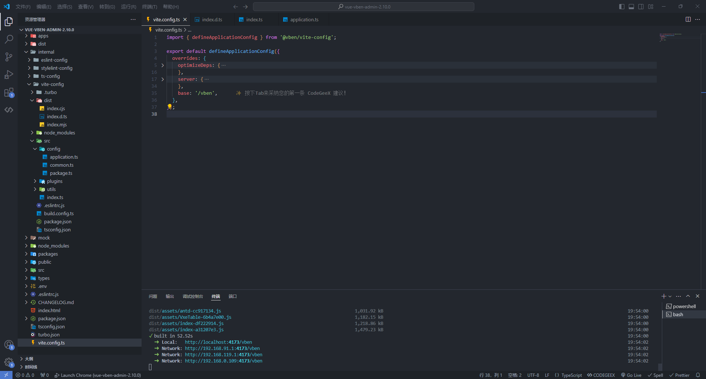
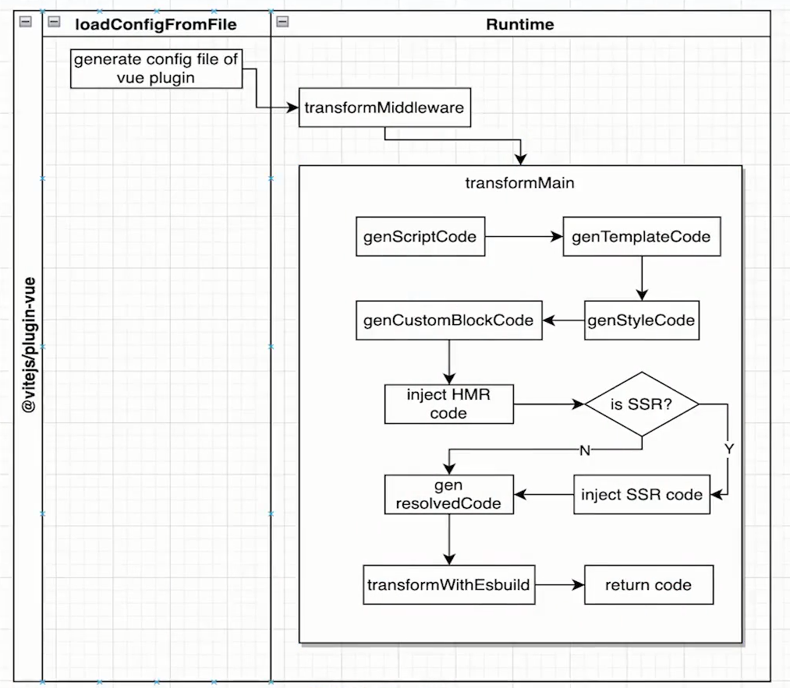

# vben 框架


文档：<https://doc.vvbin.cn/guide/introduction.html>

预览：<https://vben.vvbin.cn/#/dashboard/analysis>

Vue-Vben-Admin 是一个基于 Vue3.0、Vite、 Ant-Design-Vue、TypeScript 的后台解决方案，目标是为开发中大型项目提供开箱即用的解决方案。包括二次封装组件、utils、hooks、动态菜单、权限校验、按钮级别权限控制等功能。项目会使用前端较新的技术栈，可以作为项目的启动模版，以帮助你快速搭建企业级中后台产品原型。也可以作为一个示例，用于学习 vue3、vite、ts 等主流技术。该项目会持续跟进最新技术，并将其应用在项目中。

## 快速开始

### 下载安装

(1) 下载地址：<https://github.com/vbenjs/vue-vben-admin>




(2) 运行项目

版本要求



```bash
pnpm i

npm run dev
```


打开网页



## 运行模式

### vite
```bash
"dev": "pnpm vite"
"serve": "npm run dev"
```
指令

```bash
npm run dev
npm run server
```

特点：打包快，访问满

### preview

本地加载
```bash
"preview": "npm run build && vite preview"
```
```bash
npm run preview
```

特点：打包慢，访问超快

### build
```bash
"build": "cross-env NODE_ENV=production pnpm vite build",
"build:analyze": "pnpm vite build --mode analyze",
```
```bash
npm run build
npm run build:analyze
```

analyze：打包分析



地址: E:\zhenPath\vue-vben-admin-2.10.0\node_modules\.cache\visualizer\stats.html

## 项目发布

npm run build 会将项目直接打包到根目录，不推荐这种做法

vben 的vite项目配置是自己封装的（vite.config.ts）
```ts
import { defineApplicationConfig } from '@vben/vite-config';
```

vite 配置
```bash
// package.json
"@vben/vite-config": "workspace:*",
```
workspace 意义：本地



```ts
export * from './config/application';
export * from './config/package';
```

修改配置（访问路径）



## es module 特性

vite 设置 type 属性支持 es module 特性

```js
<script type="module" src="/src/main.ts"></script>
```

## vue 插件原理



```
1. 读取配置文件阶段：vue plugin
2. 运行时：编译
```

```js
"@vitejs/plugin-vue": "^4.1.0",
```

D:\project\zhenpath\vue-vben-admin\node_modules\@vitejs\plugin-vue\dist\index.cjs