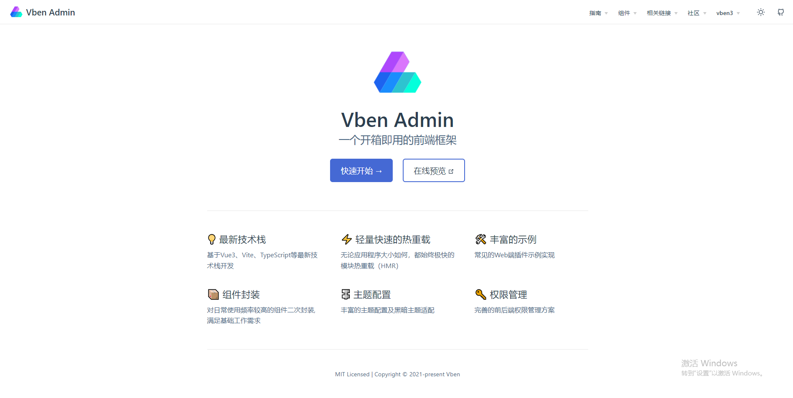

# vben 框架

文档：<https://doc.vvbin.cn/guide/introduction.html>

预览：<https://vben.vvbin.cn/#/dashboard/analysis>

Vue-Vben-Admin 是一个基于 Vue3.0、Vite、 Ant-Design-Vue、TypeScript 的后台解决方案，目标是为开发中大型项目提供开箱即用的解决方案。包括二次封装组件、utils、hooks、动态菜单、权限校验、按钮级别权限控制等功能。项目会使用前端较新的技术栈，可以作为项目的启动模版，以帮助你快速搭建企业级中后台产品原型。也可以作为一个示例，用于学习 vue3、vite、ts 等主流技术。该项目会持续跟进最新技术，并将其应用在项目中。
