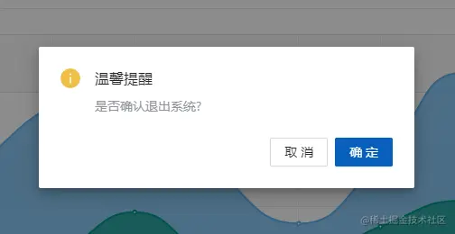

# 状态管理

## 主体分析

项目状态管理代码实现在 src/store/ 目录下, 使用新一代的状态管理器 Pinia。

src\store\index.ts 文件中声明 setupStore 方法，用于将创建一个 pinia 根存储并注册到应用程序中。

```ts
import type { App } from "vue";
import { createPinia } from "pinia";
// 创建一个 pinia（根存储）
const store = createPinia();
// 注册到应用程序
export function setupStore(app: App<Element>) {
  app.use(store);
}

// 单独将pinia 实例导出
export { store };
```

在 src/store/modules 目录下，各个文件中定义不同的 store 实例，主要用于项目配置、错误日志、国际化、锁屏、多标签、菜单路由权限、用户状态等状态管理。

```sh
├── store # 数据仓库
│   ├── index.ts
│   ├── modules
│   │   ├── app.ts #  项目配置
│   │   ├── errorLog.ts # 错误日志
│   │   ├── locale.ts # 国际化/多语言
│   │   ├── lock.ts # 系统锁屏
│   │   ├── multipleTab.ts # 多标签
│   │   ├── permission.ts # 权限/菜单/路由
│   │   └── user.ts # 用户状态
```

## 项目配置：app.ts

::: info 主要内容

- data
- getter
- action
- 其它
  :::

文件 src\store\modules\app.ts 声明导出一个 store 实例 useAppStore 、一个方法 useAppStoreWithOut()用于没有使用 setup 组件时使用。

```ts
// 项目配置存储实例
export const useAppStore = defineStore({
  id: 'app',  // 也称为 name，是必要的，Pinia 使用它来将 store 连接到 devtools。
  state: {},
  getters: {}
  actions：{}
});

export function useAppStoreWithOut() {
  return useAppStore(store);
}

```

(一) data

状态对象定义了主题模式、页面加载状态、项目配置、菜单状态快照等。

```ts
state: (): AppState => ({
  darkMode: undefined, // 主题模式  dark|light
  pageLoading: false, //  页面加载状态
  projectConfig: Persistent.getLocal(PROJ_CFG_KEY), // 项目配置 ProjectConfig
  beforeMiniInfo: {}, // BeforeMiniState
}),

```

- projectConfig 属性用于配置项目内展示的内容、布局、文本等效果，具体配置文件路径 src/settings/projectSetting.ts， 属性定义由于篇幅原因请直接查看官网的 项目配置说明 。
- projectConfig 的初始化值从缓存中获取，而不是从文件中引入，这个后面会有单独篇幅进行讲解。
- beforeMiniInfo 属性用于当窗口缩小时记住菜单状态，并在恢复窗口时恢复这些状态（是否折叠、是否分割、类型、模式）。

```ts
export interface BeforeMiniState {
  menuCollapsed?: boolean; // 菜单折叠
  menuSplit?: boolean; // 分割菜单
  menuMode?: MenuModeEnum; // 菜单类型
  menuType?: MenuTypeEnum; // 菜单模式
}
```

(二) Getter

Getter 等同于 Store 状态的计算值(计算属性)。

```ts
getters: {
  // 页面加载状态
  getPageLoading(): boolean {
    return this.pageLoading;
  },
  // 主题模式
  getDarkMode(): 'light' | 'dark' | string {
    return this.darkMode || localStorage.getItem(APP_DARK_MODE_KEY_) || darkMode;
  },
  // 菜单状态快照
  getBeforeMiniInfo(): BeforeMiniState {
    return this.beforeMiniInfo;
  },
  // 项目配置
  getProjectConfig(): ProjectConfig {
    return this.projectConfig || ({} as ProjectConfig);
  },
  // 头部配置
  getHeaderSetting(): HeaderSetting {
    return this.getProjectConfig.headerSetting;
  },
  // 菜单配置
  getMenuSetting(): MenuSetting {
    return this.getProjectConfig.menuSetting;
  },
  // 动画配置
  getTransitionSetting(): TransitionSetting {
    return this.getProjectConfig.transitionSetting;
  },
  // 多标签配置
  getMultiTabsSetting(): MultiTabsSetting {}
    return this.getProjectConfig.multiTabsSetting;
  },
},

```

其中 getDarkMode() 根据 state.darkMode、localStorage 存储和 配置文件的定义值 darkMode 进行计算。

```ts
// src\settings\designSetting.ts
export const darkMode = ThemeEnum.LIGHT;
```

(三) Actions

Actions 相当于组件中的 methods，主要用于设置 state 对象。

```ts
actions: {
  // 设置页面加载状态
  setPageLoading(loading: boolean): void {
    this.pageLoading = loading;
  },
  // 设置主题模式 存于`localStorage`中
  setDarkMode(mode: ThemeEnum): void {
    this.darkMode = mode;
    localStorage.setItem(APP_DARK_MODE_KEY_, mode);
  },
  // 设置页面加载状态
  setBeforeMiniInfo(state: BeforeMiniState): void {
    this.beforeMiniInfo = state;
  },
  // 设置项目配置 项目自带的缓存类进行缓存操作
  setProjectConfig(config: DeepPartial<ProjectConfig>): void {
    this.projectConfig = deepMerge(this.projectConfig || {}, config);
    Persistent.setLocal(PROJ_CFG_KEY, this.projectConfig);
  },
  // 重置路由
  async resetAllState() {
    resetRouter();
    Persistent.clearAll(); // 清空缓存
  },
  // 使用定时器设置页面加载状态
  async setPageLoadingAction(loading: boolean): Promise<void> {
    if (loading) {
      clearTimeout(timeId);
      // Prevent flicker  防止闪烁
      timeId = setTimeout(() => {
        this.setPageLoading(loading);
      }, 50);
    } else {
      this.setPageLoading(loading);
      clearTimeout(timeId);
    }
  },
},

```

（四） 其它

在缓存、localStorage 操作中使用了存储 KEY，它定义在 src\enums\cacheEnum.ts 文件中。

```ts
import { APP_DARK_MODE_KEY_, PROJ_CFG_KEY } from "/@/enums/cacheEnum";

// src\enums\cacheEnum.ts
export const APP_DARK_MODE_KEY_ = "__APP__DARK__MODE__";
export const APP_LOCAL_CACHE_KEY = "COMMON__LOCAL__KEY__";
```

## 错误日志：rrorLog.ts

文件 src\store\modules\errorLog.ts 声明导出一个 store 实例 useErrorLogStore 、一个方法 useErrorLogStoreWithOut()用于没有使用 setup 组件时使用。

```ts
// 错误日志存储实例
export const useAppStore = defineStore({
  id: 'app-error-log',
  state: {},
  getters: {}
  actions：{}
});

export function useErrorLogStoreWithOut() {
  return useErrorLogStore(store);
}
```

（一）State / Getter

状态对象定义了错误日志信息数组、错误日志信息总数。

```ts
state: (): ErrorLogState => ({
  errorLogInfoList: null, // Nullable<ErrorLogInfo[]>
  errorLogListCount: 0,
}),
getters: {
  // 获取错误日志  默认空数组
  getErrorLogInfoList(): ErrorLogInfo[] {
    return this.errorLogInfoList || [];
  },
  // 获取错误日志总数量
  getErrorLogListCount(): number {
    return this.errorLogListCount;
  },
},
```

errorLogInfoList 是一个名为 ErrorLogInfo 对象数组，记录了错误详细信息，包含错误类型、错误产生错文件信息、错误名称、错误信息、调用堆栈信息、错误详情、页面 url、错误发生时间。

```ts
export interface ErrorLogInfo {
  type: ErrorTypeEnum; // 错误类型
  file: string; // 产生错误文件
  name?: string; // 错误名称
  message: string; // 错误信息
  stack?: string; // 调用堆栈信息
  detail: string; // 错误详情
  url: string; // 页面url
  time?: string; // 发生时间
}
```

错误类型有 4 种，分别为 Vue 异常、 脚本错误、 静态资源异常、 promise 异常。

```ts
// 错误类型
export enum ErrorTypeEnum {
  VUE = "vue",
  SCRIPT = "script",
  RESOURCE = "resource",
  AJAX = "ajax",
  PROMISE = "promise",
}
```

（二）Actions

addErrorLogInfo 方法用于添加错误日志，接受类型为 ErrorLogInfo 的参数，使用 展开语法(Spread syntax) 简洁的构造方式进行数组和对象构造。

- 更新错误日志时间属性。
- 将日志信息加入名为 errorLogInfoList 的数组中。
- 同时更新错误日志总数(errorLogListCount) +1。

```ts
addErrorLogInfo(info: ErrorLogInfo) {
  const item = {
    ...info,
    time: formatToDateTime(new Date()),
  };
  this.errorLogInfoList = [item, ...(this.errorLogInfoList || [])];
  this.errorLogListCount += 1;
},
```

setErrorLogListCount 方法用于重置错误日志总数数值。

```ts
setErrorLogListCount(count: number): void {
  this.errorLogListCount = count;
},

```

addAjaxErrorInfo 方法用于在 ajax 请求错误后触发，将返回的错误信息格式化后，调用 addErrorLogInfo 方法将其添加至系统全局数组中。

```ts
addAjaxErrorInfo(error) {
  const { useErrorHandle } = projectSetting;
  if (!useErrorHandle) {
    return;
  }
  const errInfo: Partial<ErrorLogInfo> = {
    message: error.message,
    type: ErrorTypeEnum.AJAX,
  };
  if (error.response) {
    ...
  }
  this.addErrorLogInfo(errInfo as ErrorLogInfo);
},

```

需要在项目配置 src/settings/projectSetting.ts 中开启,将 useErrorHandle 属性值设置 true ，默认不开启。

```ts
// src/settings/projectSetting.ts

// 是否使用全局错误捕获
useErrorHandle: true,

```

使用 Partial 将类型定义的所有属性都修改为可选。

声明了一个错误日志对象，仅定义了类型和消息两个属性值。

其余的属性值通过对 error.response 对象内容进行解构,然后进行对象属性赋值。

```ts
const errInfo: Partial<ErrorLogInfo> = {
  message: error.message,
  type: ErrorTypeEnum.AJAX,
};
if (error.response) {
  const {
    config: { url = "", data: params = "", method = "get", headers = {} } = {},
    data = {},
  } = error.response;
  errInfo.url = url;
  errInfo.name = "Ajax Error!";
  errInfo.file = "-";
  errInfo.stack = JSON.stringify(data);
  errInfo.detail = JSON.stringify({ params, method, headers });
}
```

最后调用 addErrorLogInfo 方法，添加错误日志信息。

```ts
this.addErrorLogInfo(errInfo as ErrorLogInfo);
```

## 用户状态：user.ts

文件 src\store\modules\user.ts 声明导出一个 store 实例 useUserStore 、一个方法 useUserStoreWithOut()用于没有使用 setup 组件时使用。

```ts
export const useUserStore = defineStore({
  id: 'app-user',
  state: {},
  getters: {}
  actions：{}
});

export function useUserStoreWithOut() {
  return useUserStore(store);
}
```

（一）State

状态对象定义了登录用户的用户信息、token、角色列表、登录是否超期失效、用户信息最后更新时间。

```ts
state: (): UserState => ({
  // 用户信息
  userInfo: null,
  // token
  token: undefined,
  // 角色列表
  roleList: [],
  // 登录是否超期失效
  sessionTimeout: false,
  // 用户信息最后更新时间
  lastUpdateTime: 0,
}),
```

接口 UserInfo 定义了 用户 id、用户名称、真实名称、头像、描述、用户角色等。 RoleEnum 定义了前端角色类型值。

```ts
export interface UserInfo {
  // 用户id
  userId: string | number;
  // 用户名称
  username: string;
  // 真实名称
  realName: string;
  // 头像
  avatar?: string;
  // 描述
  desc?: string;
  // 用户指定不同的后台首页
  homePath?: string;
  // 用户角色信息
  roles: RoleInfo[];
}

export interface RoleInfo {
  roleName: string;
  value: string;
}

export enum RoleEnum {
  // 超级管理员
  SUPER = "super",
  // tester
  TEST = "test",
}
```

（二）src\utils\auth 权限缓存方法

接下会使用权限缓存方法 getAuthCache、setAuthCache,用于获取和设置权限缓存。默认存放于 localStorage 。

```ts
// src\utils\auth\index.ts
const { permissionCacheType } = projectSetting;
const isLocal = permissionCacheType === CacheTypeEnum.LOCAL;

export function getAuthCache<T>(key: BasicKeys) {
  const fn = isLocal ? Persistent.getLocal : Persistent.getSession;
  return fn(key) as T;
}

export function setAuthCache(key: BasicKeys, value) {
  const fn = isLocal ? Persistent.setLocal : Persistent.setSession;
  return fn(key, value, true);
}
```

缓存方式支持 localStorage 和 sessionStorage,在 src/settings/projectSetting.ts 进行设置， 改动后需要清空浏览器缓存后生效。

```ts
// src/settings/projectSetting.ts
const setting: ProjectConfig = {
  // 权限缓存存放位置。默认存放于 localStorage
  permissionCacheType: CacheTypeEnum.LOCAL,
};
// src\enums\cacheEnum.ts
export enum CacheTypeEnum {
  SESSION,
  LOCAL,
}
```

（三）getter

从状态中获取用户信息、token、角色列表、登录是否超期失效、最后更新时间，若用户信息、token、角色列表为空，则从缓存中获取值。

```ts
getters: {
  getUserInfo(): UserInfo {
    return this.userInfo || getAuthCache<UserInfo>(USER_INFO_KEY) || {};
  },
  getToken(): string {
    return this.token || getAuthCache<string>(TOKEN_KEY);
  },
  getRoleList(): RoleEnum[] {
    return this.roleList.length > 0 ? this.roleList : getAuthCache<RoleEnum[]>(ROLES_KEY);
  },
  getSessionTimeout(): boolean {
    return !!this.sessionTimeout;
  },
  getLastUpdateTime(): number {
    return this.lastUpdateTime;
  },
},

```

（四）actions

更新用户信息、token、角色列表等，同时使用 setAuthCache 进行缓存。

```ts
setToken(info: string | undefined) {
  this.token = info ? info : '';
  setAuthCache(TOKEN_KEY, info);
},
setRoleList(roleList: RoleEnum[]) {
  this.roleList = roleList;
  setAuthCache(ROLES_KEY, roleList);
},
setUserInfo(info: UserInfo | null) {
  this.userInfo = info;
  this.lastUpdateTime = new Date().getTime();
  setAuthCache(USER_INFO_KEY, info);
},

```

setSessionTimeout 方法设置用户登录状态。

```ts
setSessionTimeout(flag: boolean) {
  this.sessionTimeout = flag;
},

```

resetState 方法清空重置用户登录状态。

```TypeScript
resetState() {
  this.userInfo = null;
  this.token = '';
  this.roleList = [];
  this.sessionTimeout = false;
},

```

（五）用户登录

login() 方法用于用户登录后获取用户信息，返回一个 Promise 对象。

- 调用了 loginApi，此服务接口为数据 mock&联调，根据项目自行替换真实服务。
- 获取 token 后调用 setToken 更新状态。
- 调用 afterLoginAction 方法进行登录后预处理操作。

```ts
async login(
  params: LoginParams & {
    goHome?: boolean;
    mode?: ErrorMessageMode;
  },
): Promise<GetUserInfoModel | null> {
  try {
    const { goHome = true, mode, ...loginParams } = params;
    const data = await loginApi(loginParams, mode);
    const { token } = data;

    // save token
    this.setToken(token);
    return this.afterLoginAction(goHome);
  } catch (error) {
    return Promise.reject(error);
  }
},

```

afterLoginAction 方法用于用户登录后，进行角色、权限、菜单、路由等配置操作。

（1）调用 getUserInfoAction 获取登录用户信息，

- 调用 mock 服务 getUserInfo()，
- 根据返回用户登录信息，设置角色列表，
- 更新状态对象值。

（2）调用权限存储构建路由列表（详细逻辑稍后文章会详细讲解）。

- 若是路由还没态添加过，调用 buildRoutesAction()方法， 根据不同的权限处理方式构建路由列表
- 根据用户指定不同的后台首页进行跳转。

```ts
async afterLoginAction(goHome?: boolean): Promise<GetUserInfoModel | null> {
  if (!this.getToken) return null;
  // get user info
  const userInfo = await this.getUserInfoAction();

  ...

    const permissionStore = usePermissionStore();
    if (!permissionStore.isDynamicAddedRoute) {
      const routes = await permissionStore.buildRoutesAction();
      routes.forEach((route) => {
        router.addRoute(route as unknown as RouteRecordRaw);
      });
      router.addRoute(PAGE_NOT_FOUND_ROUTE as unknown as RouteRecordRaw);
      permissionStore.setDynamicAddedRoute(true);
    }
    goHome && (await router.replace(userInfo?.homePath || PageEnum.BASE_HOME));

  ...

  return userInfo;
},
async getUserInfoAction(): Promise<UserInfo | null> {
  if (!this.getToken) return null;
  const userInfo = await getUserInfo();
  const { roles = [] } = userInfo;
  if (isArray(roles)) {
    const roleList = roles.map((item) => item.value) as RoleEnum[];
    this.setRoleList(roleList);
  } else {
    userInfo.roles = [];
    this.setRoleList([]);
  }
  this.setUserInfo(userInfo);
  return userInfo;
},

```

登录页面中调用 userStore.login() 方法进行系统登录操作。

```ts
// src\views\sys\login\LoginForm.vue

const userInfo = await userStore.login({
  password: data.password,
  username: data.account,
  mode: "none", //不要默认的错误提示
});
if (userInfo) {
  notification.success({
    message: t("sys.login.loginSuccessTitle"),
    description: `${t("sys.login.loginSuccessDesc")}: ${userInfo.realName}`,
    duration: 3,
  });
}
```

（六）用户注销

logout 注销方法调用 mock 服务 doLogout() ,同时清空 token 和用户信息，设置用户登录状态失效，然后跳转系统登录界面。

```ts
// 用户注销
async logout(goLogin = false) {
 if (this.getToken) {
   try {
     await doLogout();
   } catch {
     console.log('注销Token失败');
   }
 }
 this.setToken(undefined);
 this.setSessionTimeout(false);
 this.setUserInfo(null);
 goLogin && router.push(PageEnum.BASE_LOGIN);
},
```

confirmLoginOut() 会弹出系统确认框,确认后调用 logout 方法。

```ts
// 退出系统确认框
confirmLoginOut() {
  const { createConfirm } = useMessage();
  const { t } = useI18n();
  createConfirm({
    iconType: 'warning',
    title: () => h('span', t('sys.app.logoutTip')),
    content: () => h('span', t('sys.app.logoutMessage')),
    onOk: async () => {
      await this.logout(true);
    },
  });
},

```


