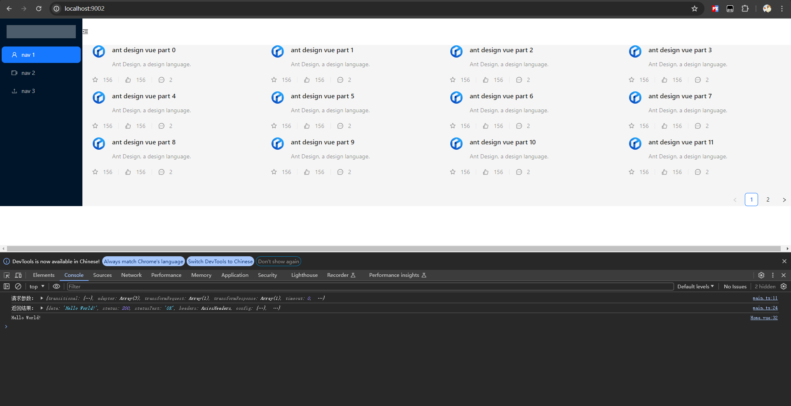

# Axios

官方文档：<https://www.axios-http.cn/docs/intro>

集成 axios

npm i axios --save

测试
```vue
<script setup lang="ts">
import axios from "axios";
import {onMounted} from "vue";
onMounted(()=>{
  console.log('hello');
  axios.get("/api/hello").then((res)=>{console.log(res)})
})

</script>
```


### 拦截器

```ts
import axios from "axios";
// 添加请求拦截器
axios.interceptors.request.use(
    function (config) {
        config.headers.Authorization = 'Bearer ' + localStorage.getItem('token');
        console.log("请求参数：" , config)
        return config;
    },
    function (error) {
        return Promise.reject(error);
    }
);

// 添加响应拦截器
axios.interceptors.response.use(
    function (response) {
        if (response.status === 200) {
            // 处理响应数据
            console.log("返回结果：" , response);
            return response.data;
        } else {
            return Promise.reject(response);
        }
    },
    function (error) {
        return Promise.reject(error);
    }
);
```


