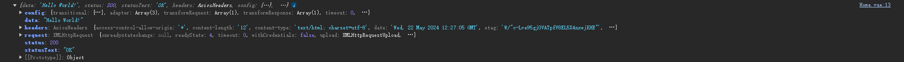

# Axios

官方文档：<https://www.axios-http.cn/docs/intro>

集成 axios

npm i axios --save

测试
```vue
<script setup lang="ts">
import axios from "axios";
import {onMounted} from "vue";
onMounted(()=>{
  console.log('hello');
  axios.get("/api/hello").then((res)=>{console.log(res)})
})

</script>
```

