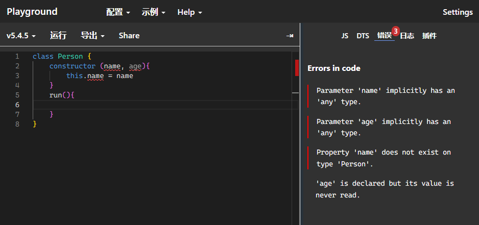
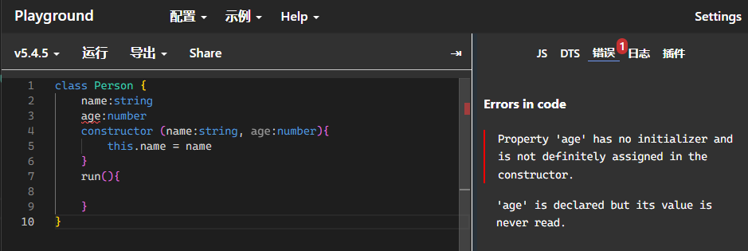
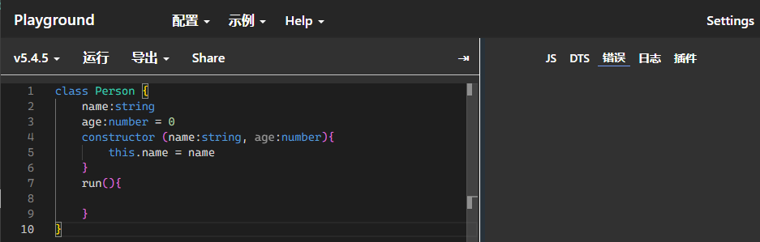
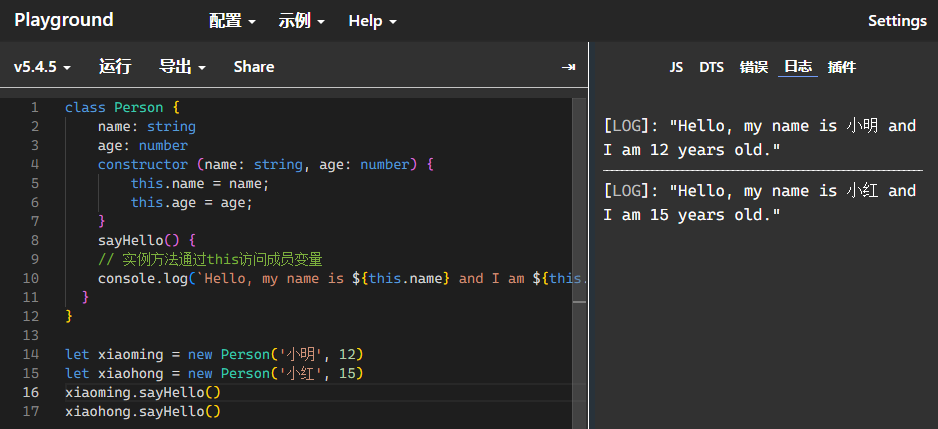

# class

- class 的基本用法 继承 和 类型约束
- class 的修饰符 readonly private protected public
- super 原理
- 静态方法
- get set
 


ES6提供了更接近传统语言的写法，引入了Class（类）这个概念，作为对象的模板。通过class关键字，可以定义类。基本上，ES6的class可以看作只是一个语法糖，它的绝大部分功能，ES5都可以做到，新的class写法只是让对象原型的写法更加清晰、更像面向对象编程的语法而已。上面的代码用ES6的“类”改写，就是下面这样。

```ts
//定义类
class Person {
    constructor () {
 
    }
    run () {
        
    }
}
```
### constructor

构造函数（Constructor）是一种特殊的方法，用于在创建新对象时初始化类。在TypeScript（和JavaScript）中，构造函数是类的默认方法，当你创建一个类的新实例时，它会被自动调用。

构造函数通常以类的名称命名，并且没有返回类型注释。

```ts
class Person {
    name: string
    age: number
    constructor (name: string, age: number) {
        this.name = name;
        this.age = age;
    }
    run () {
        
    }
}
```
::: warning 注意
- 成员初始化后(比如,age:number)才可以通过this.age来访问实例成员
- 需要为构造函数指定类型注解,否则会被隐式推断为any;
- 构造函数不需要返回值类型
:::

在TypeScript是不允许直接在constructor 定义变量的  如



需要在constructor上面先声明



这样引发了第二个问题你如果了定义了变量不用 也会报错 通常是给个默认值 或者 进行赋值



### 实例方法

在TypeScript（及其基础语言JavaScript）中，类的实例方法是定义在类中的方法，它们被用于操作类的实例。这些方法可以使用this关键字引用类的实例。

```ts
class Person {
    name: string
    age: number
    constructor (name: string, age: number) {
        this.name = name;
        this.age = age;
    }
    sayHello() {
  	// 实例方法通过this访问成员变量
    console.log(`Hello, my name is ${this.name} and I am ${this.age} years old.`)
  }
}
```

实例方法是在类的定义中定义的方法，而不是在类的实例上直接定义的方法。这意味着每个类的实例都有自己的实例方法副本。




### 类的约束

interface 约束

```ts
interface Person {
    name: string;
    age: number;
}

class Student implements Person {
    constructor (public name: string, public age: number) {
 
    }
    run () {
        
    }
}
```


### 类的修饰符

总共有三个 public private protected

- public 默认值 都可以访问
- private 只能在本类中访问
- protected 只能在本类和子类中访问

```ts
class Person {
    public name: string;
    private age: number;
    protected sex: string;
    constructor (name: string, age: number, sex: string) {
        this.name = name;
        this.age = age;
        this.sex = sex;
    }
    run () {
        
    }
}
```

### 类的继承

super 关键字用于访问和调用对象父类上的函数。

```ts
class Person {
    name: string;
    constructor (name: string) {
        this.name = name;
    }
    run () {
        console.log(this.name);
    }
}

class Student extends Person {
    constructor (name: string) {
        super(name);
    }
    run () {
        super.run();
    }
}
```

### 静态方法

```ts
class Person {
    static name: string;
    static run () {
        console.log(this.name);
    }
}
```

### get set

```ts
class Person {
    private _name: string;
    get name () {
        return this._name;
    }
    set name (value) {
        if (value.length < 2) {
            console.log('名字长度不能小于2');
            return;
        }
        this._name = value;
    }
}
```


