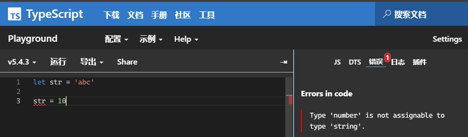
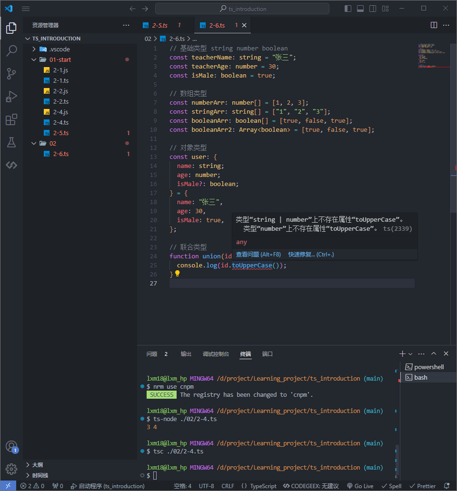
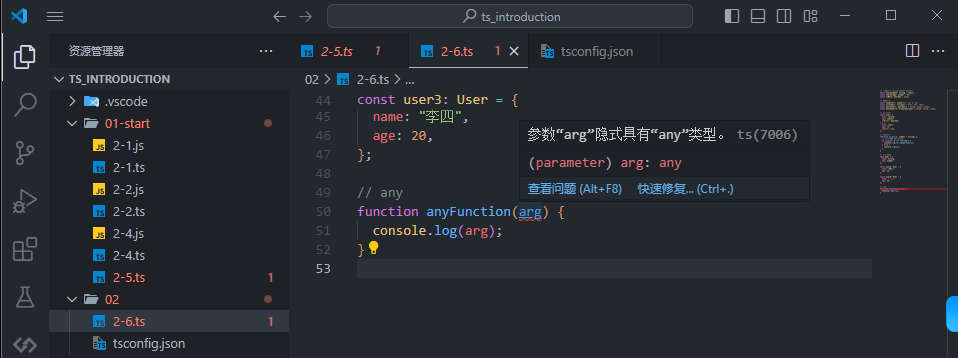
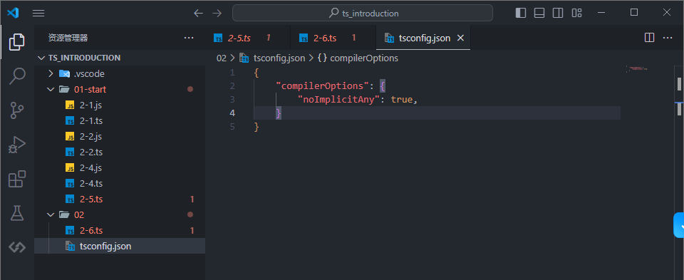

# 日常类型

## 类型定义

javascript 本身提供类型支持，但有以下几个问题：

- js 是弱类型，类型可以根据值发生改变

- 使用 js 不能自定义类型，比如 name 我们想只允许是 lxm yefenglin 值，但实际上是可以传递任何值的。

而在 typescript 中，可以将类型理解为一类值的集合，比如 'lxm'、'夜枫林'都属于 string 类型集合。


### 类型注解

```js
let str: string;

str = "abc";
```
### 类型推断

当没有明确设置类型时，系统会根据初值推断变量的类型



### 类型准则

- 只要有变量或者对象属性，都应该有一个明确的类型
- 如果类型推断能够自动推断出类型，就没必要手写类型注解

### 类型校验

下面没有使用类型限制时，函数参数传入字符串也是可以执行的，显示这个结果是不对的

```ts
function sum(a, b) {
  return a + b;
}

console.log(sum("a", 3)); //结果为 a3
```

加上严格类型后，在编译环节就会提示错误

```ts
function sum(a: number, b: number) {
  return a + b;
}

console.log(sum("a", 3));
//报错 Argument of type 'string' is not assignable to parameter of type 'number'.
```

### 类型别名

目的：实现复用

```ts
type User = {
  name: string;
  age: number;
};

const user2: User = {
  name: "张三",
  age: 30,
};

const user3: User = {
  name: "李四",
  age: 20,
};
```


### 类型等级

- 1.top type 顶级类型 any unknown
- 2.Object
- 3.Number String Boolean
- 4.number string boolean
- 5.'lxm' false 1
- 6.never

## 基础类型

### string

字符串是使用 string 定义的

```ts
let a: string = "yefenglin";
//普通声明

//也可以使用es6的字符串模板
let str: string = `dddd${a}`;
```

### number

支持十六进制、十进制、八进制和二进制；

```ts
let notANumber: number = NaN; //Nan
let num: number = 123; //普通数字
let infinityNumber: number = Infinity; //无穷大
let decimal: number = 6; //十进制
let hex: number = 0xf00d; //十六进制
let binary: number = 0b1010; //二进制
let octal: number = 0o744; //八进制s
```

### boolean

```ts
let booleand: boolean = true; //可以直接使用布尔值

let booleand2: boolean = Boolean(1); //也可以通过函数返回布尔值
```

注意，使用构造函数 Boolean 创造的对象不是布尔值

```ts
let createdBoolean: boolean = new Boolean(1);
//这样会报错 应为事实上 new Boolean() 返回的是一个 Boolean 对象
```

如果想通过构造函数获取布尔值，应该按照如下写法

```ts
let createdBoolean: Boolean = new Boolean(1);
```

### null

```ts
let n: null = null; //定义null
```

### undefined

```ts
let u: undefined = undefined; //定义undefined
```

### void

JavaScript 没有空值（Void）的概念，在 TypeScript 中，可以用 void 表示没有任何返回值的函数

```ts
function voidFn(): void {
  console.log("test void");
}
```

### void 和 undefined 和 null 最大的区别?

与 void 的区别是，undefined 和 null 是所有类型的子类型。也就是说 undefined 类型的变量，可以赋值给 string 类型的变量：

### never

never 表示的是那些永不存在的值的类型。

```ts
// 返回never的函数必须存在无法达到的终点
function error(message: string): never {
  throw new Error(message);
}
```

## 数组类型

```ts
const numberArr: number[] = [1, 2, 3];
const stringArr: string[] = ["1", "2", "3"];
const booleanArr: boolean[] = [true, false, true];
const booleanArr2: Array<boolean> = [true, false, true];
```

## 对象类型

```ts
const user: {
  name: string;
  age: number;
  isMale?: boolean;
} = {
  name: "张三",
  age: 30,
  isMale: true,
};
```

## 联合类型

```ts
function union(id: number | string) {
  console.log(id);
}
```



类型收窄

```ts
function union(id: number | string) {
  // 类型收窄 Narrowing
  if (typeof id === "string") {
    console.log(id.toUpperCase());
  } else {
    console.log(id);
  }
}
```

## any

当你不希望某个特定的值导致类型检查错误时，你可以使用它。

当一个值的类型为 any 时，你可以访问它的任何属性（这又将是 any 类型），像函数一样调用它，将它分配给（或从）任何类型的值，或者几乎任何其他东西这在语法上是合法的：

```ts
function anyFunction(arg: any) {
  console.log(arg);
}
```

禁止不明确的 any





### any / unknown

any 表示任意类型，unknown 表示未知类型

```ts
let a: any = 123;
a = "abc";
```

```ts
let b: unknown = 123;
b = "abc";
```

any 与 unknown 的区别？
（1）类型检查
（2）属性方法的调用

```ts
// 如果是any类型在对象没有这个属性的时候还在获取是不会报错的
let obj: any = { b: 1 };
obj.a;

// 如果是unknow 是不能调用属性和方法
let obj: unknown = { b: 1, ccc: (): number => 213 };
obj.b;
obj.ccc();
```

## 函数类型

返回值定义

```ts
function add(x: number, y: number): number {
  return x + y;
}

// 其它方式
const def: (age: number) => number = (age: number) => {
  return age;
};
```

可选参数

```ts
function add(x: number, y?: number): number {
  if (y) {
    return x + y;
  } else {
    return x;
  }
}
```

默认参数

```ts
function add(x: number, y = 10): number {}
```


## 接口类型

```ts
interface Student {
    age: number;
    sex?: string;
}

const student: Student = {
    age: 18,
    sex: "男",
}
```

### 接口 与 类型别名 的区别

- 接口优先

- 接口可以直接扩展（extends或者重复定义扩展），类型别名不行
- 
```ts
interface Student {
  age: number;
  sex?: string;
}
interface Student {
    name: string;
}

interface OldStudent extends Student {
    age: number;
}
  
const student: Student = {
  name: "张三",
  age: 18,
  sex: "男",
};
```

## 交叉类型

```ts
type Employee = User &{salary: number}

const employee: Employee = {
    name : "张三",
    age: 30,
    salary : 10000
}
```

## 断言
```ts
// dom 可能是 undefined 或者 HTMLElement 类型，取消类型推断，定义类型为 HTMLElement
const dom: HTMLElement = document.getElementById("app") as HTMLDivElement;
```

## 字面类型

除了通用类型 string 和 number 之外，我们还可以在类型位置引用特定的字符串和数字。

```ts
let x: "hello" = "hello";
```

变量只能有一个值并没有多大用处！

但是通过将字面量组合成联合，你可以表达更有用的概念 - 例如，仅接受一组特定已知值的函数：

```ts
function printText(s: string, alignment: "left" | "right" | "center") {
  // ...
}
printText("Hello, world", "left");
printText("G'day, mate", "centre");
```

### 字面推断


