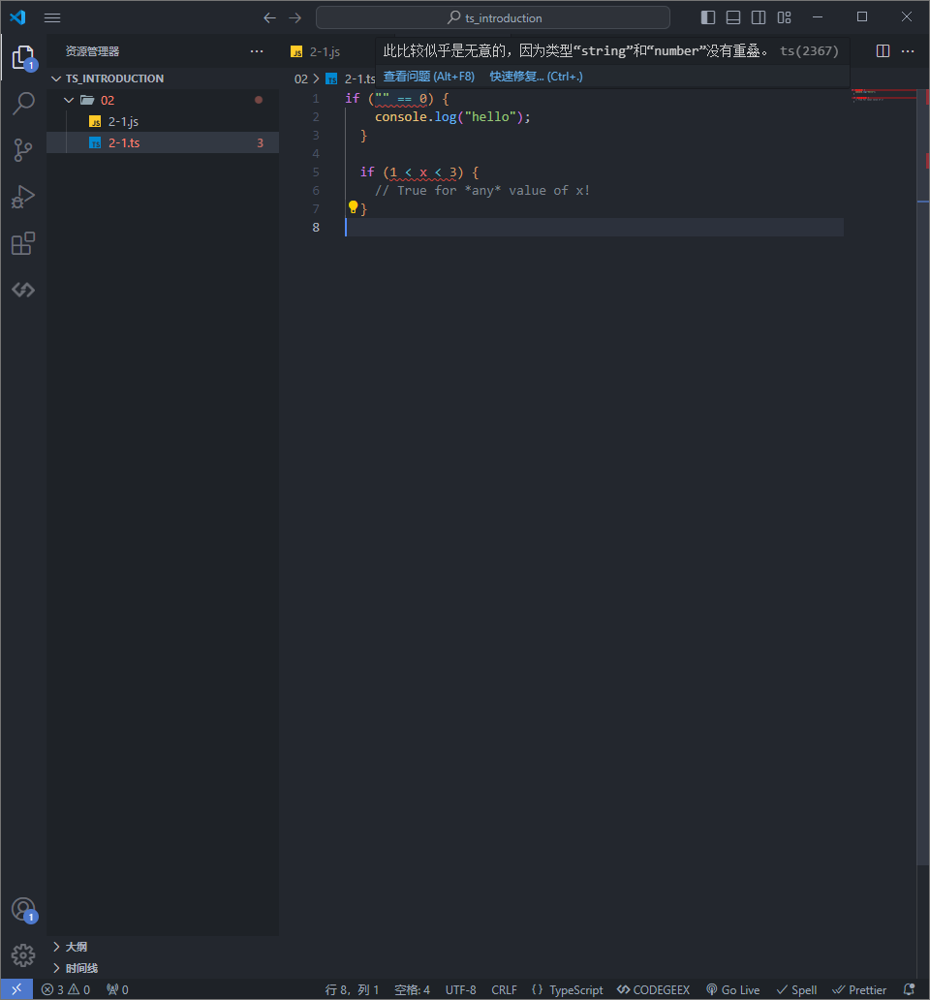
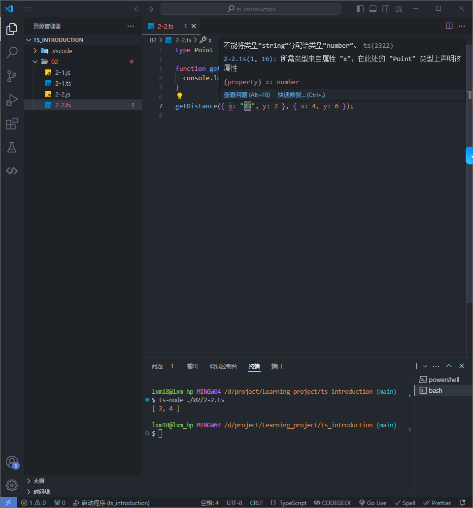

# TypeScript

官网：<https://www.typescriptlang.org/>

中文文档：<https://ts.nodejs.cn/docs/handbook/intro.html>

在线调试：<https://www.typescriptlang.org/zh/play?#code/Q>

小满 TS：<https://www.bilibili.com/video/BV1wR4y1377K/>

小满笔记：<https://blog.csdn.net/qq1195566313/category_11559497.html>

大前端笔记：<https://front-end.toimc.com/notes-page/basic/ts/>


## 什么是 TypeScript

TypeScript 是由微软开发的开源、跨平台的编程语言。它是 JavaScript 的一个超集，而且本质上向这个语言添加了可选的静态类型和基于类的面向对象编程。

TypeScript 设计目标是开发大型应用，它可以编译成纯 JavaScript，编译出来的 JavaScript 可以运行在任何浏览器上。

TypeScript 增加了一些语法，让开发者可以很容易地使用这些语法来构建大型应用。

TypeScript 提供最新的和不断发展的 JavaScript 特性，包括那些来自 2015 年的 ECMAScript 和未来的提案中的特性，比如异步功能和 Decorators，以帮助建立健壮的组件。

## 为什么使用 TypeScript

- 增加了代码的可读性和可维护性。

- 类型检测 利于团队协助

- 动态输入 自动推导 利于 IDE 提升开发效率


### JS 缺陷：隐性的类型转换

```js
// "" 经过转换后等于 0，所以表达式 "" == 0 的结果为 true。
if ("" == 0) {
  console.log("hello");
}
```

- 在 JavaScript 中，== 是一种松散相等比较运算符。它会尝试在比较之前将操作数转换为相同的类型。
- "" 是一个空字符串，它在 JavaScript 中被视为假值（falsy value）。
- 0 是数字零，同样在 JavaScript 中被视为假值（falsy value）

```js
// 首先计算 1 < x 的结果，然后将该结果（true 或 false）与 3 直接比较
if (1 < x < 3) {
  // True for *any* value of x!
}
```

### JS 缺陷：允许访问不存在的属性
```js
const obj = { width: 10, height: 15 };
// Why is this NaN? Spelling is hard!
const area = obj.width * obj.heigth;
```

当发生此类错误时，大多数编程语言都会抛出错误，有些语言会在编译期间（在任何代码运行之前）抛出错误。在编写小程序时，这种怪癖很烦人但可以管理；在编写包含数百或数千行代码的应用时，这些不断出现的意外是一个严重的问题。

TypeScript 在执行前检查程序是否有错误，并根据值的种类进行检查，使其成为静态类型检查器。



### TS 可读性

```js
function getDistance(point1, point2) {
  return [point2.x - point1.x, point2.y - point1.y];
}

getDistance({ x: 1, y: 2 }, { x: 4, y: 6 });
```

```ts
type Point = { x: number; y: number };

function getDistance(point1: Point, point2: Point) {
  console.log([point2.x - point1.x, point2.y - point1.y]);
}

getDistance({ x: "23", y: 2 }, { x: 4, y: 6 });

```



### TS 运行机制

ts 代码默认在v8引擎（浏览器和node）中是无法直接执行的，需要先编译成 js

```bash
 tsc ./02/2-4.ts
```

### TS 静态类型校验能力

TS 约等于 JS + STC

Static Type Checking

静态校验能力：在代码执行之前，具备错误预警的能力

实现方式是：类型（校验）

JS + 类型 -> Static Checking(vscode的js静态类型校验能力) -> 代码错误预警


所以，TS 要学习的核心就是：JS + 类型


## 快速入门

### 安装运行

```bash
lxm18@lxm_hp MINGW64 /d/projectTest/xiaoman-ts
$ npm i typescript -g

added 1 package in 9s

lxm18@lxm_hp MINGW64 /d/projectTest/xiaoman-ts
$ tsc -v
Version 5.4.5

lxm18@lxm_hp MINGW64 /d/projectTest/xiaoman-ts
$ tsc index.ts

lxm18@lxm_hp MINGW64 /d/projectTest/xiaoman-ts
$ nodemon index.js
```

上方的例子分为了两步（先转换在运行），可以通过 npm（ts-node），来进行合并操作：

```bash
$ npm install ts-node -g
# 直接进行运行
$ ts-node demo.ts
```

### 配置文件

执行以下命令创建配置项: tsconfig.json

```bash
tsc --init
```

然后执行以下命令使用配置项的定义进行监测

```bash
tsc -w
```

配置 说明

noImplicitAny 禁止使用隐含的 any 类型，如函数参数没有设置具体类型

strictNullChecks 开启时不否允许将 null、undefined 赋值给其他类型比如字符串

target 转换成 JS 的版本

strict 是否严格模式执行

module 使用的模块系统

类型断言

```js
let numArr = [1, 2, 3];

const result = numArr.find((item) => item > 2);

result * 5; // 报错: 'result' is possibly 'undefined'.
```

类型断言

```js
let numArr = [1, 2, 3];

const result = numArr.find((item) => item > 2) as number;

result * 5; // 报错: 'result' is possibly 'undefined'.
```

```js
// 限制值类型
let str: string | number;
str = "abc";
str = 123;

// 限定值选项
let str2: 1 | 2 | 3;
str2 = 1;
str2 = 2;
str2 = 3;
```

数组

```js
// 两种书写方式
let arr: number[] = [1, 2, 3];
let arr2: Array<number> = [1, 2, 3];

let arr3: (number | string)[] = [1, "abc", 2, "def"];
```

元组

```js
let t1: [string, number] = ["abc", 123];

t1[0] = 100; // 报错: Type 'number' is not assignable to type 'string'.

// 设置可选值
let t2: [string, number, string?];
t2 = ["abc", 123];
```

枚举

```js
enum MyEnum{
    A,
    B,
    C
}

console.log(MyEnum.A); // 0
console.log(MyEnum[0]); // A
```

void

函数

```js
function MyFunc(a: number, b: number) {
  return a + b;
}
```

void 表示函数没有返回值

```js
function MyFunc(): void {
  console.log("abc");
}
```

接口

```js
interface MyInterface {
  name: string;
  age: number;
}

let obj: MyInterface = {
  name: "abc",
  age: 12,
  sex: "male", // 报错: Object literal may only specify known properties, and 'sex' does not exist in type 'MyInterface'.
};
```

类型别名

type

```js
type MyType = string | number;

let str: MyType = "abc";
let num: MyType = 123;
```

泛型

```js
function MyFunc<T>(a: T): T {
  return a;
}

let str: string = MyFunc < string > "abc";
let num: number = MyFunc < number > 123;
```

进阶内容

函数重载

```js
function MyFunc(a: number, b: number): number;
function MyFunc(a: string, b: string): string;
function MyFunc(a: any, b: any): any {

}

```

接口继承

```js
interface MyInterface1 {
  name: string;
}

interface MyInterface2 extends MyInterface1 {
  age: number;
}

let obj: MyInterface2 = {
  name: "abc",
  age: 12,
};
```

类的修饰符

```js

```

