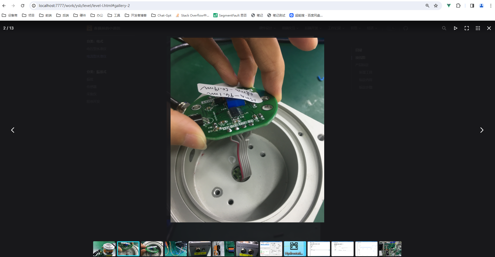

# vitepress

https://vitepress.dev/zh/

## vuepress 迁移到 vitepress ？

- 访问速度快
- 支持导航热更新
- pnpm 包管理更为发方便

## 快速开始

## 主题配置

### 路由跳转

在页面之间链接时，可以使用绝对路径和相对路径。请注意，虽然 .md 和 .html 扩展名都可以使用，但最佳做法是省略文件扩展名，以便 VitePress 可以根据配置生成最终的 URL。

```
<!-- Do -->
[Getting Started](./getting-started)
[Getting Started](../guide/getting-started)

<!-- Don't -->
[Getting Started](./getting-started.md)
[Getting Started](./getting-started.html)
```

链接到非 VitePress 页面

```
[Link to pure.html](/pure.html){target="\_self"}

<https://blog.csdn.net/LT_admin/article/details/135136872>
```

## markdown

#### 表格

```
| Tables        |      Are      |  Cool |
| ------------- | :-----------: | ----: |
| col 3 is      | right-aligned | $1600 |
| col 2 is      |   centered    |   $12 |
| zebra stripes |   are neat    |    $1 |
```

效果

| Tables        |      Are      |  Cool |
| ------------- | :-----------: | ----: |
| col 3 is      | right-aligned | $1600 |
| col 2 is      |   centered    |   $12 |
| zebra stripes |   are neat    |    $1 |

#### 自定义容器

```
::: info
This is an info box.
:::

::: tip
This is a tip.
:::

::: warning
This is a warning.
:::

::: danger
This is a dangerous warning.
:::

::: details
This is a details block.
:::
```

效果
::: info
This is an info box.
:::

::: tip
This is a tip.
:::

::: warning
This is a warning.
:::

::: danger
This is a dangerous warning.
:::

::: details
This is a details block.
:::

## 图片放大预览效果

参考教程：<https://blog.csdn.net/www1577791638/article/details/126091280>

(1) 安装依赖

```sh
npm i markdown-it-custom-attrs
```

(2) 配置 vitepress config.js 文件

```js
import mdItCustomAttrs from "markdown-it-custom-attrs";
export default {
  markdown: {
    config: (md) => {
      // use more markdown-it plugins!
      md.use(mdItCustomAttrs, "image", {
        "data-fancybox": "gallery",
      });
    },
  },
};
```

(3) 引入图片灯箱 js 和 css 文件

- 配置.vitepress/config.js 文件
- 加入 head 配置

```js
export default {
  head: [
    [
      "link",
      {
        rel: "stylesheet",
        href: "https://cdn.jsdelivr.net/npm/@fancyapps/ui/dist/fancybox.css",
      },
    ],
    [
      "script",
      {
        src: "https://cdn.jsdelivr.net/npm/@fancyapps/ui@4.0/dist/fancybox.umd.js",
      },
    ],
  ],
};
```

(4) fancybox.css fancybox.umd.js 两个加载好慢，将其改成本地静态资源

/docs/public

```js
head: [
  [
    "link",
    { rel: "stylesheet", href: "/css/fancybox.css" },
    // { rel: "stylesheet", href: "https://cdn.jsdelivr.net/npm/@fancyapps/ui/dist/fancybox.css" },
  ],
  ["script", { src: "/js/fancybox.umd.js" }],
];
```

(5) 效果图


