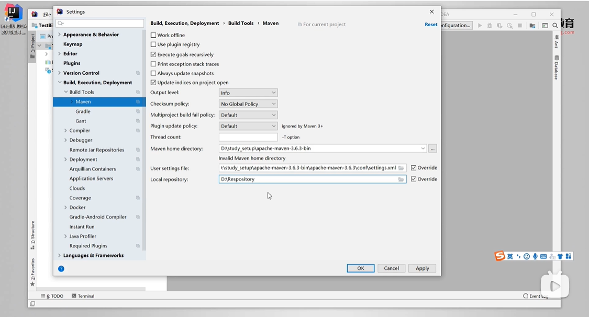
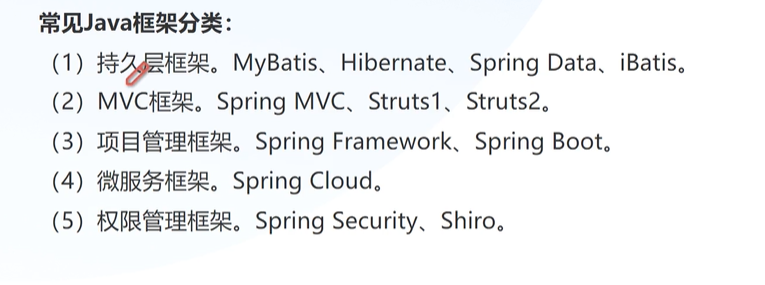
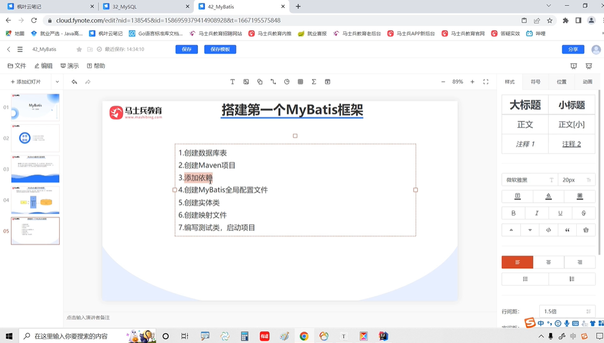

# 开发提效

### XML

### JDBC

（）增删改

（）查询

## Maven

### 常用配置

- 本地仓库

- 镜像仓库

- 配置 jdk

### 创建项目

idea 集成 maven

## MyBatis

文档：<https://mybatis.org/mybatis-3/zh_CN/index.html>

参考：<https://www.cnblogs.com/gnwzj/p/10663407.html>

持久层是分层开发中专门负责访问数据源的一层，Java 项目中每一层都有自己的作用，持久层的作用就是访问数据源，把访问数据源的代码和业务逻辑代码分开，有利于后期维护和团队分工开发。同时也增加了数据访问代码的复用性。

ORM(Object/Relation Mapping)，中文名称:对象/关系 映射。是一种解决数据库发展和面向对象编程语言发展不匹配问题而出现的技术。

