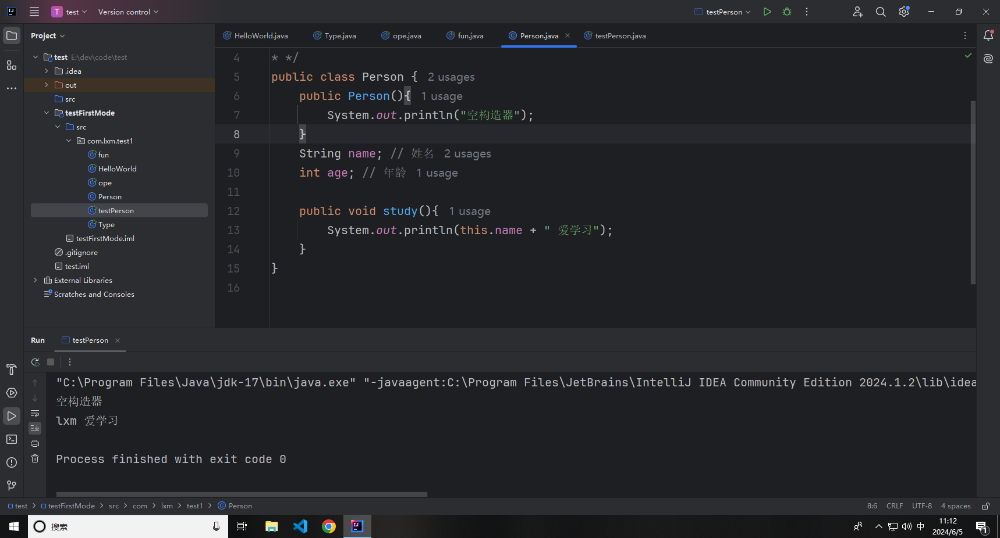
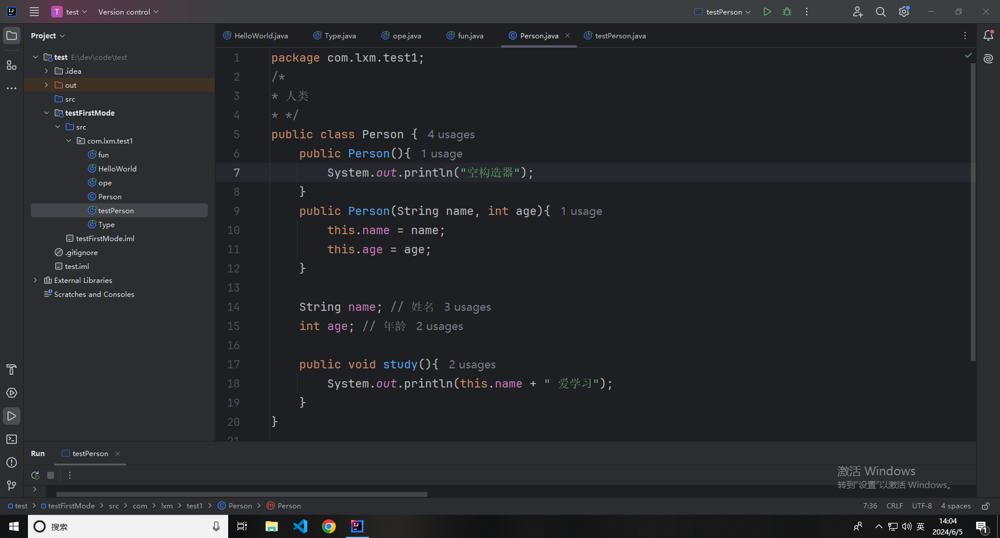
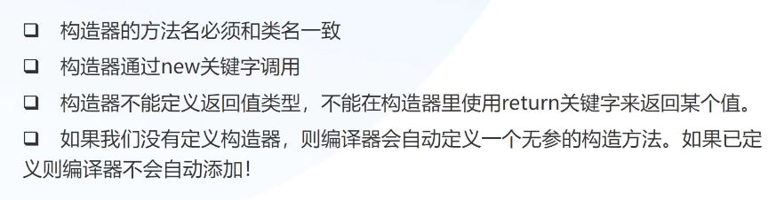
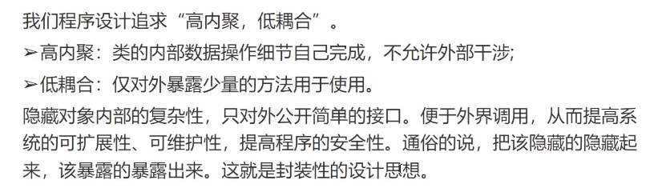
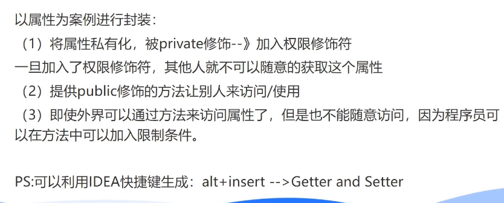
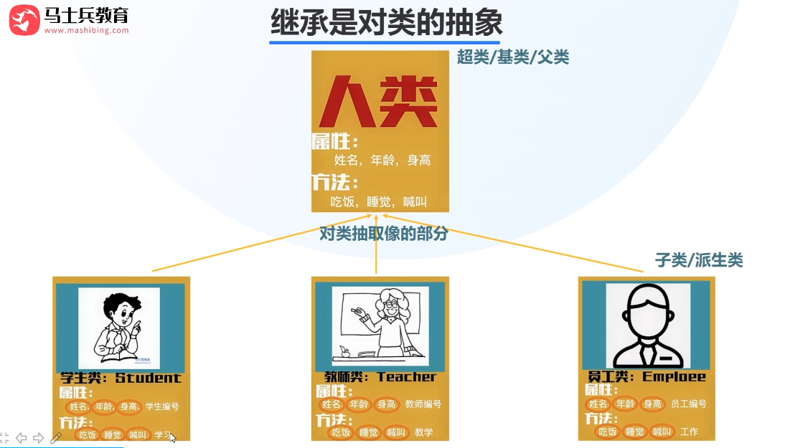
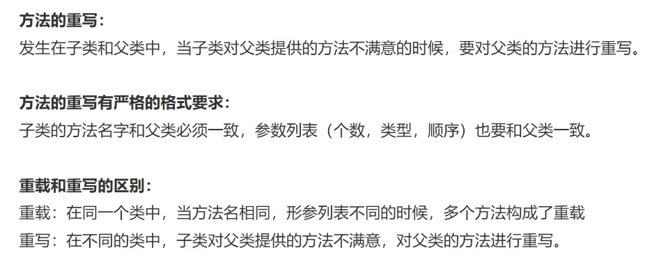
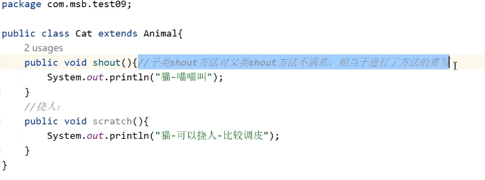

# 面向对象

## 对象与类

万事万物皆对象

对象：具体的示例

类：对象的抽象和共性

- 特性 - 属性 - 名词

- 行为 - 方法 - 动词

```java
/*
* 人类
* */
public class Person {
    String name; // 姓名
    int age; // 年龄

    public void study(){
        System.out.println(this.name + " 爱学习");
    }
}
```

```java
public class testPerson {
    public static void main(String[] args) {
        Person p1 = new Person();
        p1.name = "lxm";
        p1.age = 20;
        p1.study();
    }
}
```

## 构造器

类：属性 + 方法 + 构造器

构造方法也叫构造器，是一个创建对象时被自动调用的特殊方法，用于对象的初始化。

Java 通过 new 关键字来调用构造器，从而返回该类的实例。

空构造器



```java
public class Person {
    public Person(){
        System.out.println("空构造器");
    }
    public Person(String a, int b){
        name = a;
        age = b;
    }

    String name; // 姓名
    int age; // 年龄

    public void study(){
        System.out.println(this.name + " 爱学习");
    }
}

```

```java
public class testPerson {
    public static void main(String[] args) {
        Person p1 = new Person();
        p1.age = 20;
        p1.name = "lxm";
        p1.study();

        Person p2 = new Person("chike", 22);
        p2.study();
    }
}

```

this



快捷键：Alt + insert ——> constructor -> 选择参数



## 封装



```java
public class Girl {
    private int age;

    public void setAge(int age){
        this.age = age;
    }
    public int getAge(){
        return age;
    }
}

```

```java
public class Test {
    public static void main(String[] args) {
        Girl g = new Girl();
        g.setAge(33);
        System.out.println(g.getAge());
    }
}
```



## 继承

继承是对类的抽象



父类

```java
public class Person {
    private String name;
    private int age;

    public void setName(String name) {
        this.name = name;
    }

    public void setAge(int age) {
        this.age = age;
    }

    public int getAge() {
        return age;
    }

    public String getName() {
        return name;
    }

    public void eat(){
        System.out.println("eat");
    }
}

```

子类

```java
public class Student extends Person {
    private int sno; // 学号

    public void study(){
        System.out.println("学生要学习");
    }
}

```

调用

```java
public class Test {
    public static void main(String[] args) {
        Student s = new Student();
        s.setName("lxm");
        s.setAge(18);
        s.eat();
        s.study();
    }
}
```

### 方法重写



```java
// 父类 Animal
class Animal {
    // 父类方法 eat
    public void eat() {
        System.out.println("动物正在吃食物");
    }
}

// 子类 Dog 继承自父类 Animal
class Dog extends Animal {
    // 子类重写父类方法 eat
    @Override
    public void eat() {
        System.out.println("狗正在啃骨头");
    }
}

// 子类 Cat 继承自父类 Animal
class Cat extends Animal {
    // 子类重写父类方法 eat
    @Override
    public void eat() {
        System.out.println("猫正在吃鱼");
    }
}

// 主类 Main
public class Main {
    public static void main(String[] args) {
        Animal animal1 = new Dog(); // 创建一个 Dog 对象
        Animal animal2 = new Cat(); // 创建一个 Cat 对象

        animal1.eat(); // 调用 Dog 对象的 eat 方法，输出：狗正在啃骨头
        animal2.eat(); // 调用 Cat 对象的 eat 方法，输出：猫正在吃鱼
    }
}

```

## 多态

多态：通俗来说，就是多种形态，具体点就是去完成某个行为，当不同的对象去完成时会产生出不同的状态。同一种行为，不同的子类呈现出来的状态是不同的。

PS：多态跟属性无关，多态指的是方法的多态，而不是属性的多态。

```java
// 父类 Animal
class Animal {
    // 父类方法 makeSound
    public void makeSound() {
        System.out.println("动物发出声音");
    }
}

// 子类 Dog 继承自父类 Animal
class Dog extends Animal {
    // 子类重写父类方法 makeSound
    @Override
    public void makeSound() {
        System.out.println("狗在汪汪叫");
    }
}

// 子类 Cat 继承自父类 Animal
class Cat extends Animal {
    // 子类重写父类方法 makeSound
    @Override
    public void makeSound() {
        System.out.println("猫在喵喵叫");
    }
}

// 主类 Main
public class Main {
    public static void main(String[] args) {
        Animal animal1 = new Dog(); // 创建一个 Dog 对象并赋值给 Animal 类型的引用
        Animal animal2 = new Cat(); // 创建一个 Cat 对象并赋值给 Animal 类型的引用

        animal1.makeSound(); // 调用 Dog 对象的 makeSound 方法，输出：狗在汪汪叫
        animal2.makeSound(); // 调用 Cat 对象的 makeSound 方法，输出：猫在喵喵叫
    }
}

```



多态的三要素:继承、重写、父类引用指向子类对象

多态的好处:提高代码扩展性
