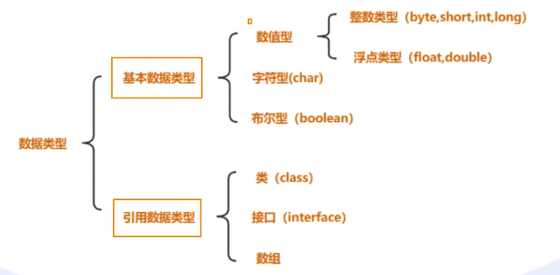
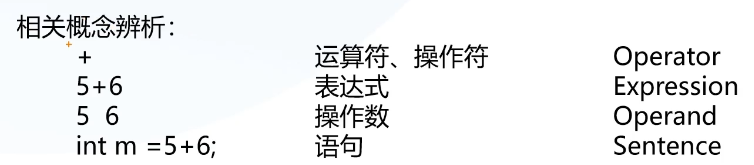
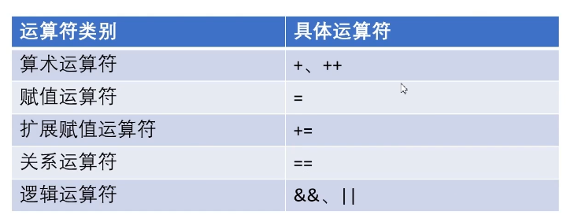
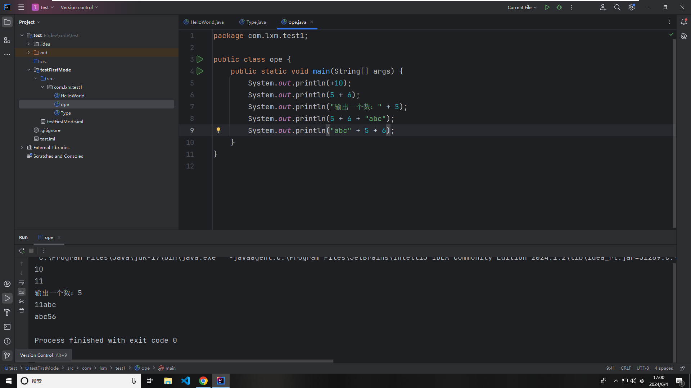

# JAVA 基础语法

### 注释

为了增加程序的可读性，方便代码的阅读，可以在程序中加入一些解释性的文字，异或可以将程序中无用的语句屏蔽掉，此时就需要一个很关键的
技能点 —— 注释

```java
// 单行注释

/*
多行注释
*/

/**
 * 文档注释
**/
```

## 变量/常量

变量本质上就是代表一个 “可操作的存储空间” 空间位置是确定的，但是里面放置什么值不确定。我们可通过变量名来访问“对应的存储空间”，从而操纵这个“存储空间”存储的值。Java 是一种强类型语言，每个变量都必须声明其数据类型。变量的数据类型决定了变量占据存储空间的大小。

- 声明：类型 + 名字
- 变量不可以重复定义

```java
package com.lxm.test1;

public class HelloWorld {
    public static void main(String[] args) {
        // 1 声明
        int age;
        // 2 赋值
        age = 18;
        // 3 使用
        System.out.println(age);
    }
}
```

变量的内存

## 数据类型



### 整数类型

- byte 1 个字节 （-128 ~ 127）
- short 2 个字节 （±30000）
- int 4 个字节 （±21 亿）
- long 8 个字节 （±9223372036854775807）

注意事项

- 整数类型默认是 int 类型
- 整数类型可以自动转换为范围小的整数类型
- 整数类型不可以自动转换为范围大的整数类型
- 整数类型不可以自动转换为范围小的浮点数类型
- 整数类型不可以自动转换为范围大的浮点数类型

### 浮点类型

- float 4 个字节
- double 8 个字节

```java
float f = 3.14f;
double d = 3.14;
```

### 字符类型

- char 2 个字节

```java
char c = 'a';
```

### 布尔类型

- boolean 1 个字节

```java
boolean flag = true;
```

## 运算符





### 加号

- 表示正数
- 表示相加操作
- 字符串拼接

::: warning 注意事项

字符串拼接时，如果其中有一个字符串是变量，那么这个变量会自动转换为字符串类型，然后进行拼接。

:::



### 自增/自减

- 自增：++
- 自减：--

```java
int a = 10;
int b = ++a; // 11
int c = a++; // 11
int d = --a; // 10
int e = a--; // 10
```

区分 ++ 在左 与 在右的区别

### 赋值运算符

- 赋值运算符 =
- 复合赋值运算符 += -= \*= /= %=

```java
int a = 10;
```

### 关系运算符

```bash
 >
 <
 > =
 <=
 ==
 !=
```

```java
int a = 10;
int b = 20;
System.out.println(a > b); // false
```

### 逻辑运算符

- && 与
- || 或
- ! 非

```java
int a = 10;
int b = 20;
System.out.println(a > b && b > a); // false
```

### 位运算符

- &
- |
- ~
- ^
- <<
- > >

```java
int a = 10;
int b = 20;
System.out.println(a & b); // 10
```

### 运算符优先级

## 流程控制

流程控制语句是用来控制程序中各语句执行顺序的语句，可以把语句组合成能完成一定功能的小逻辑模块。

### 顺序结构

- 程序从上到下依次执行

### 分支结构

- 单/双分支：if

```bash
int num = -5;

if(num > 0){
    System.out.println("num 是正数");
} else {
    System.out.println("num 是负数或零");
}

```

- 多分支：switch

```bash
int day = 3;
String dayName;

switch (day) {
    case 1:
        dayName = "星期一";
        break;
    case 2:
        dayName = "星期二";
        break;
    case 3:
        dayName = "星期三";
        break;
    case 4:
        dayName = "星期四";
        break;
    case 5:
        dayName = "星期五";
        break;
    case 6:
        dayName = "星期六";
        break;
    case 7:
        dayName = "星期日";
        break;
    default:
        dayName = "无效的天数";
        break;
}

System.out.println("今天是" + dayName);

```

### 循环结构
