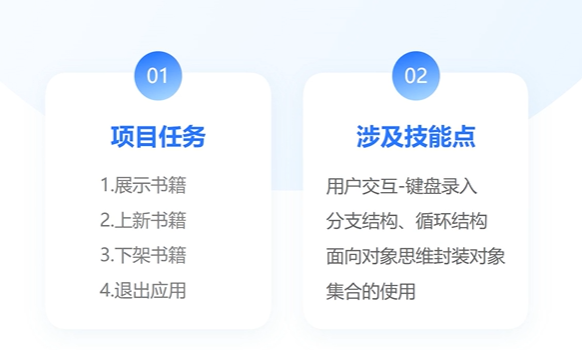
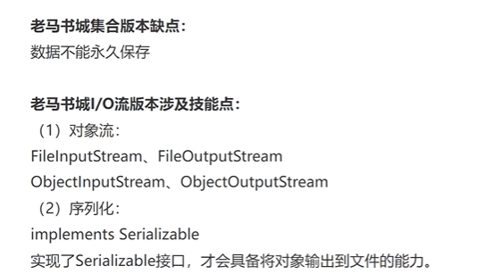

# 练习

## 马士兵2023版Java

### 老马书城1.0：集合版



#### 菜单管理

相关类：Scanner


```java
import java.util.ArrayList;
import java.util.Scanner;
public class Main {
    public static void main(String[] args) {
        // 4. 设置循环
        while (true){
            // 1. 创建 Scanner 对象
            Scanner scanner = new Scanner(System.in);

            System.out.println("-----欢迎来到老马书城-----");
            System.out.println("1.展示书籍");
            System.out.println("2.上新书籍");
            System.out.println("3.下架书籍");
            System.out.println("4.退出应用");
            System.out.print("请输入您想要执行的操作序号：");

            2. 获取用户输入
            int choice = scanner.nextInt();
            System.out.println(choice);
            
            3. 判断用户输入
            if (choice == 1){
                System.out.println("展示书籍");
            }
            if (choice == 2){
                System.out.println("上新书籍");
            }
            if (choice == 3){
                System.out.println("下架书籍");
            }
            // 5. 退出应用
            if (choice == 4){
                break;
            }
        }
    }
}
```

#### 书籍管理

- 书籍编号
- 书籍名称
- 书籍作者

book类
```java
public class Book {
    private int id;         // 书籍编号
    private String name;    // 书籍名称
    private String author;  // 书籍作者

    // 构造器

    public Book() {
    }

    public Book(int id, String name, String author) {
        this.id = id;
        this.name = name;
        this.author = author;
    }

    // 获取书籍编号
    public int getId() {
        return id;
    }

    // 设置书籍编号
    public void setId(int id) {
        if (id <= 0) {
            throw new IllegalArgumentException("书籍编号必须大于0");
        }
        this.id = id;
    }

    // 获取书籍名称
    public String getName() {
        return name;
    }

    // 设置书籍名称
    public void setName(String name) {
        if (name == null || name.trim().isEmpty()) {
            throw new IllegalArgumentException("书籍名称不能为空");
        }
        this.name = name;
    }

    // 获取书籍作者
    public String getAuthor() {
        return author;
    }

    // 设置书籍作者
    public void setAuthor(String author) {
        if (author == null || author.trim().isEmpty()) {
            throw new IllegalArgumentException("书籍作者不能为空");
        }
        this.author = author;
    }
}

```

```java
import java.util.ArrayList;
import java.util.List;
import java.util.Objects;
import java.util.Scanner;
public class Main {
    public static void main(String[] args) {
        // 书籍集合
        ArrayList<Book> bookList = new ArrayList<Book>();

        while (true){
            // 创建 Scanner 对象
            Scanner scanner = new Scanner(System.in);

            System.out.println("-----欢迎来到老马书城-----");
            System.out.println("1.展示书籍");
            System.out.println("2.上新书籍");
            System.out.println("3.下架书籍");
            System.out.println("4.退出应用");
            System.out.print("请输入您想要执行的操作序号：");
            int choice = scanner.nextInt();
            if (choice == 1){
                // 遍历 Book 对象集合并展示属性
                for (Book book : bookList) {
                    System.out.println("-----------------------");
                    System.out.println("书籍编号：" + book.getId());
                    System.out.println("书籍名称：" + book.getName());
                    System.out.println("书籍作者：" + book.getAuthor());
                    System.out.println("-----------------------");
                }
            }
            if (choice == 2){
                System.out.print("请输入书籍编号：");
                int bookID = scanner.nextInt();
                System.out.print("请输入书籍名称：");
                String bookName = scanner.next();
                System.out.print("请输入书籍作者：");
                String bookAuthor = scanner.next();

                // Book book = new Book(bookID, bookName, bookAuthor);
                Book book = new Book();
                book.setId(bookID);
                book.setName(bookName);
                book.setAuthor(bookAuthor);
                System.out.println(book);

                bookList.add(book);
                System.out.println(bookList.get(0));
            }
            if (choice == 3){
                System.out.println("下架书籍");
            }
            if (choice == 4){
                break;
            }
        }
    }
}
```

#### 下架书籍


#### 完整代码

```java
import java.util.ArrayList;
import java.util.List;
import java.util.Objects;
import java.util.Scanner;
public class Main {
    public static void main(String[] args) {
        // 书籍集合
        ArrayList<Book> bookList = new ArrayList<Book>();

        while (true){
            // 创建 Scanner 对象
            Scanner scanner = new Scanner(System.in);

            System.out.println("-----欢迎来到老马书城-----");
            System.out.println("1.展示书籍");
            System.out.println("2.上新书籍");
            System.out.println("3.下架书籍");
            System.out.println("4.退出应用");
            System.out.print("请输入您想要执行的操作序号：");
            int choice = scanner.nextInt();
            if (choice == 1){
                System.out.println(">>> 展示书籍 <<<");
                // 遍历 Book 对象集合并展示属性
                if(bookList.isEmpty()){
                    System.out.println("暂无图书");
                }
                for (Book book : bookList) {
                    System.out.println("-----------------------");
                    System.out.println("书籍编号：" + book.getId());
                    System.out.println("书籍名称：" + book.getName());
                    System.out.println("书籍作者：" + book.getAuthor());
                    System.out.println("-----------------------");
                }
            }
            if (choice == 2){
                System.out.println(">>> 上新书籍 <<<");
                System.out.print("请输入书籍编号：");
                int bookID = scanner.nextInt();
                System.out.print("请输入书籍名称：");
                String bookName = scanner.next();
                System.out.print("请输入书籍作者：");
                String bookAuthor = scanner.next();

                Book book = new Book(bookID, bookName, bookAuthor);
                bookList.add(book);
            }
            if (choice == 3){
                System.out.println(">>> 下架书籍 <<<");
                System.out.print("请输入要下架的书籍编号：");
                int deleteId = scanner.nextInt();
                for (Book book: bookList){
                    int bookId = book.getId();
                    if(bookId == deleteId){
                        bookList.remove(book);
                        break;
                    }
                }
            }
            if (choice == 4){
                System.out.println(">>> 退出应用 <<<");
                break;
            }
        }
    }
}
```

#### 代码优化
- Scanner 对象的关闭：最好在循环外创建一个 Scanner 对象，并在循环结束时关闭它，以避免重复创建和销毁多个 Scanner 对象。

- 使用 switch 替代多个 if：对于选择操作的判断，使用 switch 语句会使代码更清晰易读。

- 下架书籍功能的改进：在删除书籍时，直接使用 ArrayList 的 removeIf 方法会更简洁高效。


```java
import java.util.ArrayList;
import java.util.List;
import java.util.Scanner;

public class Main {
    public static void main(String[] args) {
        // 创建 Scanner 对象
        Scanner scanner = new Scanner(System.in);

        // 书籍集合
        List<Book> bookList = new ArrayList<>();

        while (true){
            System.out.println("-----欢迎来到老马书城-----");
            System.out.println("1.展示书籍");
            System.out.println("2.上新书籍");
            System.out.println("3.下架书籍");
            System.out.println("4.退出应用");
            System.out.print("请输入您想要执行的操作序号：");
            int choice = scanner.nextInt();

            switch (choice) {
                case 1:
                    displayBooks(bookList);
                    break;
                case 2:
                    addNewBook(scanner, bookList);
                    break;
                case 3:
                    removeBook(scanner, bookList);
                    break;
                case 4:
                    System.out.println(">>> 退出应用 <<<");
                    scanner.close(); // 关闭 Scanner 对象
                    return;
                default:
                    System.out.println("无效的操作序号，请重新输入！");
            }
        }
    }

    private static void displayBooks(List<Book> bookList) {
        System.out.println(">>> 展示书籍 <<<");
        if(bookList.isEmpty()){
            System.out.println("暂无图书");
        } else {
            for (Book book : bookList) {
                System.out.println("-----------------------");
                System.out.println("书籍编号：" + book.getId());
                System.out.println("书籍名称：" + book.getName());
                System.out.println("书籍作者：" + book.getAuthor());
                System.out.println("-----------------------");
            }
        }
    }

    private static void addNewBook(Scanner scanner, List<Book> bookList) {
        System.out.println(">>> 上新书籍 <<<");
        System.out.print("请输入书籍编号：");
        int bookID = scanner.nextInt();
        System.out.print("请输入书籍名称：");
        String bookName = scanner.next();
        System.out.print("请输入书籍作者：");
        String bookAuthor = scanner.next();

        Book book = new Book(bookID, bookName, bookAuthor);
        bookList.add(book);
    }

    private static void removeBook(Scanner scanner, List<Book> bookList) {
        System.out.println(">>> 下架书籍 <<<");
        System.out.print("请输入要下架的书籍编号：");
        int deleteId = scanner.nextInt();
        bookList.removeIf(book -> book.getId() == deleteId);
    }
}
```

### IO 流版

