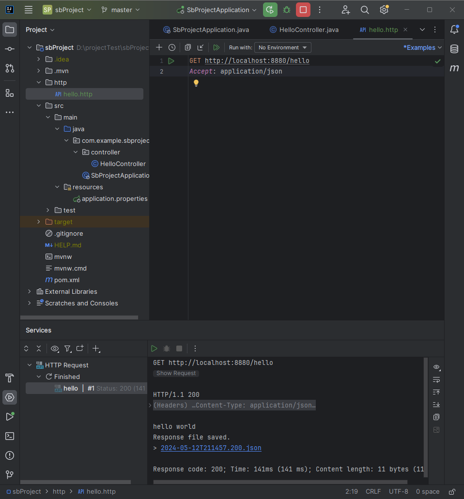
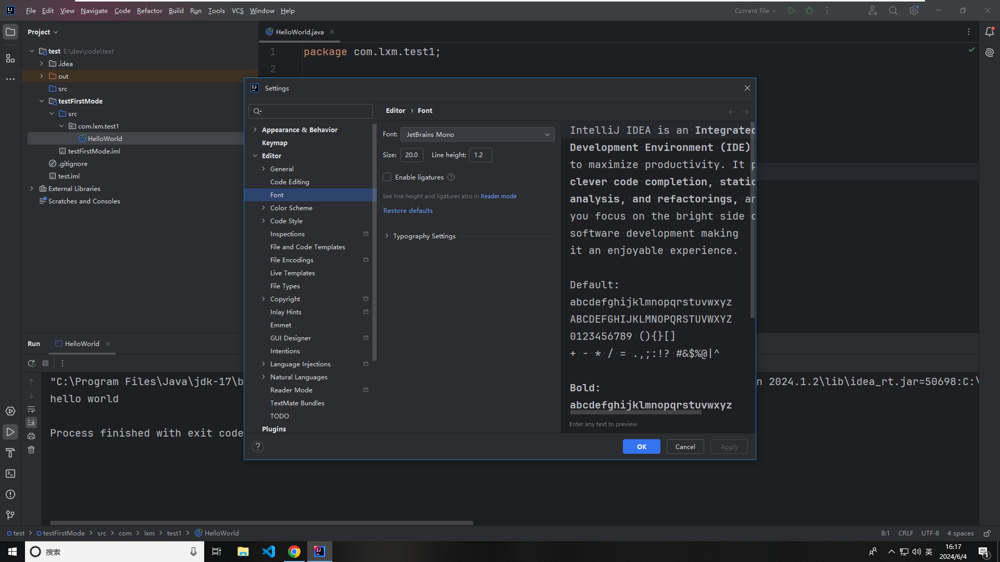
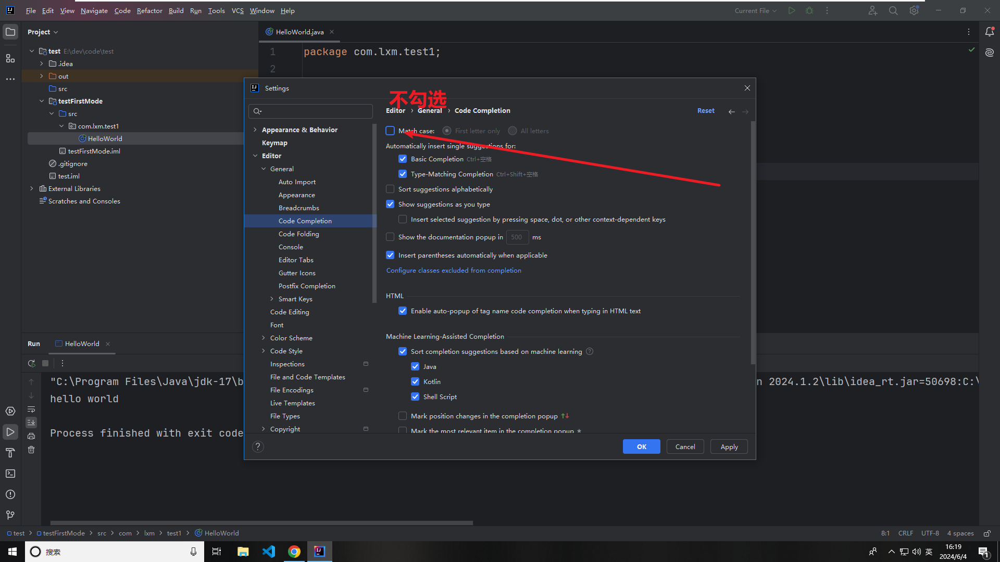
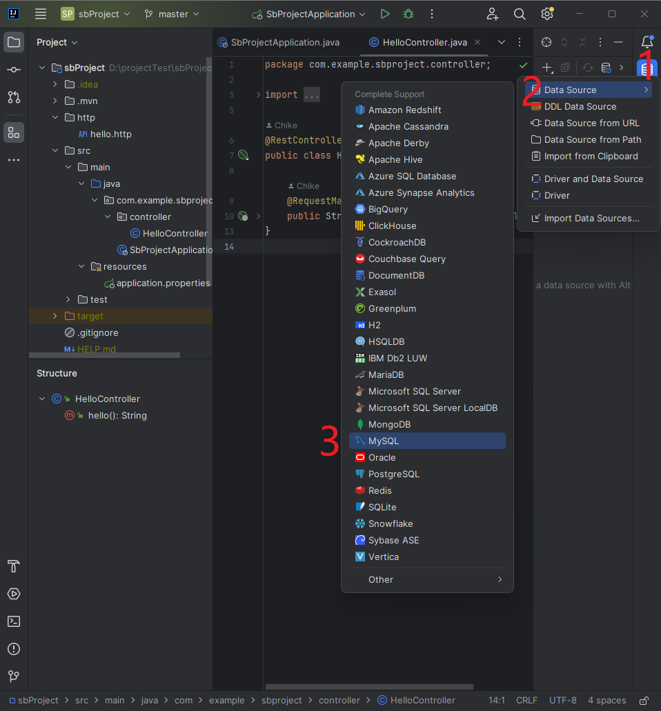
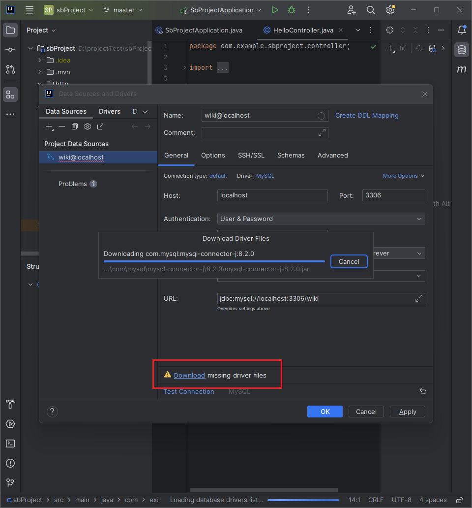
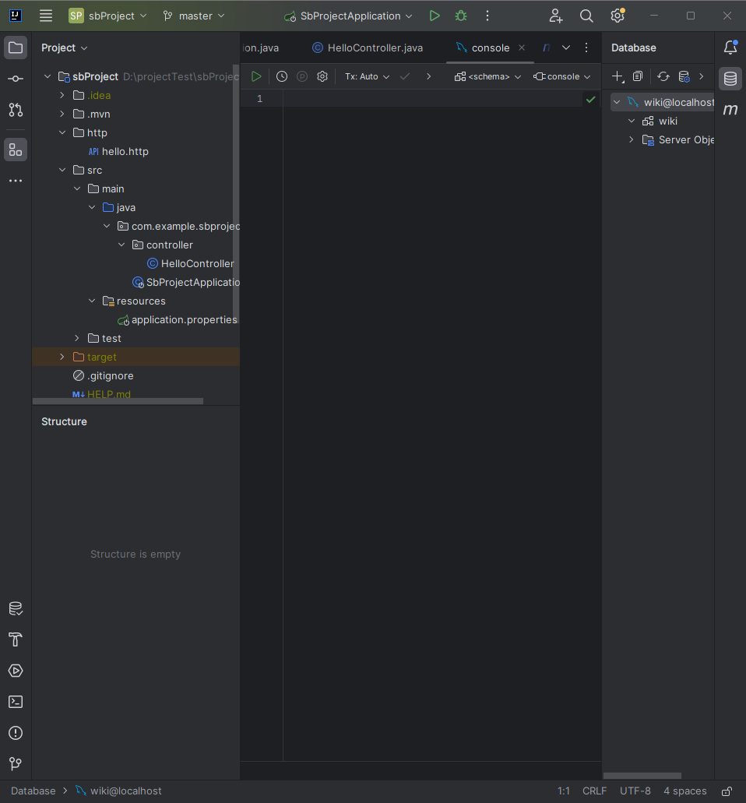
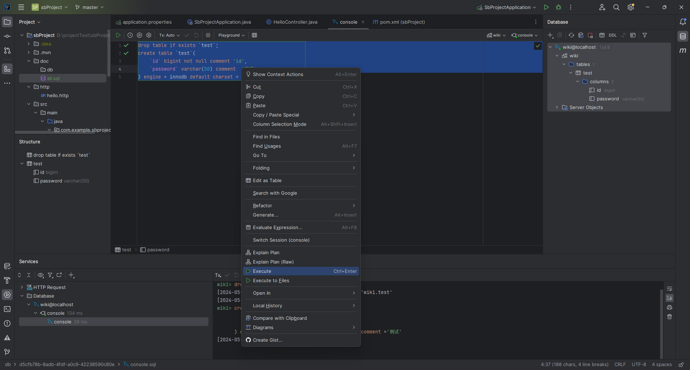

# IDEA

官网：<https://www.jetbrains.com/idea/download/?section=windows>

## 安装激活

D:\ProgramCode\jetbrainsActivate0210

### live templates

### HTTP Client 测试接口



## 常用设置

### 字体



### 忽略大小写



## 常用快捷键

### main 方法

```bash
psvm + 回车
```

### 控制台输出

```bash
sout + 回车
```

### 行操作

```bash
// 删除一行
ctrl + y

// 复制一行
ctrl + d
```

## 插件配置

### 数据库插件

新建连接



下载驱动



添加完成



测试生成 test 表


