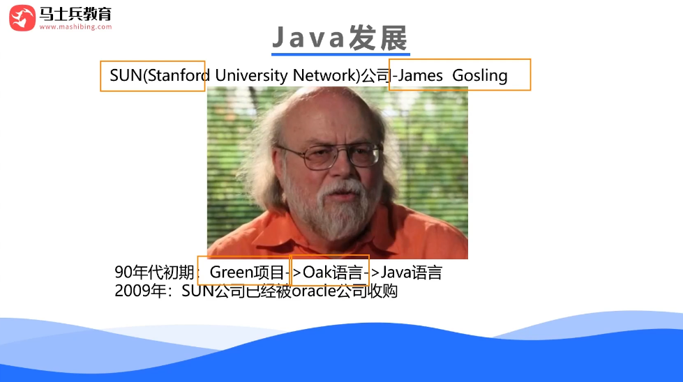
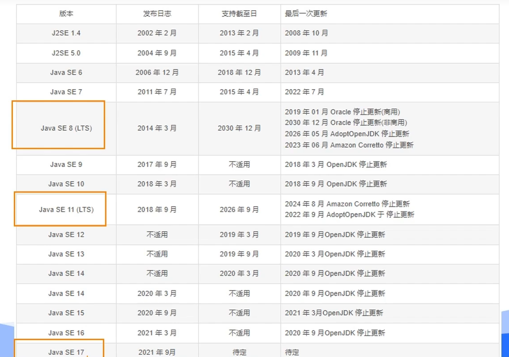
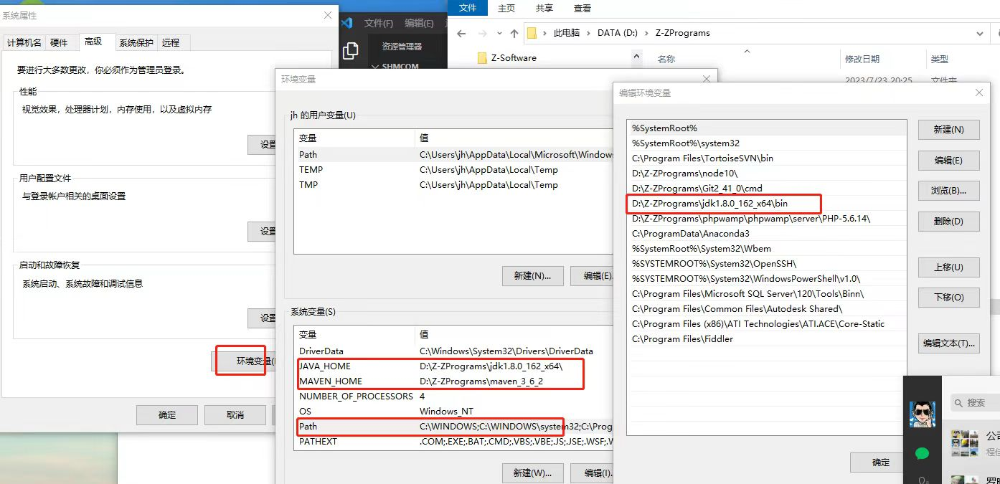
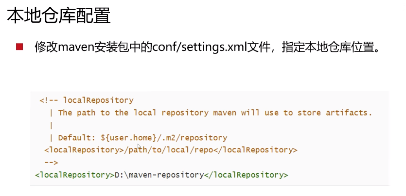

# Java




## JDK

Java Development Kit (JDK)是 Sun-公司(已被 Oracle 收购)针对 Java 开发员的软件开发工具包。自从 Java 推出以来，JDK 已经成为使用最广泛的 JavaSDK(Softwaredevelopment kit)



官网下载地址：<https://www.oracle.com/java/technologies/downloads/>



```bash
PS C:\Users\Administrator> java -version
java version "1.8.0_152"
Java(TM) SE Runtime Environment (build 1.8.0_152-b16)
Java HotSpot(TM) 64-Bit Server VM (build 25.152-b16, mixed mode)
```

## JDK8

#### 下载

官网：<https://www.oracle.com/java/technologies/downloads/#java8-windows>

华为镜像源：<https://repo.huaweicloud.com/java/jdk/8u171-b11/>

下载：jdk-8u171-windows-x64.exe

#### 环境变量

## Maven

选择 3.6 以上版本

配置本地仓库、远程仓库


