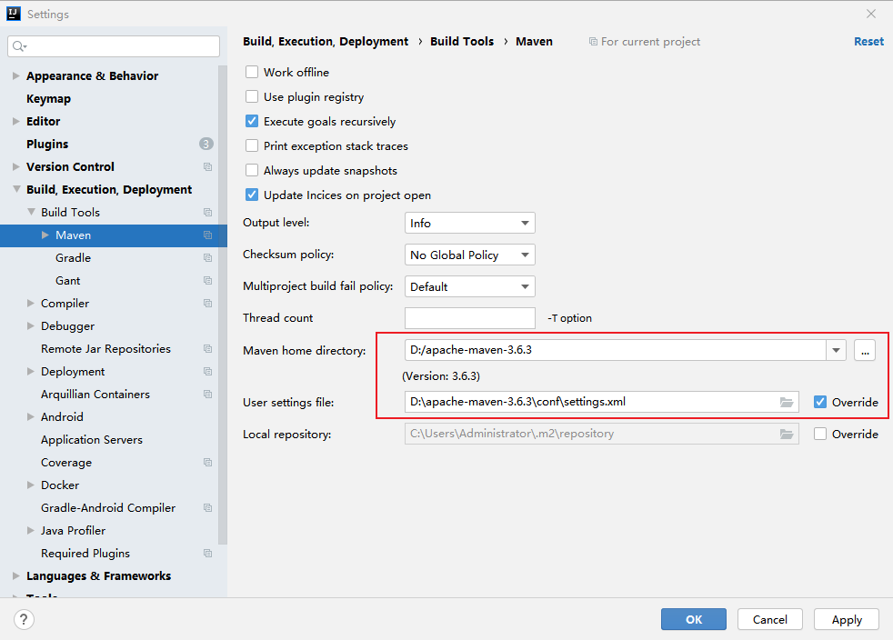

# 项目搭建

## 创建项目

#### 新建工程

file - new - project

项目类型选择 Maven 或者（Spring Initializr）

选择 SDK - Next

创建项目名称、选择项目路径 - Finish

#### SpringBoot 项目

Initialization failed for https://start.spring.io Please check URL, network and proxy settings 解决办法

<https://developer.aliyun.com/article/1168541>

#### 配置 Maven

file - settings - Build - build-tools - maven

## 热部署

## 系统配置
