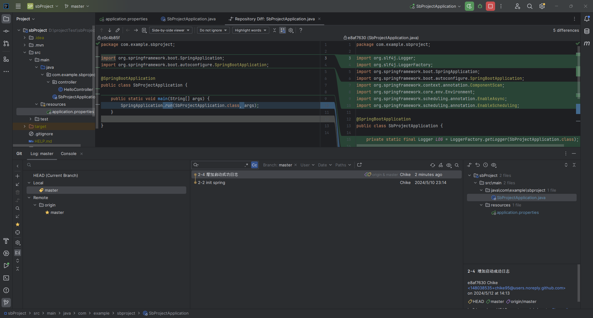
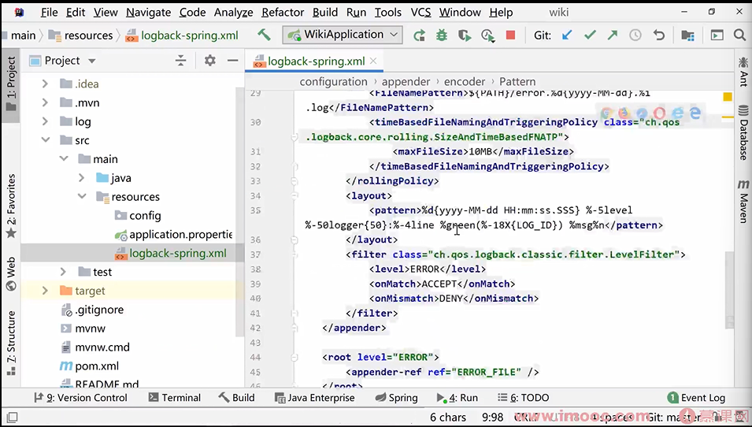
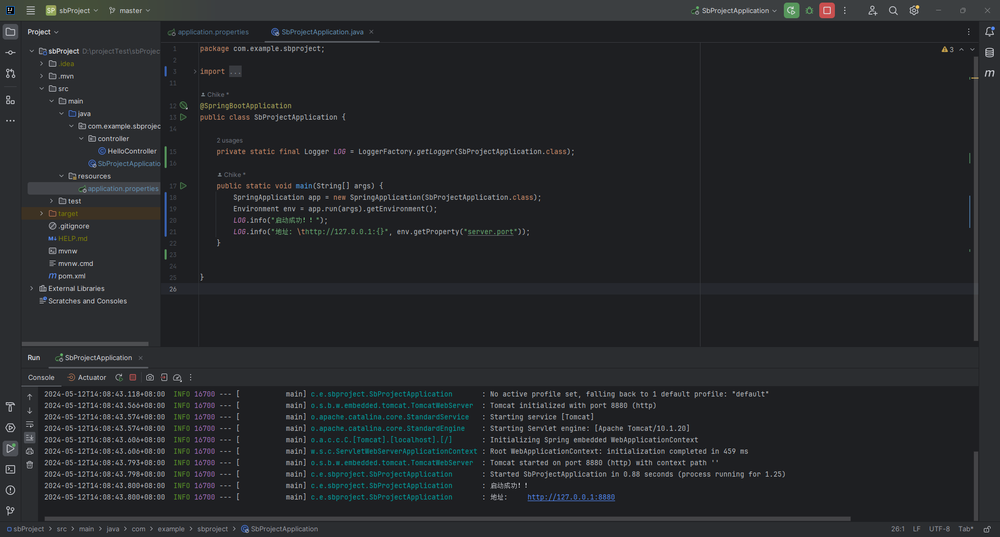
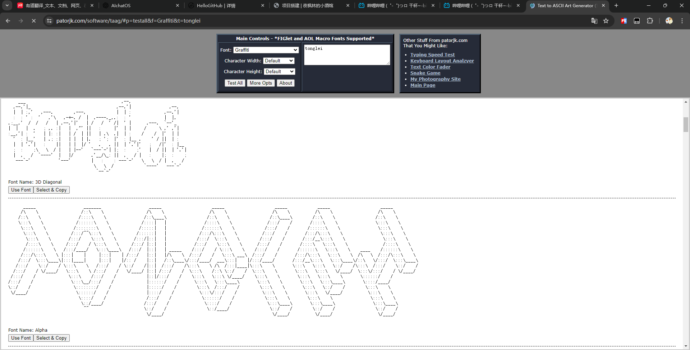
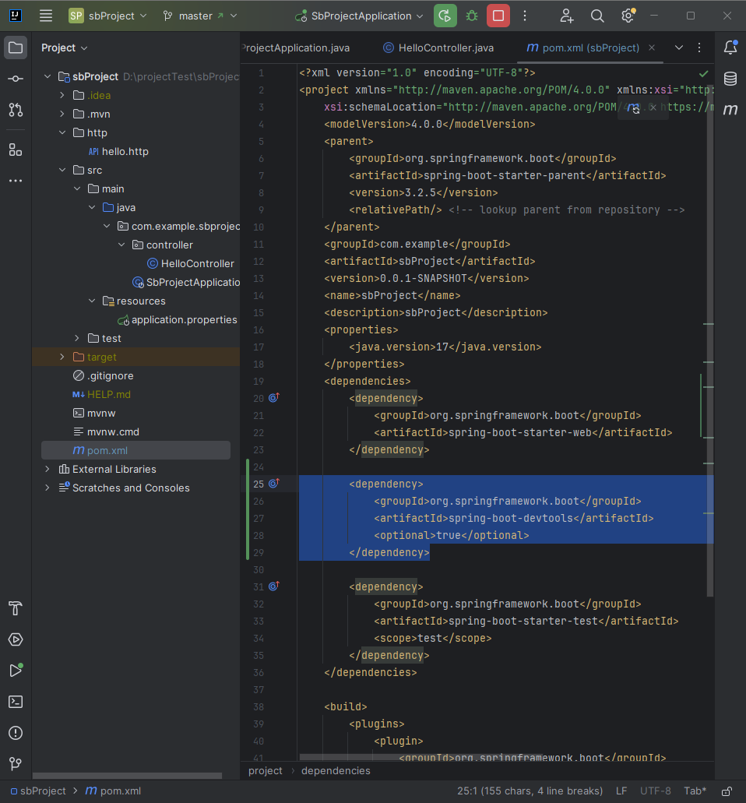
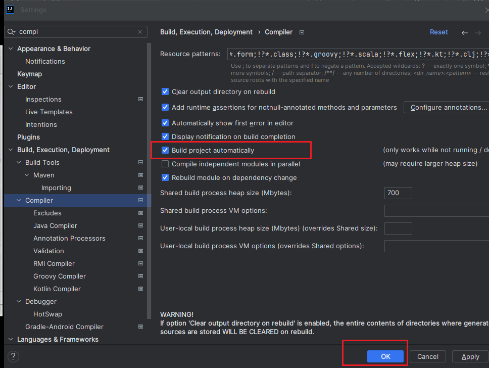
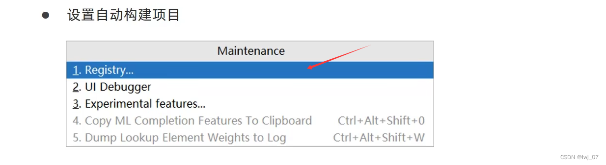
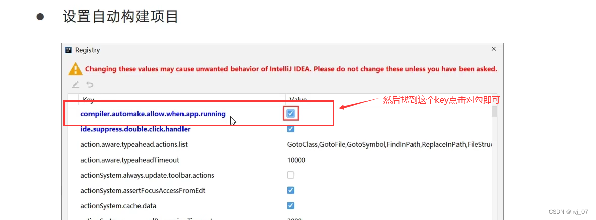
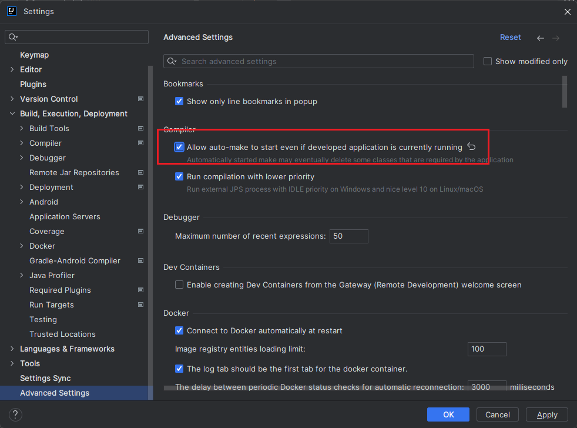
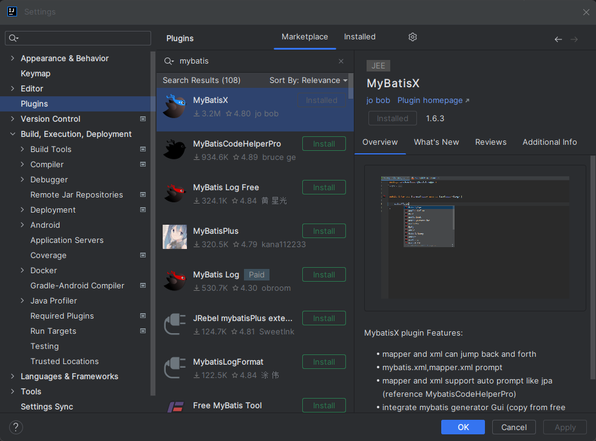

# 项目搭建

## 创建项目

### 创建maven工程


### 编写controller


## 代码结构

Spring Boot项目的代码结构通常如下：

- src/main/java：存放项目的Java代码。

- src/main/resources：存放项目的资源文件，如配置文件（application.properties或application.yml）、模板文件、国际化属性文件等。

- src/test/java：存放单元测试代码。

- pom.xml：Maven项目的项目对象模型（POM）文件，定义了项目的依赖、插件和其他配置。


## 项目配置

### 编码配置


### JDK 配置


### Maven


### Git

#### 设置版本管理工具


修改完成后：颜色变化


#### 提交代码


#### 关联远程仓库


#### 查看代码修改



### 日志优化

#### logback 日志样式修改



```xml
<?xml version="1.0" encoding="UTF-8"?>
<configuration>
    <!-- 修改一下路径-->
    <property name="PATH" value="./log"></property>

    <appender name="STDOUT" class="ch.qos.logback.core.ConsoleAppender">
        <encoder>
<!--            <Pattern>%d{yyyy-MM-dd HH:mm:ss.SSS} %highlight(%-5level) %blue(%-50logger{50}:%-4line) %thread %green(%-18X{LOG_ID}) %msg%n</Pattern>-->
            <Pattern>%d{ss.SSS} %highlight(%-5level) %blue(%-30logger{30}:%-4line) %thread %green(%-18X{LOG_ID}) %msg%n</Pattern>
        </encoder>
    </appender>

    <appender name="TRACE_FILE" class="ch.qos.logback.core.rolling.RollingFileAppender">
        <file>${PATH}/trace.log</file>
        <rollingPolicy class="ch.qos.logback.core.rolling.TimeBasedRollingPolicy">
            <FileNamePattern>${PATH}/trace.%d{yyyy-MM-dd}.%i.log</FileNamePattern>
            <timeBasedFileNamingAndTriggeringPolicy class="ch.qos.logback.core.rolling.SizeAndTimeBasedFNATP">
                <maxFileSize>10MB</maxFileSize>
            </timeBasedFileNamingAndTriggeringPolicy>
        </rollingPolicy>
        <layout>
            <pattern>%d{yyyy-MM-dd HH:mm:ss.SSS} %-5level %-50logger{50}:%-4line %green(%-18X{LOG_ID}) %msg%n</pattern>
        </layout>
    </appender>

    <appender name="ERROR_FILE" class="ch.qos.logback.core.rolling.RollingFileAppender">
        <file>${PATH}/error.log</file>
        <rollingPolicy class="ch.qos.logback.core.rolling.TimeBasedRollingPolicy">
            <FileNamePattern>${PATH}/error.%d{yyyy-MM-dd}.%i.log</FileNamePattern>
            <timeBasedFileNamingAndTriggeringPolicy class="ch.qos.logback.core.rolling.SizeAndTimeBasedFNATP">
                <maxFileSize>10MB</maxFileSize>
            </timeBasedFileNamingAndTriggeringPolicy>
        </rollingPolicy>
        <layout>
            <pattern>%d{yyyy-MM-dd HH:mm:ss.SSS} %-5level %-50logger{50}:%-4line %green(%-18X{LOG_ID}) %msg%n</pattern>
        </layout>
        <filter class="ch.qos.logback.classic.filter.LevelFilter">
            <level>ERROR</level>
            <onMatch>ACCEPT</onMatch>
            <onMismatch>DENY</onMismatch>
        </filter>
    </appender>

    <root level="ERROR">
        <appender-ref ref="ERROR_FILE" />
    </root>

    <root level="TRACE">
        <appender-ref ref="TRACE_FILE" />
    </root>

    <root level="INFO">
        <appender-ref ref="STDOUT" />
    </root>
</configuration>

```

#### 增加启动成功日志



```java
package com.example.sbproject;

import org.slf4j.Logger;
import org.slf4j.LoggerFactory;
import org.springframework.boot.SpringApplication;
import org.springframework.boot.autoconfigure.SpringBootApplication;
import org.springframework.context.annotation.ComponentScan;
import org.springframework.core.env.Environment;
import org.springframework.scheduling.annotation.EnableAsync;
import org.springframework.scheduling.annotation.EnableScheduling;

@SpringBootApplication
public class SbProjectApplication {

	private static final Logger LOG = LoggerFactory.getLogger(SbProjectApplication.class);

	public static void main(String[] args) {
		SpringApplication app = new SpringApplication(SbProjectApplication.class);
		Environment env = app.run(args).getEnvironment();
		LOG.info("启动成功！！");
		LOG.info("地址: \thttp://127.0.0.1:{}", env.getProperty("server.port"));
	}
}
```

#### 修改启动图案

banar.txt

```

```
百度搜索：字符图案

网址生成：<https://patorjk.com/software/taag>




 
### 热部署

（1）添加依赖

在pom.xml中添加Spring Boot DevTools依赖：
```xml
<dependency>
    <groupId>org.springframework.boot</groupId>
    <artifactId>spring-boot-devtools</artifactId>
    <optional>true</optional>
</dependency>
```



（2）IDE设置

在你的IDE中启用自动构建/编译功能。这确保了每次保存文件时，项目都会自动重新构建并应用变更。



（3）设置自启动

在项目中按：CTRL + ALT + SHIFT + / 找到Registry点击





::: warning 注意

有的idea版本在项目中点击CTRL + ALT + SHIFT + / 无反应，那么就可以点击CTRL+SHIFT+A搜索Registry点击进去找到上面的那个key在后面勾上对勾即可
:::



idea失去焦点 5s 后激活

或者 按 ctrl + F9 触发编译


### Mybatis

持久层框架：mybatis hibernate

#### 集成

（1）添加依赖

```xml
<!-- MyBatis -->
<dependency>
    <groupId>org.mybatis</groupId>
    <artifactId>mybatis</artifactId>
    <version>3.5.9</version>
</dependency>
<!-- 数据库驱动，例如MySQL -->
<dependency>
    <groupId>mysql</groupId>
    <artifactId>mysql-connector-java</artifactId>
    <version>8.0.28</version>
</dependency>
```

（2）配置文件

```properties
# 配置数据源
spring.datasource.url=jdbc:mysql://localhost:3306/test?useUnicode=true&characterEncoding=utf-8&useSSL=false&serverTimezone=UTC
spring.datasource.username=root
spring.datasource.password=123456
spring.datasource.driver-class-name=com.mysql.cj.jdbc.Driver
```

（3）配置持久层 Mapper

持久层叫Mapper层，即广为人知的Dao层。因为后续要用官方代码生成器，其生成的代码就是 XXXMapper.java 文件。

```java
package com.example.sbproject.mapper;

import org.apache.ibatis.annotations.Mapper;
import org.apache.ibatis.annotations.Select;

@Mapper
public interface UserMapper {
    @Select("SELECT * FROM user WHERE id = #{id}")
    User findById(Long id);
}
```

（4）配置Service

```java
package com.example.sbproject.service;

import com.example.sbproject.mapper.UserMapper;
import com.example.sbproject.model.User;
import org.springframework.beans.factory.annotation.Autowired;
import org.springframework.stereotype.Service;

@Service
public class UserService {
    @Autowired
    private UserMapper userMapper;

    public User findById(Long id) {
        return userMapper.findById(id);
    }
}
```

插件



当我们在写Springboot配置文件application.properties时引入mybatis配置文件出现以下情况：“ Cannot resolve configuration property ‘mybatis.mapper-location’ ”

<https://blog.csdn.net/m0_52734879/article/details/115408871>