# 项目搭建

## 创建项目

### 创建maven工程

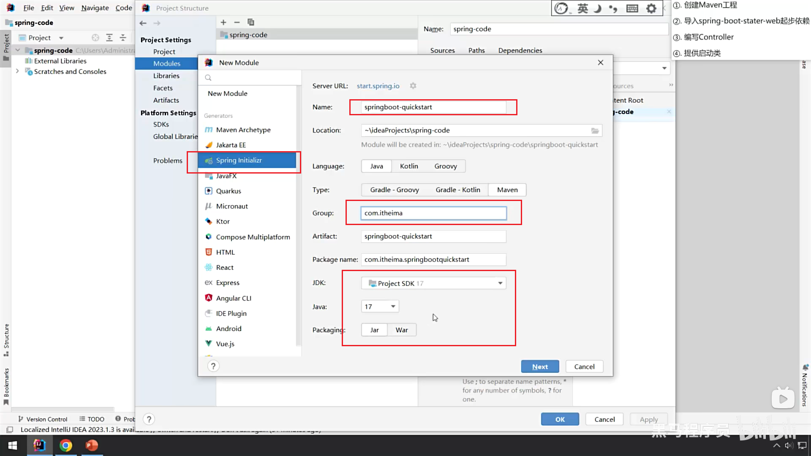

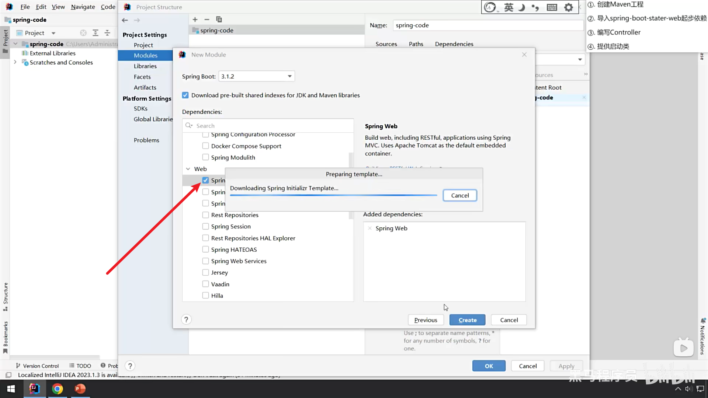

### 编写controller

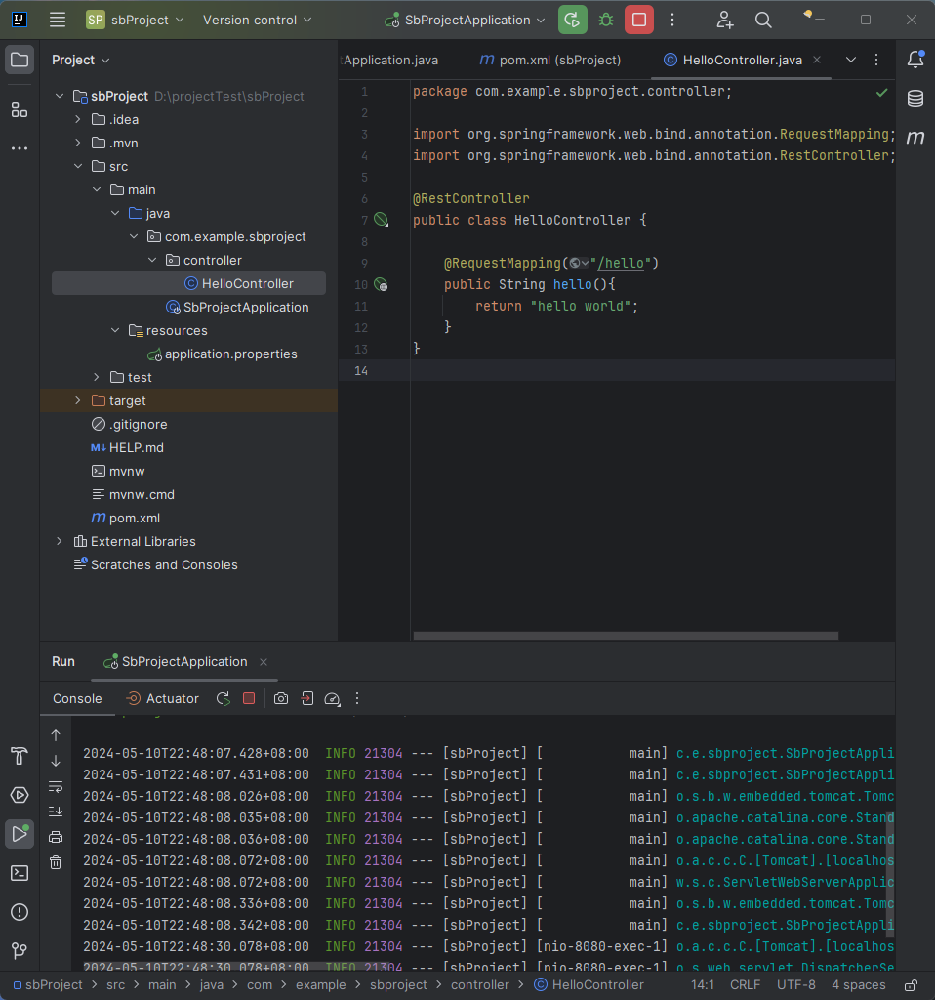

### 提供启动类

## 代码结构

Spring Boot项目的代码结构通常如下：

- src/main/java：存放项目的Java代码。

- src/main/resources：存放项目的资源文件，如配置文件（application.properties或application.yml）、模板文件、国际化属性文件等。

- src/test/java：存放单元测试代码。

- pom.xml：Maven项目的项目对象模型（POM）文件，定义了项目的依赖、插件和其他配置。

## 项目配置

### 编码配置

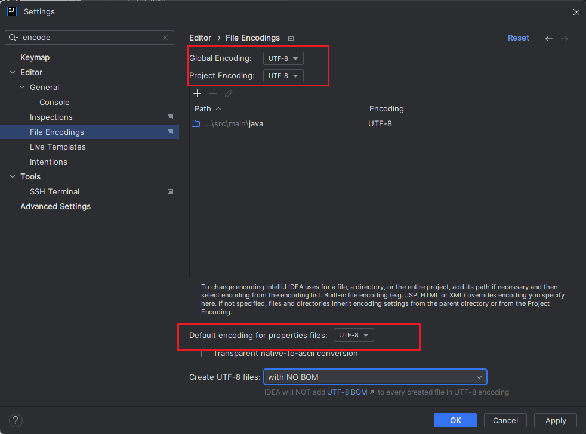

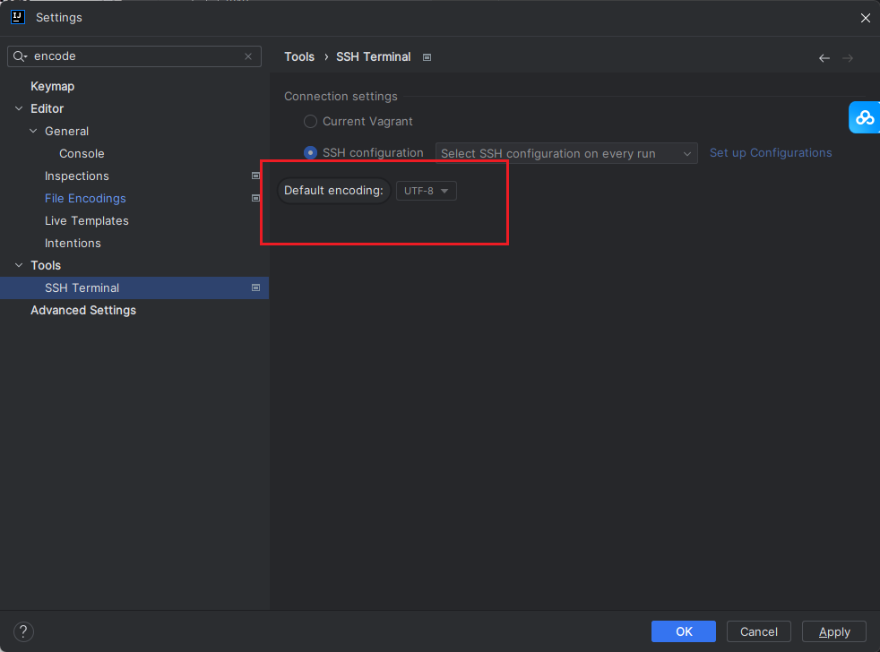

### JDK 配置

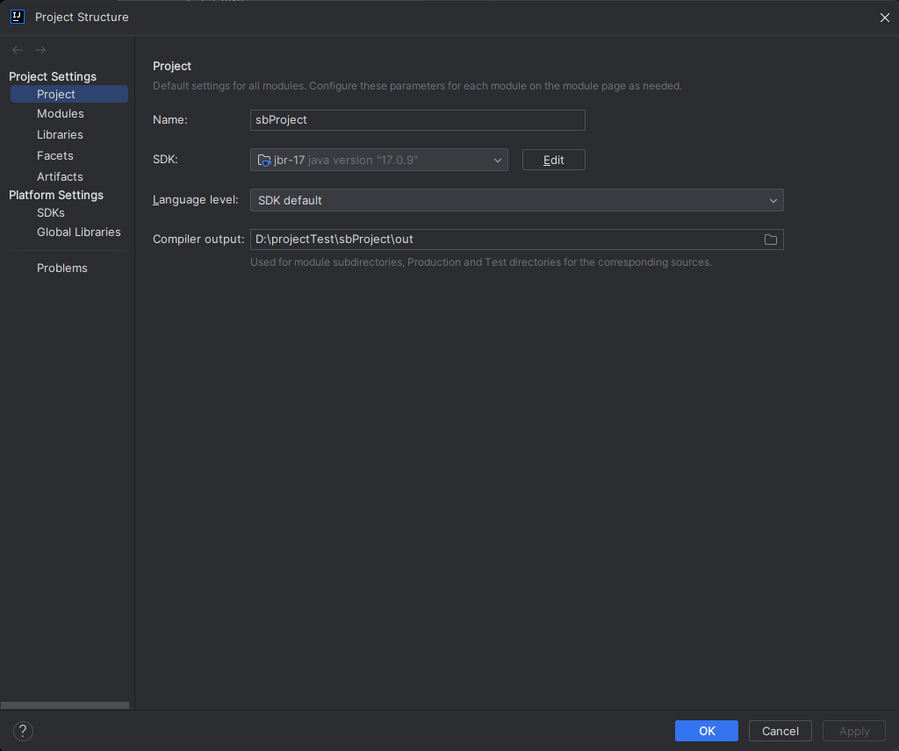

### Maven

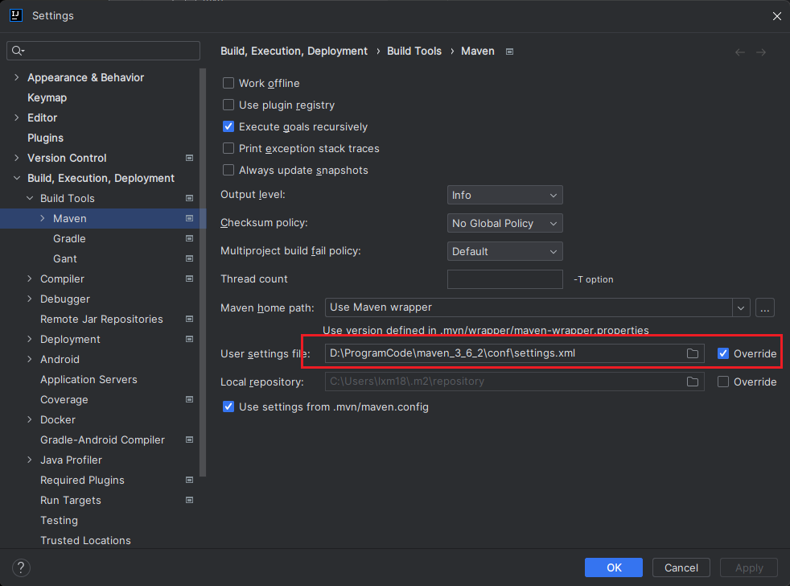

### Git

#### 设置版本管理工具

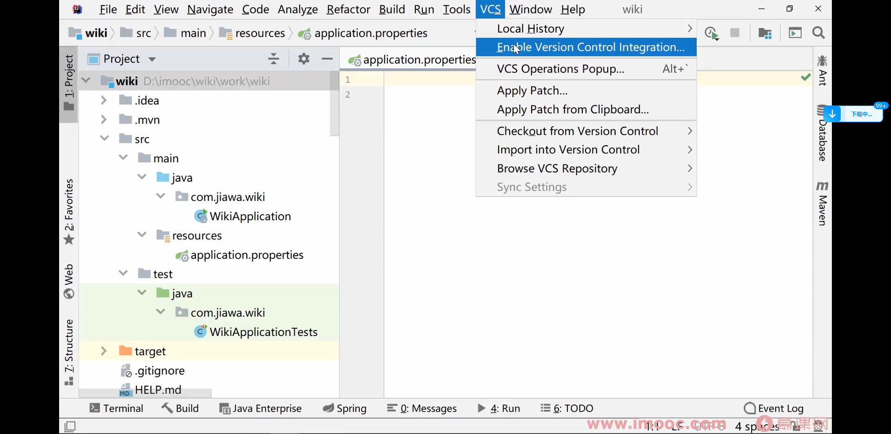

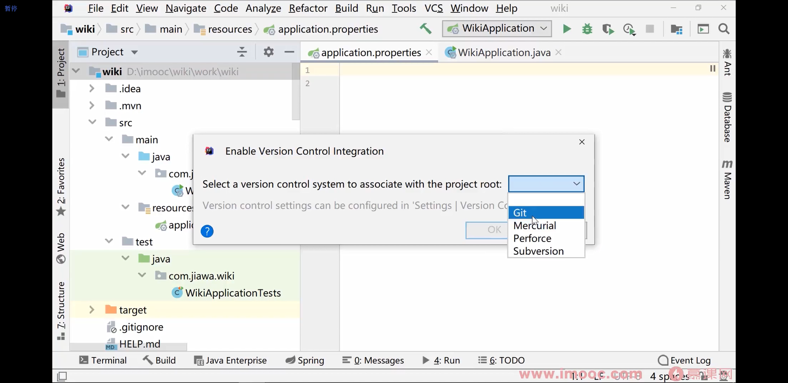

修改完成后：颜色变化

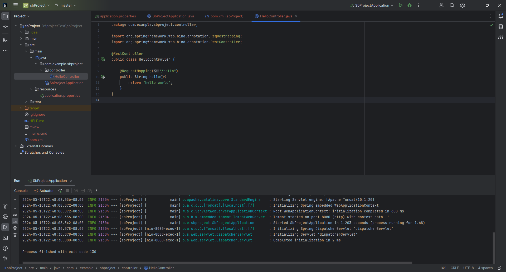

#### 提交代码

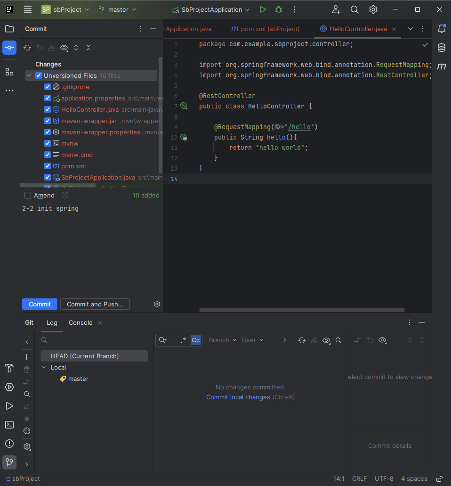

#### 关联远程仓库

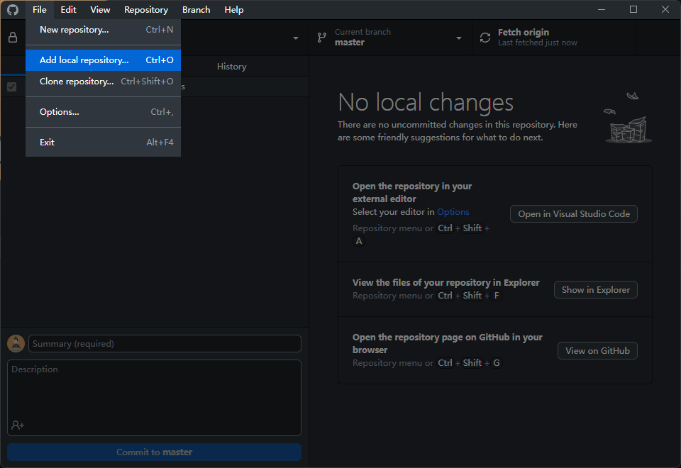

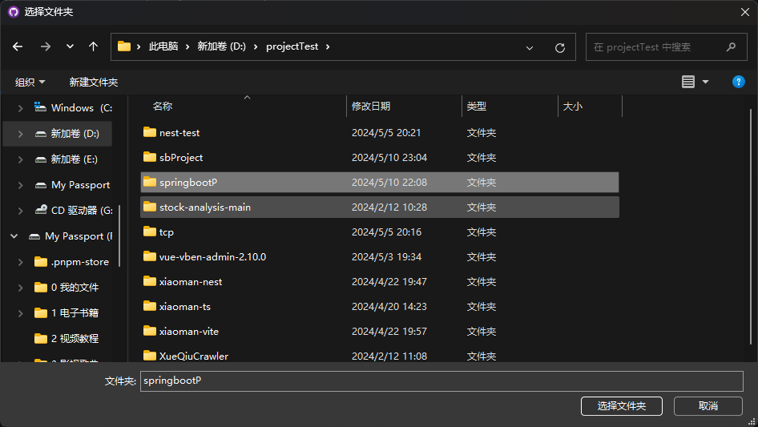

### 日志优化

### 配置文件

### 热部署

### git

### maven

