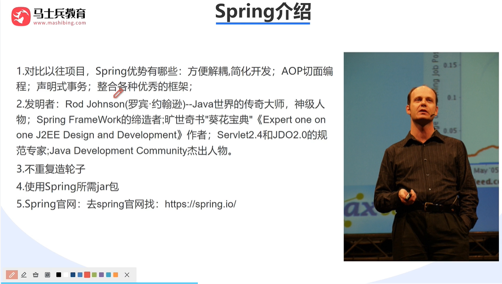
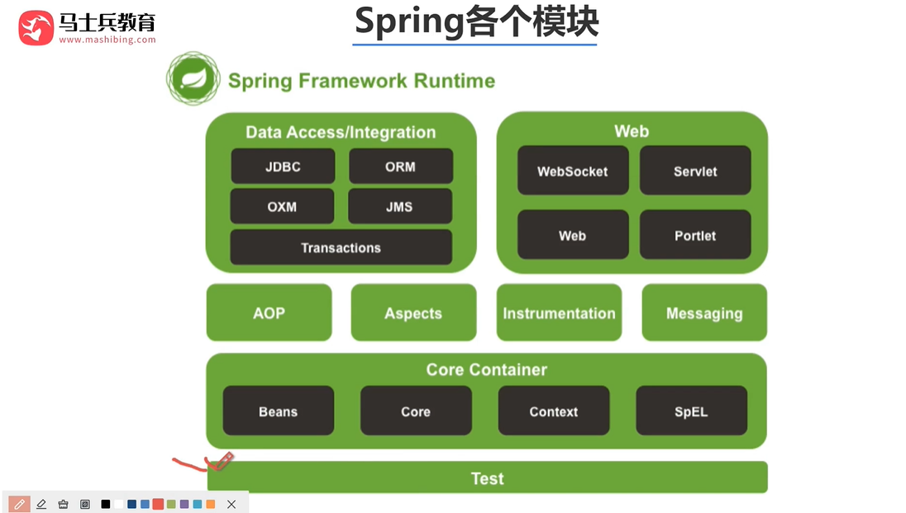
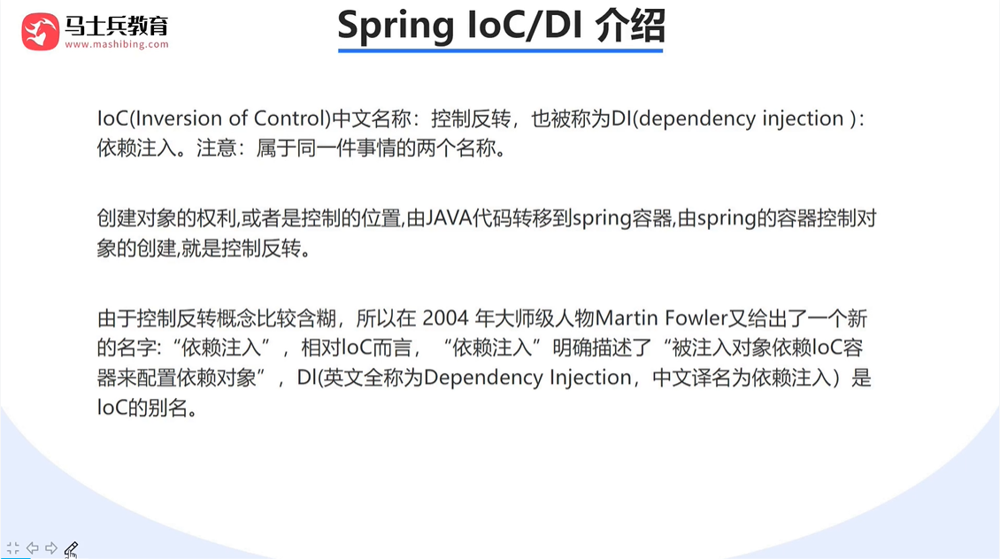
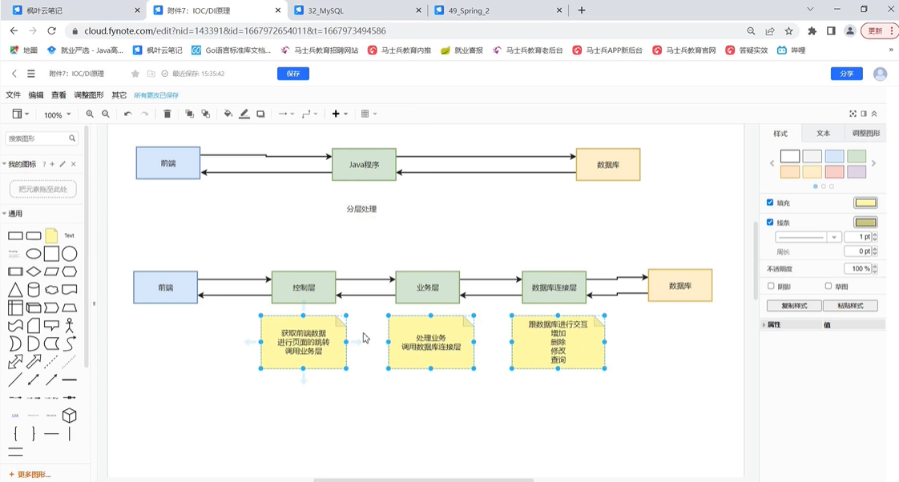
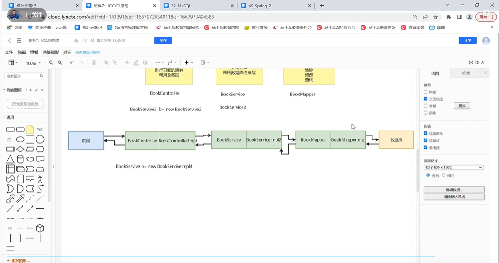

# spring

官网：<https://spring.io/>

## 编程哲学

### 控制反转

### 分层思想

### 面向接口

## SpringBoot

#### SpringBoot 特点

约定优于配置

内嵌 Tomcat（web 服务器）

定制化启动器 Starters，简化 maven 配置

提供生产级服务监控方案

### 过滤器 filter

### 拦截器 interceptor

常用于：登录校验、权限校验、请求日志打印等

### 面向切面编程 AOP

添加依赖
