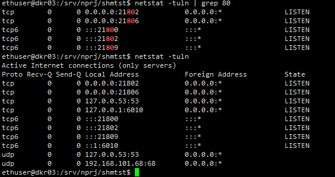

# linux

## 未分类

### 内存情况

```bash
free -h
```

### 硬盘情况

```bash
df -h
```

### 清理磁盘

清理下载的软件包的缓存

```bash
sudo apt-get autoclean
sudo apt-get clean

```

### 查看端口使用情况

```sh
netstat -an
netstat -an|grep 40023


netstat -tuln
netstat -tuln | grep 8081
```

- t: 显示 TCP 端口
- u: 显示 UDP 端口
- l: 仅显示监听的端口
- n: 以数字形式显示端口和 IP 地址，而不是尝试解析成主机名

  

## 文件处理


### 创建文件 

```bash
touch ~
```

### 复制文件

```bash
cp /etc/project/myfile.txt /home/myfolder
```

### 创建文件夹

```bash
mkdir myfolder

```

### 移动文件

```bash
mv /etc/project/myfile.txt /home/myfolder
```

### 删除文件

```bash
rm -r myfolder
```

### 实时输出文件内容

```bash
tail -f tl-whal.log
```

## 软件

### 7zip 解压

```bash
sudo apt update

sudo apt install p7zip-full

7z x node_modules.7z
```
