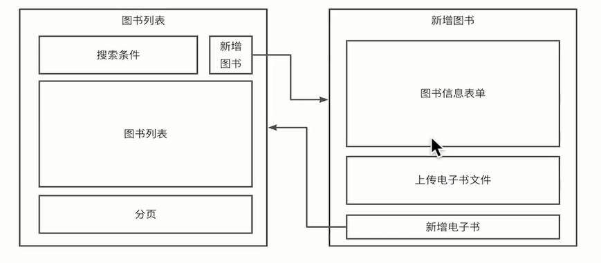
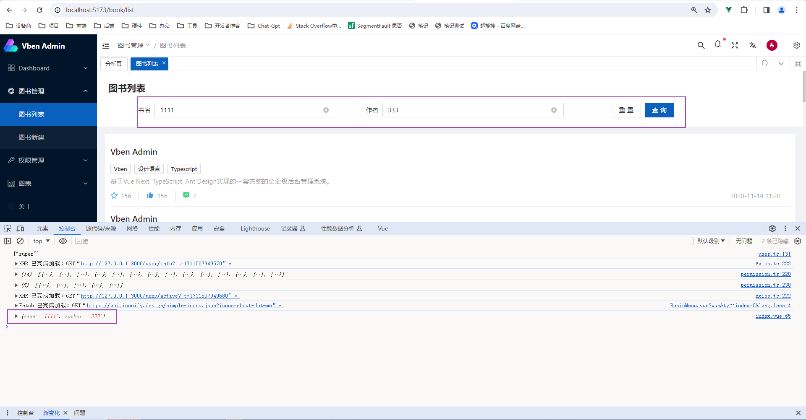

# 五、图书功能



### 页面模板

图书列表：component: () => import('/@/views/book/list/index.vue')

列表模板：component: () => import('/@/views/demo/page/list/search/index.vue')

图书新建：component: () => import('/@/views/book/create/index.vue')

新建模板：component: () => import('/@/views/demo/page/form/high/index.vue')

### 路由配置

D:\project\zhenpath\vue-vben-admin-2.10\src\router\routes\modules\book.ts

### 多语言

D:\project\zhenpath\vue-vben-admin-2.10\src\locales\lang\en\routes\book.ts

### 新建菜单

## 图书列表

#### 表单提交

事件定义：basicForm.vue

方法：useFormEvents()

```js
emits: ['advanced-change', 'reset', 'submit', 'register', 'field-value-change'],

submit: handleSubmit,  // 表单提交预处理
```

事件绑定

```js
<BasicForm
  :class="`${prefixCls}__header-form`"
  :labelWidth="100"
  :schemas="schemas"
  showActionButtonGroup   // 开启重置/查询按钮组
  @submit="handleSearch"  // 定义表单提交事件
/>
```



#### 分页器

组件地址：<https://www.antdv.com/components/pagination-cn>

（1）添加组件：

```js
<a-pagination
  v-model:current="current1"
  v-model:page-size="pageSize1"
  :total="85"
  :show-total="(total) => `Total ${total} items`"
/>
```

（2）引入组件

```js
import { Tag, List, Pagination } from "ant-design-vue";
```

(3)定义组件

```js
  export default defineComponent({
    components: {
      [List.Item.name]: List.Item,
      AListItemMeta: List.Item.Meta,
      [Pagination.name]: Pagination,
    },
```

### book 模型

D:\project\zhenpath\nest-admin\src\modules\book\book.entity.ts

```js
import { Column, Entity, PrimaryGeneratedColumn, Unique } from "typeorm";

@Entity("book")
export class Book {
  @PrimaryGeneratedColumn() // 主键 自增
  id: number;

  @Column()
  @Unique(["filename"])
  filename: string;

  @Column()
  cover: string;

  @Column()
  title: string;

  @Column()
  author: string;

  @Column()
  publisher: string;

  @Column()
  bookId: number;

  @Column()
  category: number;

  @Column()
  categoryText: string;

  @Column()
  language: string;

  @Column()
  rootFile: string;

  // 1 - 可用， 0 - 不可用
  @Column({ default: 1 })
  active: number;
}

export default Book;
```

### 后端查询

方法：Get

接口：/book?page=1&pageSize=20&title=q

## 图书新建

## 上传图书

## 解析图书
