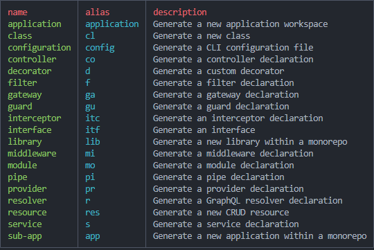

# CLI

安装

```bash
npm install -g @nestjs/cli
```

创建项目

```bash
nest new project-name
```

启动项目 我们需要热更新 就启动npm run start:dev就可以了

```bash
"start": "nest start",
"start:dev": "nest start --watch",
"start:debug": "nest start --debug --watch",
"start:prod": "node dist/main",
```
### 常用命令



生成 module.ts

```bash
nest g module module-name
```

生成 controller.ts

```bash
nest g controller controller-name
```

生成 service.ts

```bash
nest g service service-name
```


命令生成CURD

```bash
nest g resource user
```

