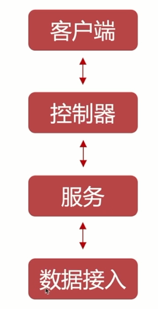

# 控制器



控制器负责处理传入的请求和向客户端返回响应。

Nest 中的控制器是一个类，它继承自 `BaseController` 类，并实现至少一个路由处理函数。

## 路由

使用 @Controller() 装饰器定义一个基本的控制器。

可选 路由路径前缀设置为 cats。在 @Controller() 装饰器中使用路径前缀可以使我们轻松地对一组相关的路由进行分组，并最大程度地减少重复代码。

```ts
import { Controller, Get } from "@nestjs/common";

@Controller("cats")
export class CatsController {
  @Get()
  findAll(): string {
    return "This action returns all cats";
  }
}
```

## request

下面是 Nest 提供的 request 装饰器及其代表的底层平台特定对象的对照列表。

| 装饰器                  | 方法                          |
| ----------------------- | :---------------------------- |
| @Request()              | @Req() req                    |
| @Response()             | @Res() res                    |
| @Next()                 | next                          |
| @Session()              | req.session                   |
| @Param(key?: string)    | req.params/req.params[key]    |
| @Body(key?: string)     | req.body/req.body[key]        |
| @Query(key?: string)    | req.query/req.query[key]      |
| @Headers(name?: string) | req.headers/req.headers[name] |
| @Ip()                   | req.ip                        |
| @HostParam()            | req.hosts                     |

## 动态路由

动态路由通过使用冒号 (:) 作为参数前缀来定义。

```ts
@Get(':id')
findOne(@Param('id') id: string) {
  return this.catsService.findOne(id);
}

```

## headers

使用 @Headers() 装饰器来访问请求头。

```ts
@Post()
@Header('Cache-Control', 'none')
create() {
  // ...
}

```

## 状态码

默认情况下，响应的状态码总是默认为 200，除了 POST 请求（默认响应状态码为 201），我们可以通过在处理函数外添加 @HttpCode（...） 装饰器来轻松更改此行为。

```ts
@Post()
@HttpCode(204)
create() {
  return 'This action adds a new cat';
}

```
