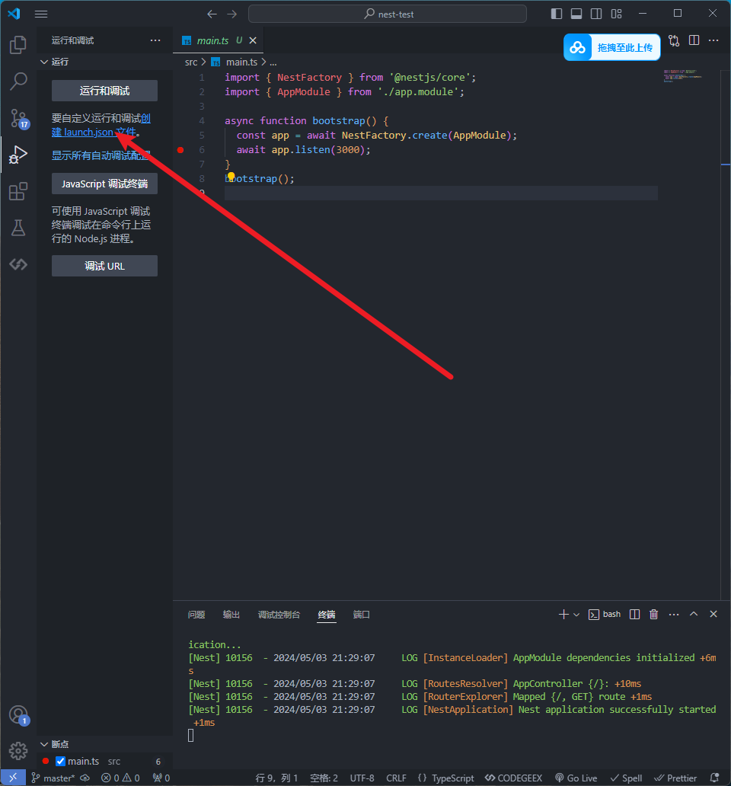
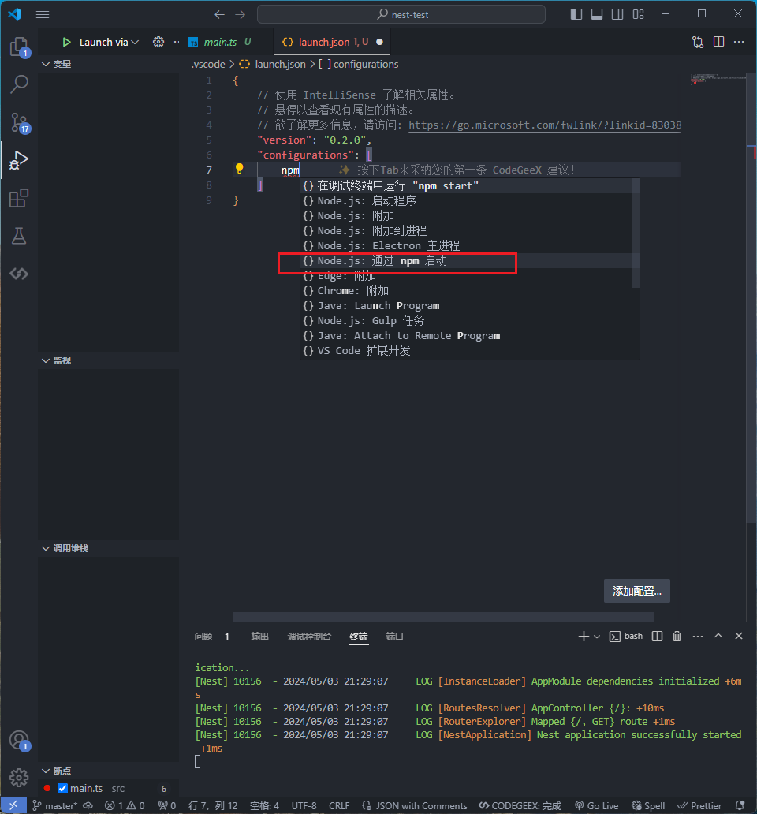
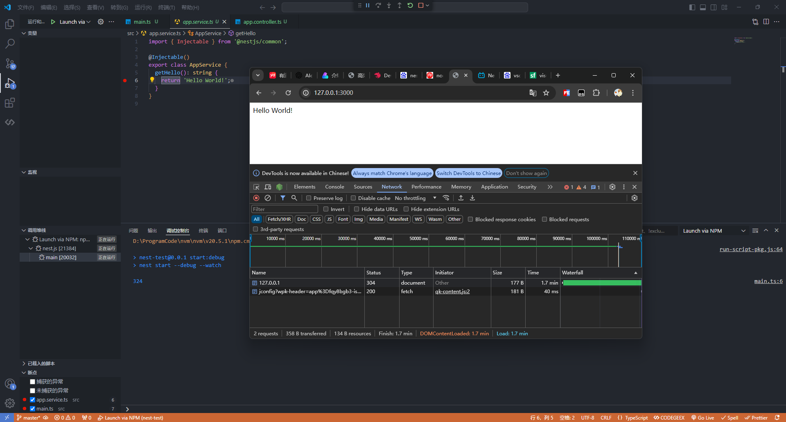
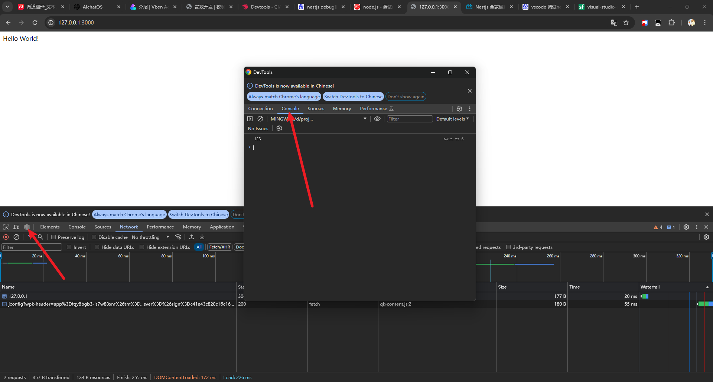
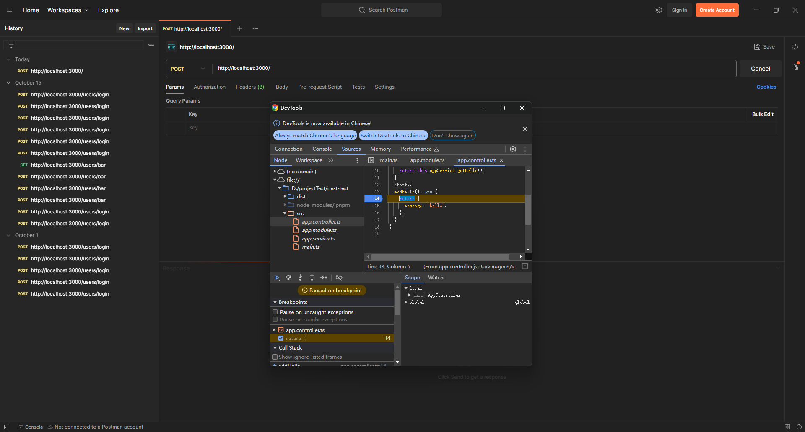

# 高效开发

## 热重载

非必要

地址：<https://nest.nodejs.cn/recipes/hot-reload>

## VSCode配置

(1) 新建配置



(2) 修改配置



调试报错：端口占用

原因：未关闭原有的运行程序


```json
{
    // 使用 IntelliSense 了解相关属性。 
    // 悬停以查看现有属性的描述。
    // 欲了解更多信息，请访问: https://go.microsoft.com/fwlink/?linkid=830387
    "version": "0.2.0",
    "configurations": [
        {
            "name": "Launch via NPM",
            "request": "launch",
            "runtimeArgs": [
                "run-script",
                "start:debug" // 修改脚本
            ],
            "runtimeExecutable": "npm",
            "runtimeVersion": "20.5.1",    // 设置node版本
            "internalConsoleOptions": "neverOpen",  // 关闭内置控制台
            "skipFiles": [
                "<node_internals>/**"
            ],
            "type": "node"
        }
    ]
}

```



其它调试方法：<https://segmentfault.com/a/1190000019064197?utm_source=tag-newest>

```json
{
    "version": "0.2.0",
    "configurations": [
        {
            "name": "Attach to node",
            "type": "node",
            "request": "attach",
            "restart": true,
            "processId": "${command:PickProcess}"
        }
    ]
}
```

## Chrome 调试

适用于线上发布后调试

```bash
$ nest start --help
Usage: nest start [options] [app]

Run Nest application.

Options:
  -c, --config [path]        Path to nest-cli configuration file.
  -p, --path [path]          Path to tsconfig file.
  -w, --watch                Run in watch mode (live-reload).
  -b, --builder [name]       Builder to be used (tsc, webpack, swc).
  --watchAssets              Watch non-ts (e.g., .graphql) files mode.
  -d, --debug [hostport]     Run in debug mode (with --inspect flag).
  --webpack                  Use webpack for compilation (deprecated option, use --build instead).
  --webpackPath [path]       Path to webpack configuration.
  --type-check               Enable type checking (when SWC is used).
  --tsc                      Use tsc for compilation.
  --sourceRoot [sourceRoot]  Points at the root of the source code for the single project in standard mode structures, or the default project in monorepo mode structures.
  --entryFile [entryFile]    Path to the entry file where this command will work with. Defaults to the one defined at your Nest's CLI config file.
  -e, --exec [binary]        Binary to run (default: "node").
  --preserveWatchOutput      Use "preserveWatchOutput" option when tsc watch mode.
  -h, --help                 Output usage information.

```

调试指令

```bash
pnpm start:debug
```


### Post请求

chrome中找到原文件，打好断点，然后访问该路由

