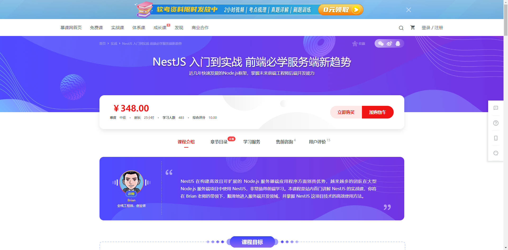
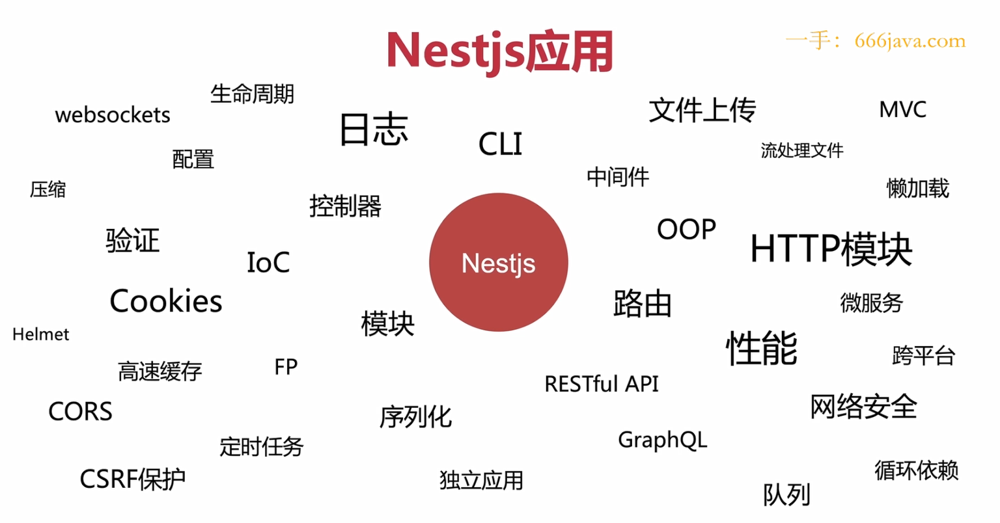
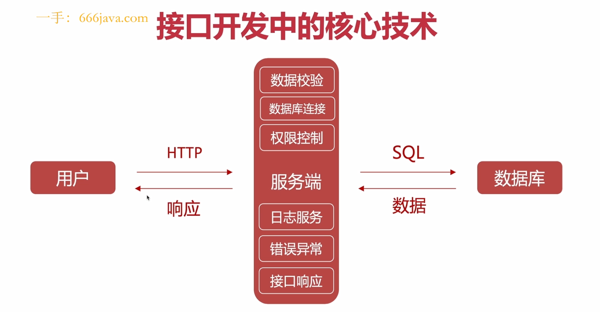
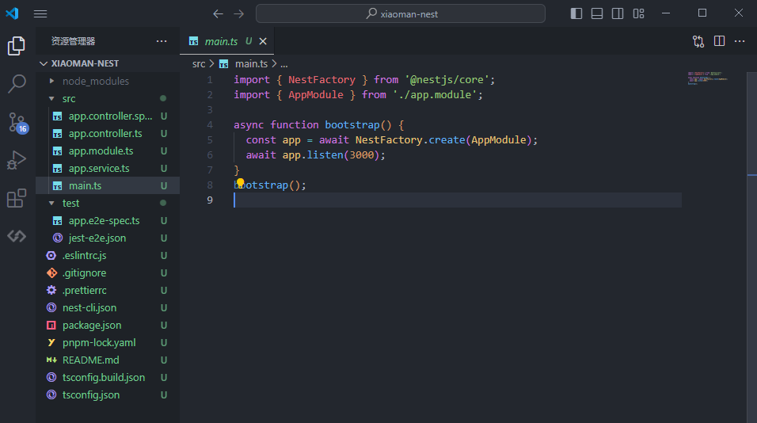

# NestJs

- Nestjs 是一个用于构建高效可扩展的一个基于Node js 服务端 应用程序开发框架

- 完全支持typeScript  结合了 AOP 面向切面的编程方式

- nestjs 还是一个spring MVC 的风格 其中有依赖注入 IOC 控制反转 都是借鉴了Angualr

- nestjs 的底层代码运用了 express 和  Fastify 在他们的基础上提供了一定程度的抽象，同时也将其 API 直接暴露给开发人员。这样可以轻松使用每个平台的无数第三方模块


官方文档: <https://nest.nodejs.cn/>

中文文档: <https://docs.nestjs.cn/10/firststeps>

github：<https://github.com/nestjs/nest>

参考教程1：小满 nestjs

视频：<https://www.bilibili.com/video/BV1NG41187Bs/>

文档：<https://blog.csdn.net/qq1195566313/category_11844396.html>

参考教程2：



视频：<https://coding.imooc.com/class/617.html/>

文档：





## 设计模式

IOC：Inversion of Control 字面意思是控制反转，具体定义是高层模块不应该依赖低层模块，二者都应该依赖其抽象；抽象不应该依赖细节；细节应该依赖抽象。

DI: 依赖注入（Dependency Injection）其实和 IoC 是同根生，这两个原本就是一个东西，只不过由于控制反转概念比较含糊（可能只是理解为容器控制对象这一个层面，很难让人想到谁来维护对象关系），所以 2004 年大师级人物 Martin Fowler 又给出了一个新的名字：“依赖注入”。 类 A 依赖类 B 的常规表现是在 A 中使用 B 的 instance。

案例：未使用控制反转和依赖注入之前的代码

```java
class A {
    name: string;
    constructor() {
        this.name = 'lxm';
    }
}

class B {
    a: any;
    constructor(){
        this.a = new A().name;
    }
}

class C {
    a: any;
    constructor(){
        this.a = new A().name;
    }
}
```
我们可以看到，B 中代码的实现是需要依赖 A 的，两者的代码耦合度非常高。当两者之间的业务逻辑复杂程度增加的情况下，维护成本与代码可读性都会随着增加，并且很难再多引入额外的模块进行功能拓展。

为了解决这个问题可以使用IOC容器

```ts
class A {
    name: string
    constructor(name: string) {
        this.name = name
    }
}
 
 
class C {
    name: string
    constructor(name: string) {
        this.name = name
    }
}
//中间件用于解耦
class Container {
    modeuls: any
    constructor() {
        this.modeuls = {}
    }
    provide(key: string, modeuls: any) {
        this.modeuls[key] = modeuls
    }
    get(key) {
        return this.modeuls[key]
    }
}
 
const mo = new Container()
mo.provide('a', new A('小满1'))
mo.provide('c', new C('小满2'))
 
class B {
    a: any
    c: any
    constructor(container: Container) {
        this.a = container.get('a')
        this.c = container.get('c')
    }
}
 
new B(mo)
```


## 目录结构

### main.ts

main.ts 入口文件主文件 类似于vue 的main.ts

通过 NestFactory.create(AppModule) 创建一个app  就是类似于绑定一个根组件App.vue

app.listen(3000) 监听一个端口



### app.module.ts

app.module.ts 根模块用于处理其他类的引用与共享，app.controller.ts 常见功能是用来处理 http 请求以及调用 service 层的处理方法app.service.ts 封装通用的业务逻辑、与数据层的交互(例如数据库)、其他额外的一些三方请求

```ts
// app.module.ts
import { Module } from '@nestjs/common';
import { AppController } from './app.controller';
import { AppService } from './app.service';

@Module({
  imports: [],
  controllers: [AppController],
  providers: [AppService],
})
export class AppModule {}
```

### app.controller.ts


可以理解成vue 的路由

private readonly appService: AppService 这一行代码就是依赖注入不需要实例化  appService 它内部会自己实例化的我们主需要放上去就可以了

```ts
// app.controller.ts
import { Controller, Get } from '@nestjs/common';
import { AppService } from './app.service';

@Controller('app')
export class AppController {
  constructor(private readonly appService: AppService) {}

  @Get()
  getHello(): string {
    return this.appService.getHello();
  }
}
```

### app.service.ts

这个文件主要实现业务逻辑的 当然Controller可以实现逻辑，但是就是单一的无法复用，放到app.service有别的模块也需要就可以实现复用

```ts
// app.service.ts
import { Injectable } from '@nestjs/common';

@Injectable()
export class AppService {
  getHello(): string {
    return 'Hello World!';
  }
}
```

### Dto.ts

Dto 数据传输对象 用于接收前端传递过来的数据

```ts
// user.dto.ts
import { IsString } from 'class-validator';

export class CreateUserDto {
  @IsString()
  name: string;

  @IsString()
  password: string;
}
```

### Entity.ts

实体类 用于定义数据库表结构

```ts
// user.entity.ts
import { Entity, Column, PrimaryGeneratedColumn } from 'typeorm';

@Entity()
export class User {
    @PrimaryGeneratedColumn()
    id: number;

    @Column()
    name: string;

    @Column()
    password: string;
}
```

### Repository.ts

Repository 用于操作数据库

```ts
// user.repository.ts
import { EntityRepository, Repository } from '@nestjs/typeorm';
import { User } from './user.entity';

@EntityRepository(User)
export class UserRepository extends Repository<User> {}
```

