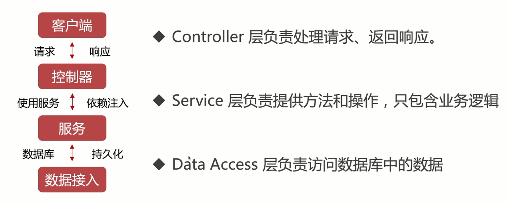
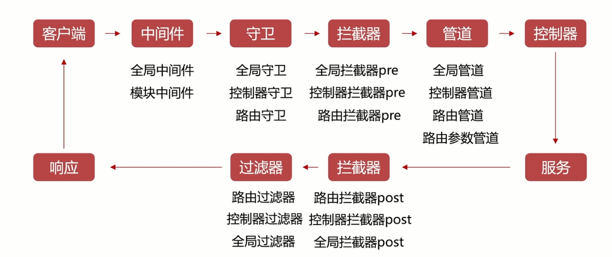
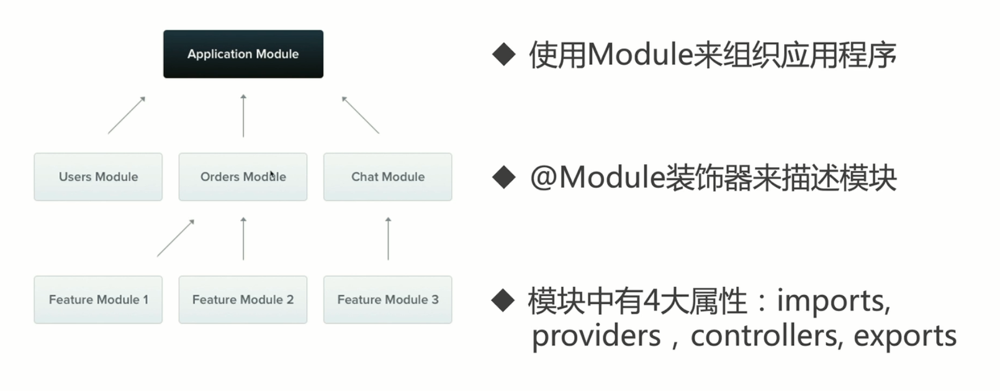
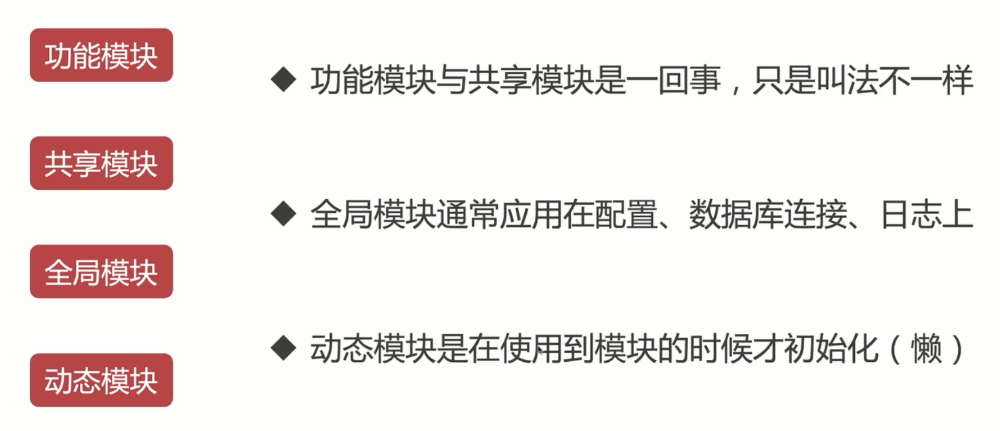
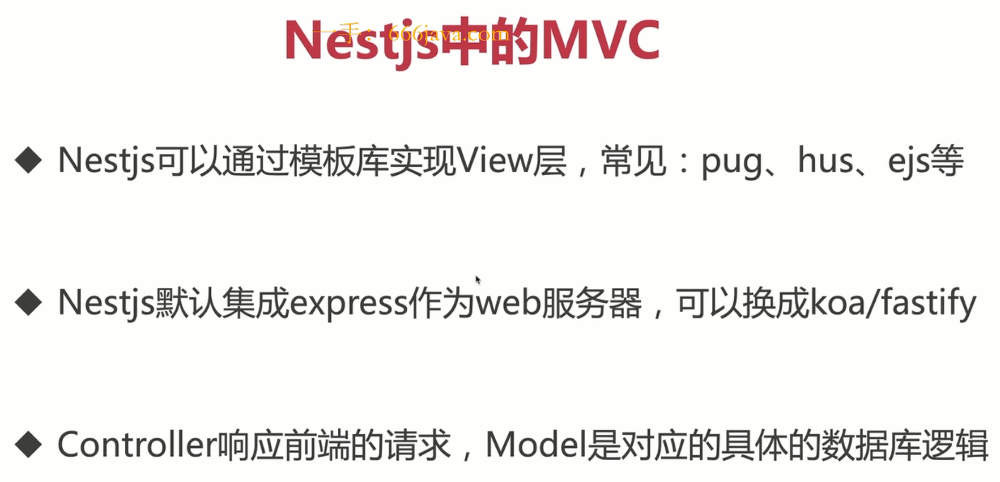
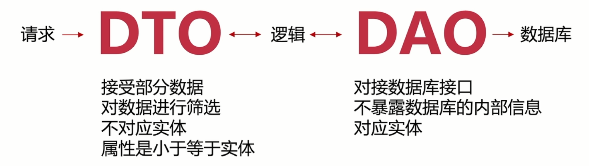

# NestJs

- Nestjs 是一个用于构建高效可扩展的一个基于 Node js 服务端 应用程序开发框架

- 完全支持 typeScript 结合了 AOP 面向切面的编程方式

- nestjs 还是一个 spring MVC 的风格 其中有依赖注入 IOC 控制反转 都是借鉴了 Angualr

- nestjs 的底层代码运用了 express 和 Fastify 在他们的基础上提供了一定程度的抽象，同时也将其 API 直接暴露给开发人员。这样可以轻松使用每个平台的无数第三方模块

官方文档: <https://nest.nodejs.cn/>

中文文档: <https://docs.nestjs.cn/10/firststeps>

github：<https://github.com/nestjs/nest>

参考教程 1：小满 nestjs

视频：<https://www.bilibili.com/video/BV1NG41187Bs/>

文档：<https://blog.csdn.net/qq1195566313/category_11844396.html>

参考教程 2：


视频：<https://coding.imooc.com/class/617.html/>

文档：


## 设计模式

### 面向切面编程 AOP

面向对象的补充

- 扩展功能方便，不影响业务之间的逻辑

- 逻辑集中管理

- 利于代码复用

- 典型案例：nestjs

### 依赖注入与控制反转

IOC：控制反转（Inversion of Control ），具体定义是高层模块不应该依赖低层模块，二者都应该依赖其抽象；抽象不应该依赖细节；细节应该依赖抽象。

DI: 依赖注入（Dependency Injection）其实和 IoC 是同根生，这两个原本就是一个东西，只不过由于控制反转概念比较含糊（可能只是理解为容器控制对象这一个层面，很难让人想到谁来维护对象关系），所以 2004 年大师级人物 Martin Fowler 又给出了一个新的名字：“依赖注入”。 类 A 依赖类 B 的常规表现是在 A 中使用 B 的 instance。

控制反转(Inversion of Control)是一种是面向对象编程中的一种设计原则，用来减低计算机代码之间的耦合度。其基本思想是:借助于第三方”实现具有依赖关系的对象之间的解耦。

依赖注入(Dependency Injection)是一种用于实现 IoC 的设计模式它允许在类外创建依赖对象，并通过不同的方式将这些对象提供给类

#### 小满案例

案例：未使用控制反转和依赖注入之前的代码

```java
class A {
    name: string;
    constructor() {
        this.name = 'lxm';
    }
}

class B {
    a: any;
    constructor(){
        this.a = new A().name;
    }
}

class C {
    a: any;
    constructor(){
        this.a = new A().name;
    }
}
```

我们可以看到，B 中代码的实现是需要依赖 A 的，两者的代码耦合度非常高。当两者之间的业务逻辑复杂程度增加的情况下，维护成本与代码可读性都会随着增加，并且很难再多引入额外的模块进行功能拓展。

为了解决这个问题可以使用 IOC 容器

```ts
class A {
  name: string;
  constructor(name: string) {
    this.name = name;
  }
}

class C {
  name: string;
  constructor(name: string) {
    this.name = name;
  }
}
//中间件用于解耦
class Container {
  modeuls: any;
  constructor() {
    this.modeuls = {};
  }
  provide(key: string, modeuls: any) {
    this.modeuls[key] = modeuls;
  }
  get(key) {
    return this.modeuls[key];
  }
}

const mo = new Container();
mo.provide("a", new A("小满1"));
mo.provide("c", new C("小满2"));

class B {
  a: any;
  c: any;
  constructor(container: Container) {
    this.a = container.get("a");
    this.c = container.get("c");
  }
}

new B(mo);
```

#### 慕课案例

#### reflect-metadata 库

npm 地址：<https://www.npmjs.com/package/reflect-metadata>

## 项目架构

### 架构分层



### 生命周期



### 模块化

类似前端组件化





### MVC

- Model 数据模型
- View 视图
- Controller 控制器



### DTO & DAO

Data Transter Object 数据传输对象

Data Access Object 数据访问对象



## 目录结构

### main.ts

main.ts 入口文件主文件 类似于 vue 的 main.ts

通过 NestFactory.create(AppModule) 创建一个 app 就是类似于绑定一个根组件 App.vue

app.listen(3000) 监听一个端口


### app.module.ts

app.module.ts 根模块用于处理其他类的引用与共享，app.controller.ts 常见功能是用来处理 http 请求以及调用 service 层的处理方法 app.service.ts 封装通用的业务逻辑、与数据层的交互(例如数据库)、其他额外的一些三方请求

```ts
// app.module.ts
import { Module } from "@nestjs/common";
import { AppController } from "./app.controller";
import { AppService } from "./app.service";

@Module({
  imports: [],
  controllers: [AppController],
  providers: [AppService],
})
export class AppModule {}
```

### app.controller.ts

可以理解成 vue 的路由

private readonly appService: AppService 这一行代码就是依赖注入不需要实例化 appService 它内部会自己实例化的我们主需要放上去就可以了

```ts
// app.controller.ts
import { Controller, Get } from "@nestjs/common";
import { AppService } from "./app.service";

@Controller("app")
export class AppController {
  constructor(private readonly appService: AppService) {}

  @Get()
  getHello(): string {
    return this.appService.getHello();
  }
}
```

### app.service.ts

这个文件主要实现业务逻辑的 当然 Controller 可以实现逻辑，但是就是单一的无法复用，放到 app.service 有别的模块也需要就可以实现复用

```ts
// app.service.ts
import { Injectable } from "@nestjs/common";

@Injectable()
export class AppService {
  getHello(): string {
    return "Hello World!";
  }
}
```

### Dto.ts

Dto 数据传输对象 用于接收前端传递过来的数据

```ts
// user.dto.ts
import { IsString } from "class-validator";

export class CreateUserDto {
  @IsString()
  name: string;

  @IsString()
  password: string;
}
```

### Entity.ts

实体类 用于定义数据库表结构

```ts
// user.entity.ts
import { Entity, Column, PrimaryGeneratedColumn } from "typeorm";

@Entity()
export class User {
  @PrimaryGeneratedColumn()
  id: number;

  @Column()
  name: string;

  @Column()
  password: string;
}
```

### Repository.ts

Repository 用于操作数据库

```ts
// user.repository.ts
import { EntityRepository, Repository } from "@nestjs/typeorm";
import { User } from "./user.entity";

@EntityRepository(User)
export class UserRepository extends Repository<User> {}
```
