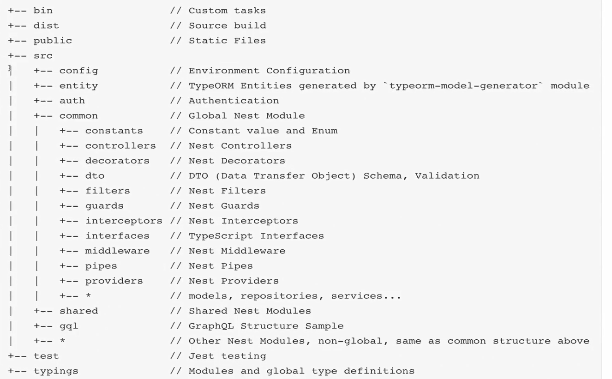
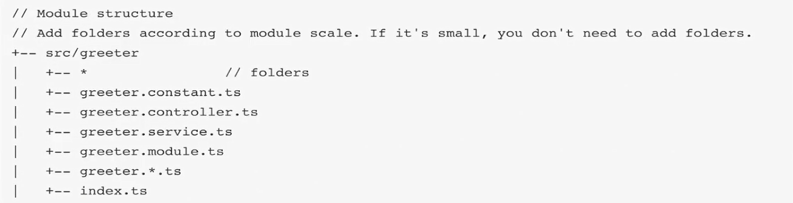

# 项目规范

约定大于配置

## 工程目录

### 作者推荐

链接：<https://github.com/nestjs/nest/issues/2249>

```bash
- src
  - core
  - common
    - middleware
    - interceptors
    - guards
  - user
      - interceptors (scoped interceptors)
    - user.controller.ts
    - user.model.ts
  - store
    - store.controller.ts
    - store.model.ts
```
- 没有模块目录，按照功能进行划分。

- 把通用的东西归为单独的目录:common，比如:拦截器/守卫/管道

### 参考1

地址：<https://github.com/kentloog/nestjs-sequelize-typescript>

特点:
- 项目文档及相关的资源在根目录
- 数据库及项目配置会放在根目录(细节:数据库升级文件)
- sze中会对功能进行划分建不同的文件夹users、posts
- 单个功能文件夹中，会包括一个完整CURD的相关文件(dto/controller/module/providers/service)
- 抽离公共配置到 shared 文件夹

### 参考项目2

地址：<https://github.com/International-Slackline-Association/Rankings-Backend>

特点:
- 根目录中存放webpack、微服务配置+项目文档
- src中会对功能进行划分建不同的文件夹:api、core、dynamodb-stream、image-resizer
- 在核心模块中，按照功能模块进划分，与之相关的entity、service放置在同一文件夹中
- 抽离公共配置到shared文件夹:常量、自定义的装饰器、统一错误处理、过滤器、生成器、守卫、日志服务

### 参考项目3

国人 CMS BLOG

地址：<https://github.com/surmon-china/nodepress/>

### 参考项目4（推荐）

地址：<https://github.com/CatsMiaow/nestjs-project-structure>



功能模块



特点:
- 项目文档及相关的资源在根目录，包括typings、test、bin
- src 中会对功能进行划分建不同的文件夹
- 抽离公共代码到common 文件夹，配置文件放在config文件夹，实体类放置在entity中
- 鉴权相关的逻辑放在 auth
- 把同类的guards、filters、decorators、interceptors、interfaces、errors存放在common文件夹中

## 代码规范
我们对Angular风格指南进行了摘抄，如下:参考:Angular风格指南

### 总则
- 坚持每个文件只定义一样东西(例如服务或组件)考虑把文件大小限制在 400 行代码以内

- 坚持定义简单函数

- 考虑限制在 75 行之内

### 命名

- 坚持所有符号使用一致的命名规则

- 坚持遵循同一个模式来描述符号的特性和类型

- 使用点和横杠来分隔文件名
  
- 坚持 在描述性名字中，用横杠来分隔单词。
  
- 坚持使用点来分隔描述性名字和类型。
  
- 坚持遵循先描述组件特性，再描述它的类型的模式，对所有组件使用一致的类型命名规则。推荐的模式为feature.type.tso
  
- 坚持使用惯用的后缀来描述类型，如*.service、*.component、*.pipe、.module、.directive。必要时可以创建更多类型名，但必须注意，不要创建太多

### 符号名与文件名

- 坚持为所有东西使用一致的命名约定，以它们所代表的东西命名。
  
- 坚持使用大写驼峰命名法来命名类
  
- 坚持匹配符号名与它所在的文件名
  
- 坚持在符号名后面追加约定的类型后缀(例如Uomponent、Directive、Module、pipe、service ) UserModule
  
- 坚持在文件名后面追加约定的类型后缀(例如
.module.ts、pipe.ts、.service.ts).component.ts、.directive.ts

- 坚持使用中线命名法(dashed-case)或叫烤串命名法(kebab-case)来命名组件的元素选择器。

