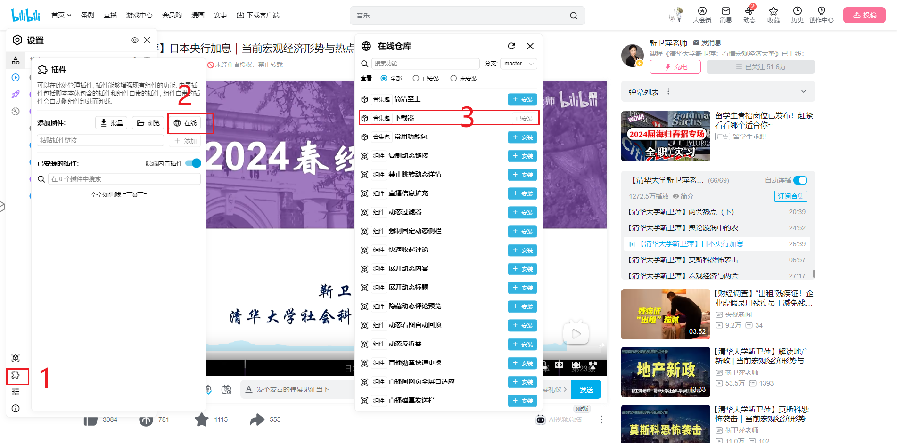
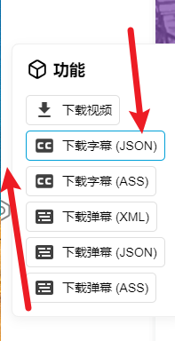
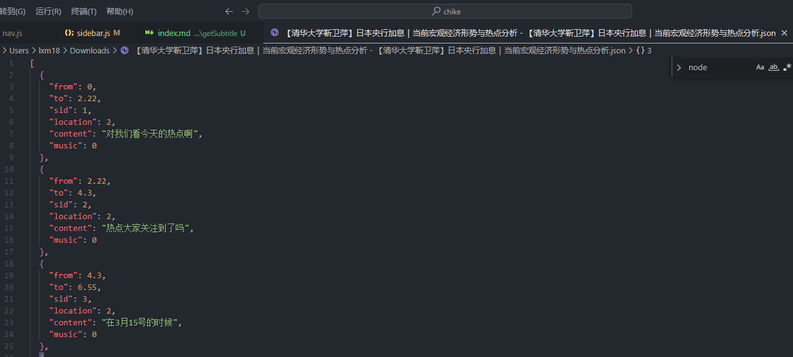
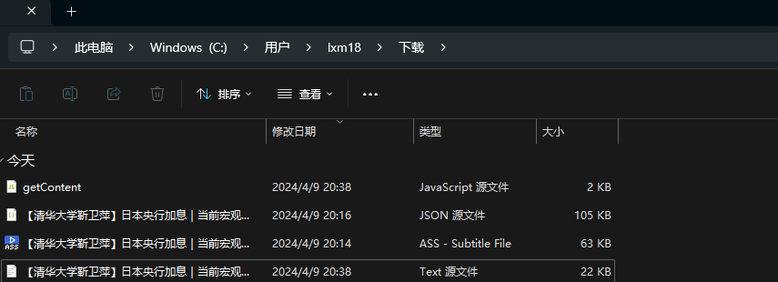
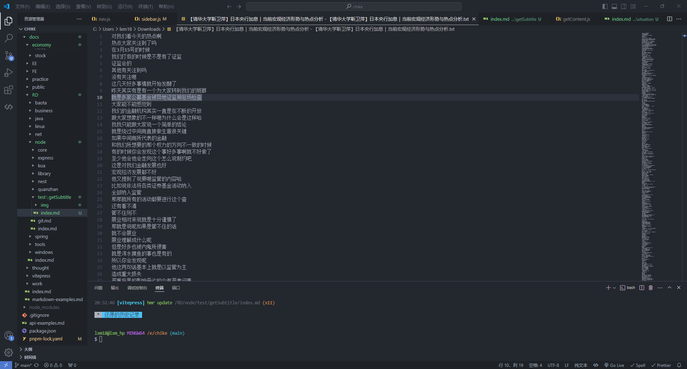

# 获取 JSON 文件中的字幕内容

## 安装插件

油猴子：<https://www.tampermonkey.net/>

哔哩哔哩增强脚本: <https://github.com/the1812/Bilibili-Evolved>





## 设计

### 需求分析

需要将 JSON 文件中的字幕内容提取出来，并保存到一个新的 txt 文件中。

字幕内容位于 json 对象的 content 属性中



### 实现思路

1. 由于 json 文件每次从浏览器下载后位于同一位置，所有可以考虑程序直接放入该目录下

2. 使用 nodejs 自动将 json 文件中的 content 内容读出存入一个新的 txt 文件中，文件名跟 json 文件一致

## 代码

## 获取字幕

```js
const fs = require("fs");
const path = require("path");

// 要读取的文件夹路径
const folderPath = "./";

// 读取文件夹中的所有文件
fs.readdir(folderPath, (err, files) => {
  if (err) {
    console.error("读取文件夹时发生错误:", err);
    return;
  }

  // 遍历文件夹中的所有文件
  files.forEach((file) => {
    // 检查文件扩展名是否为.json
    if (path.extname(file) === ".json") {
      // 读取JSON文件
      fs.readFile(path.join(folderPath, file), "utf8", (err, data) => {
        if (err) {
          console.error(`读取文件 ${file} 时发生错误:`, err);
          return;
        }

        try {
          // 将JSON字符串转换为JavaScript对象
          const jsonData = JSON.parse(data);

          // 提取content内容
          const contentArray = jsonData.map((item) => item.content);

          // 写入txt文件
          const txtFilePath = path.join(
            folderPath,
            path.basename(file, ".json") + ".txt"
          );
          fs.writeFile(txtFilePath, contentArray.join("\n"), (err) => {
            if (err) {
              console.error(`写入文件 ${txtFilePath} 时发生错误:`, err);
              return;
            }
            console.log(`内容已写入到 ${txtFilePath} 文件中`);
          });
        } catch (parseError) {
          console.error(`解析文件 ${file} 时发生错误:`, parseError);
        }
      });
    }
  });
});
```

## 效果





## 自动转换
