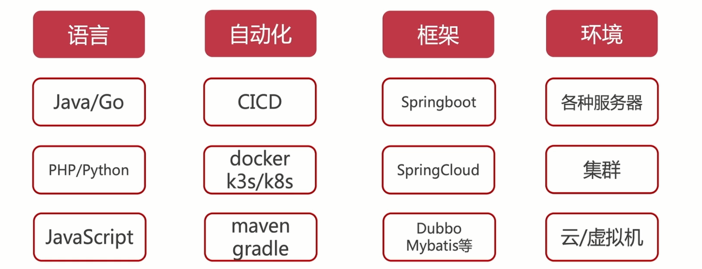

# 后端开发哲学

### 整体流程

### 知识图谱

语言

自动化

框架

环境

设计模式

## 编程范式

### 面向对象编程

- 封装、继承、多态

- 抽象现象生活中的事物特征，对于理解友好

- java c#

### 面向过程编程

### 函数式编程

- 确定的数据输入、输出；没有副作用，相对独立

- 引用透明、对 IDE 友好、易于理解

－ vue / react 的书写方式

### 函数式响应编程

- 适合需要对事件流进行复杂组合应用的场景

- 响应式多用在异步的场景

- 典型案例：rxjs，广告推荐

### 面向切面编程 AOP

面向对象的补充

- 扩展功能方便，不影响业务之间的逻辑

- 逻辑集中管理

- 利于代码复用

- 典型案例：nestjs

## 后端设计

### 需求分析

- 项目用户最痛点的问题是什么？是角色设计？

- 用户功能的最小闭环是什么？内容查询&筛选？

- 辅助最小闭环的实现到项目上线，需要什么技术&方案？

### 技术栈选型

### 通用接口服务设计

- 接口服务：服务可靠、可拓展的 web 服务，集成数据库+redis

- 实现最小闭环：接口 CURD、登录注册（认证）、权限控制（鉴权）

- 服务部署与测试 -> 提供文档（需求、测试、部署、产品）

### 面向对象

### 接口设计

接口是对抽象能力的抽象，接口是抽象能力的集合。

企鹅不会飞是"真的不会飞"了?

接口不是用来抽象自身的“内在能力”（扇翅膀），而是用来反映外部可观测的效应（真的能飞起来）。扇翅膀这个没有实际作用的能力抽象出来有什么用，卖萌吗？
接口实现抛异常不是好设计，只是对坏设计的无可奈何的补救。

### 组合、继承
