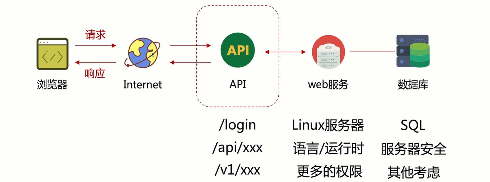
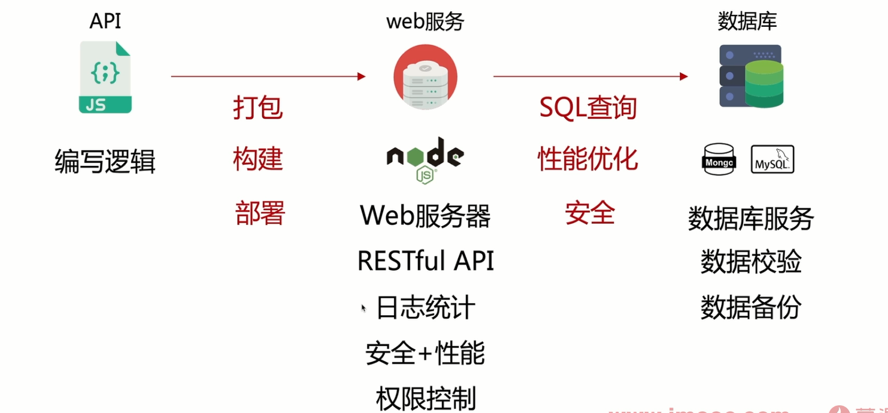
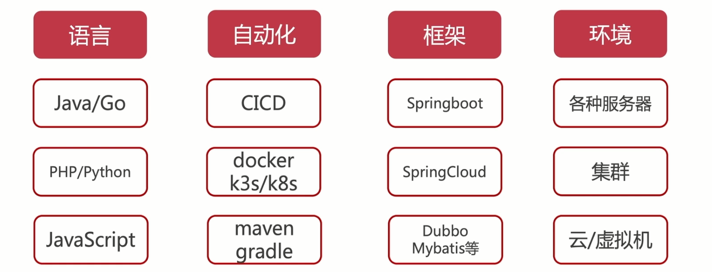

# 后端编程思想

### 整体流程

### 知识图谱

语言

自动化

框架

环境

设计模式

## 编程范式

### 面向对象编程

- 封装、继承、多态

- 抽象现象生活中的事物特征，对于理解友好

- java c#

### 面向过程编程

### 函数式编程

- 确定的数据输入、输出；没有副作用，相对独立

- 引用透明、对 IDE 友好、易于理解

－ vue / react 的书写方式

### 函数式响应编程

- 适合需要对事件流进行复杂组合应用的场景

- 响应式多用在异步的场景

- 典型案例：rxjs，广告推荐

### 面向切面编程 AOP

面向对象的补充

- 扩展功能方便，不影响业务之间的逻辑

- 逻辑集中管理

- 利于代码复用

- 典型案例：nestjs
