# MYSQL

MySQL数据库最初是由瑞典MySQLAB公司开发，2008年1月16号被Sun公司收购2009年，SUN又被Oracle收购。

MySQL数据库具有体积小、速度快、成本低、跨平台、开放源码等优点

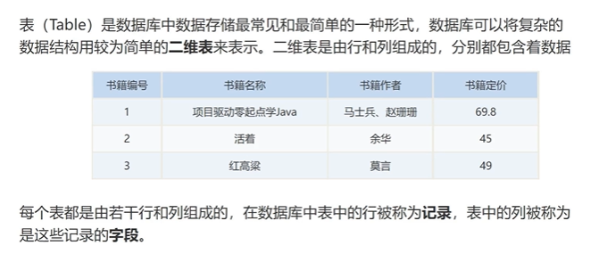

### 创建数据表

（1）创建数据库

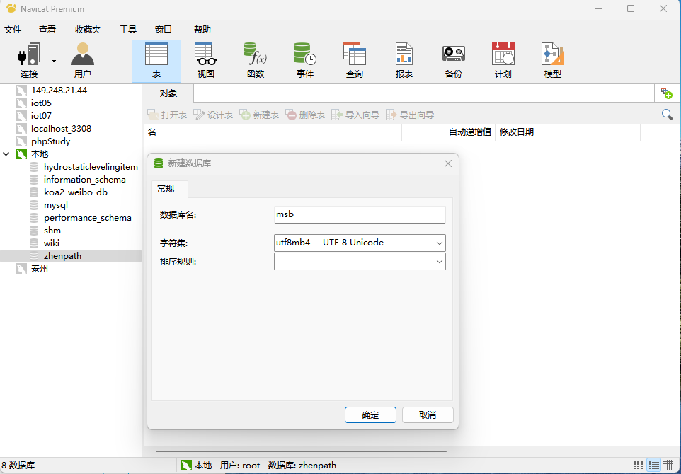

（2）创建表SQL

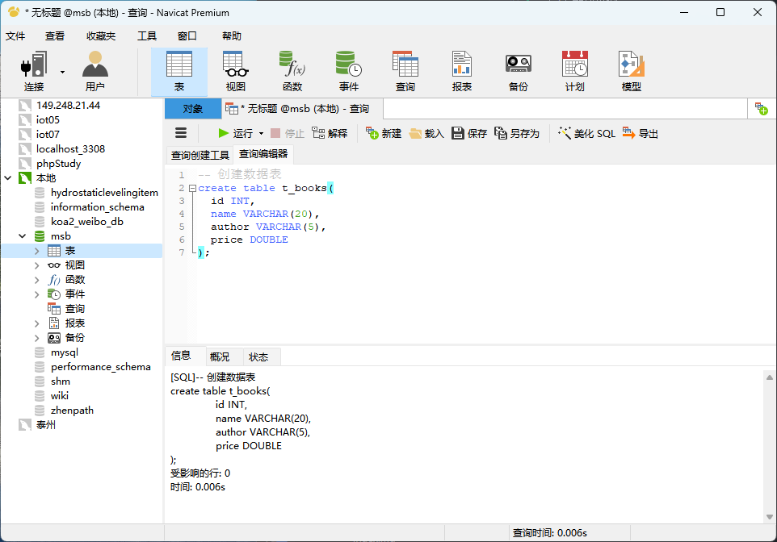

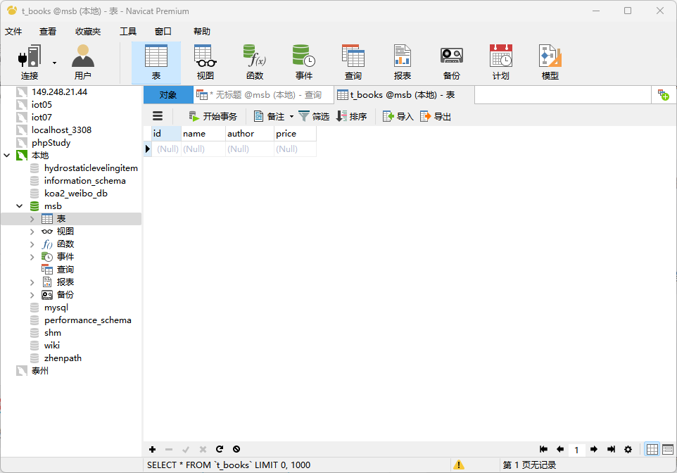

（3）新建查询

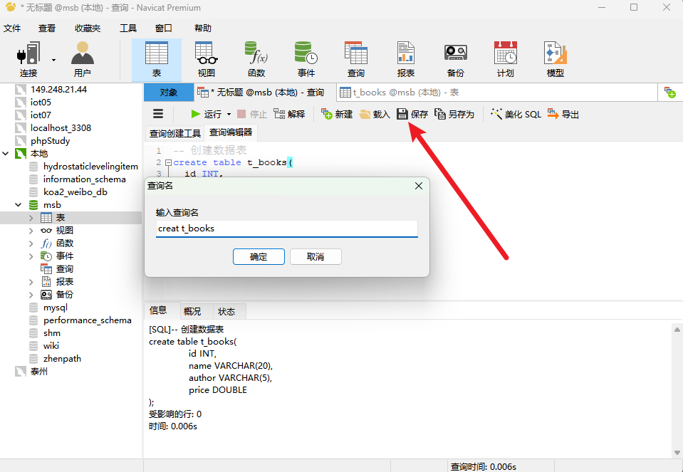

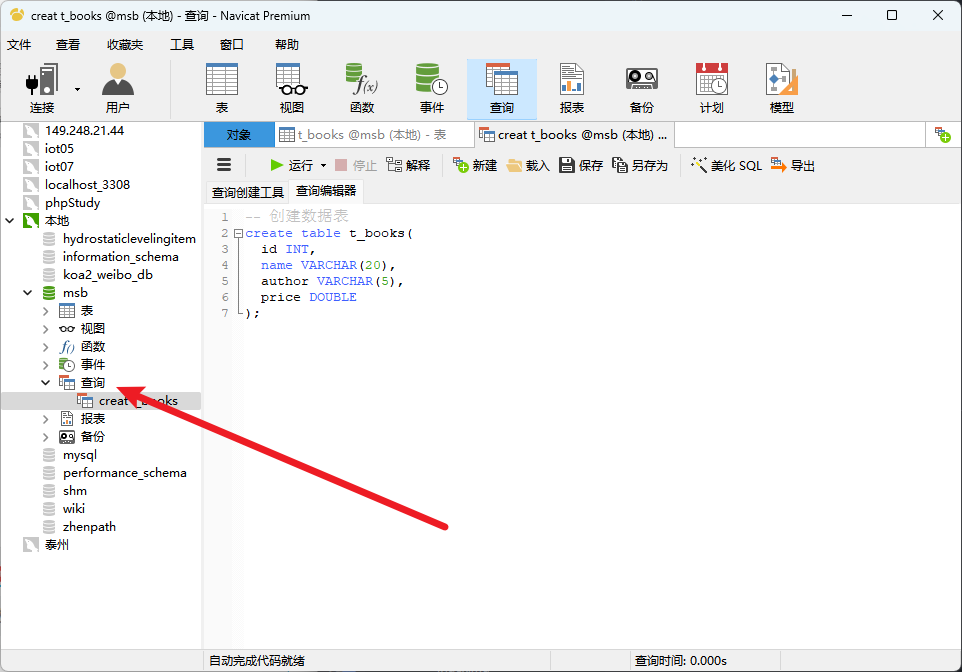

（4）查看表中数据SQL

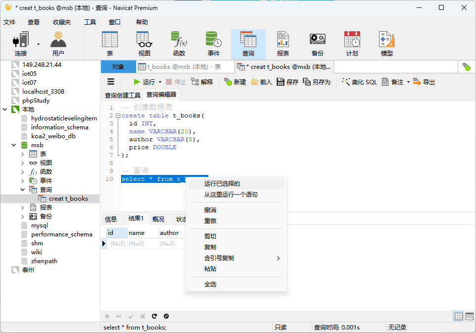

#### 增删改查

（1）增加

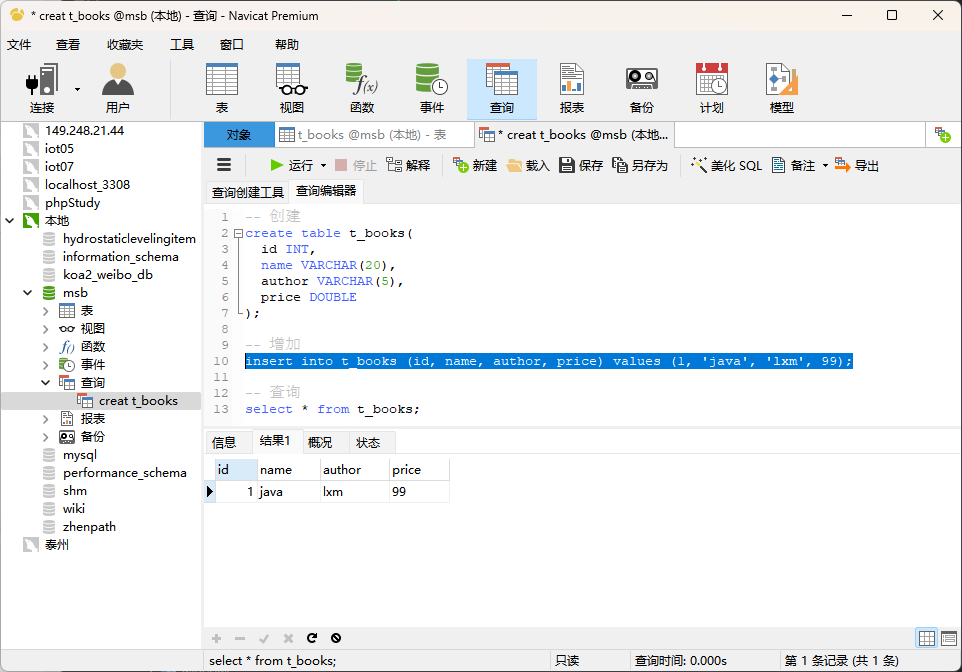

（2）删除

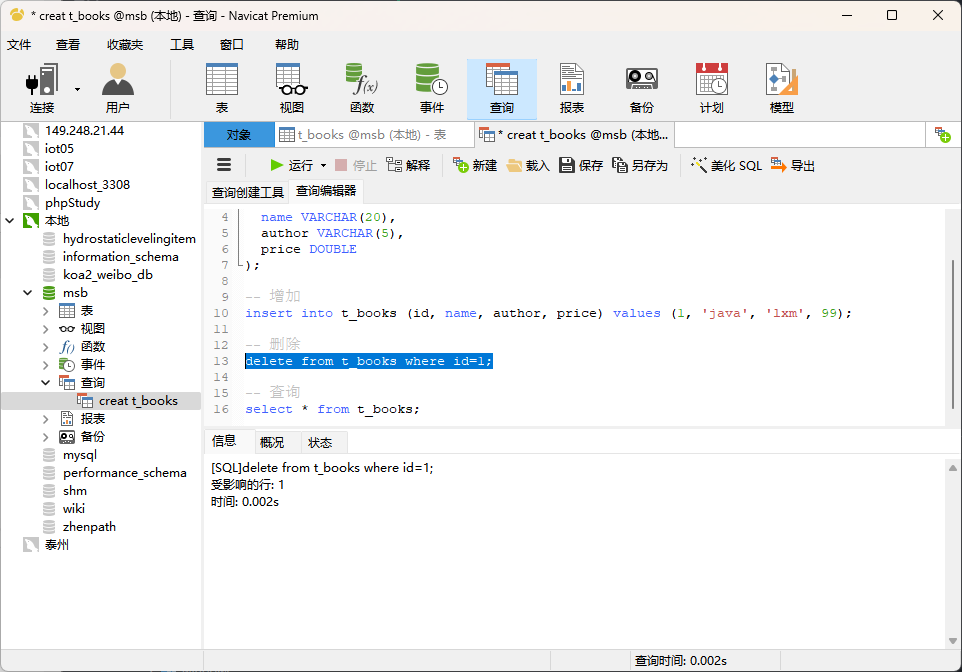

（3）修改

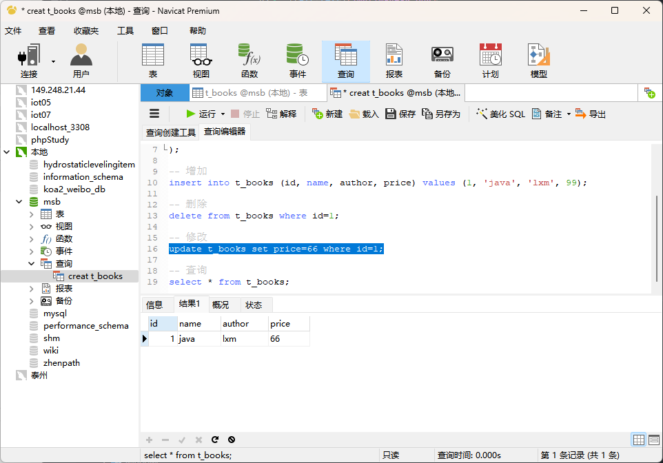

（4）查询
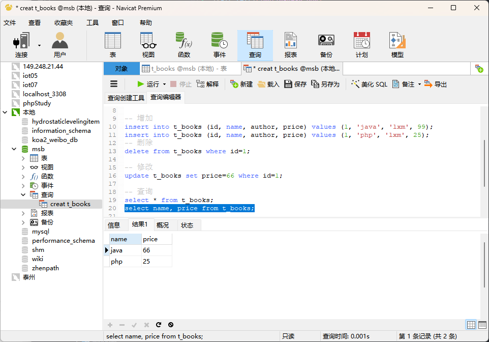

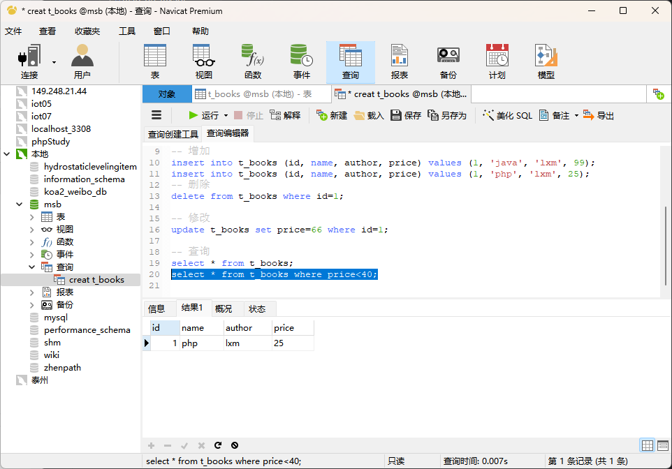