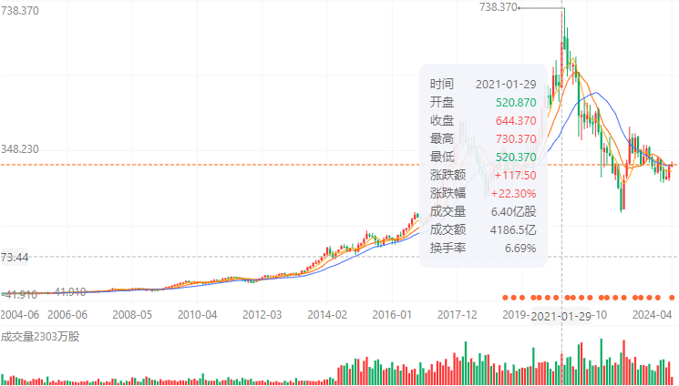

# 本轮经济危机

2021 年 2 月：腾讯市值达到最高点

如何看待 2019 年 8 月 1 日美联储降息 25 个基点？会产生哪些影响？
https://www.zhihu.com/question/338065122/answer/770351019

2019 到底是通缩还是通胀？非金融行业人士能做什么保全自己？

https://www.zhihu.com/question/300336544/answer/520130786

## 2022 加息

加息，其它货币开始贬值

## 2024 降息
