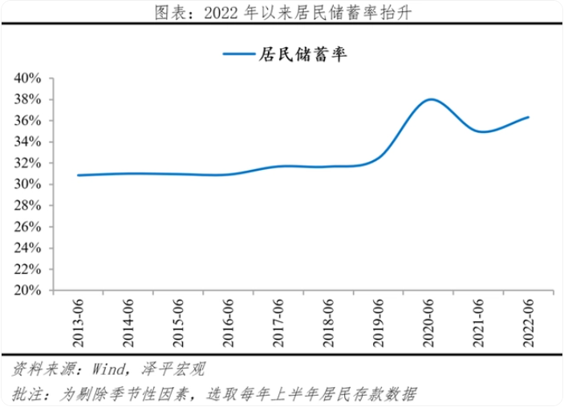
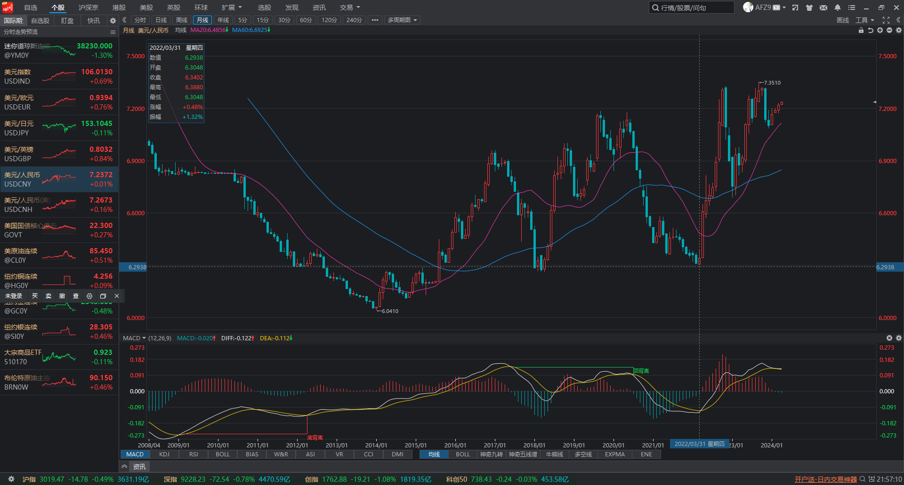

# 经济危机

信用急剧扩张：美股、中房、日债

## 判断

2017.07.05：<https://www.zhihu.com/question/62025901/answer/193760027>

经济危机出现前，一般会出现三大征兆：一是全社会的负债率上升，超过警戒线；二是资产价格飞涨，出现泡沫；三是经济增长潜力弱化，高速扩张的产能不能被市场认可。

如果将来爆发经济危机，首当其冲的是企业债务出问题。最近已经出现了一些民营煤炭企业、钢贸企业和中小房地产企业的违约。将来出问题，肯定还是这些企业。尤其是类似浙江奉化兴润置业这种房地产企业，在房地产泡沫严重地区投资比较多，危险非常大。

当社会上有一大批“兴润置业”的时候，危机就自然而然爆发了。大量建成的房子无人购买，房地产企业资金无法回笼，无力偿还贷款、货款和员工工资。于是，危机向上传导给银行、信托机构，向下传导给建筑企业、建材企业，以及众多员工。员工实际收入下降，购买力必然下降，影响他们买房子、消费。这样就开始恶性循环。

一些中小银行或信托企业，因为跟违约公司关系密切，马上会出现挤兑，于是银行间市场的资金价格陡然上升，大家都本能地攥住自己的钱袋子，钱荒爆发，利率飙升。到这时，全社会经济正常运转的链条就突然停止或者慢了下来，债务危机开始演变为金融危机！

这时，居民肯定会抢购美元、英镑、欧元、黄金等硬通货。国家将会收紧兑换条件，黑市也就出现了。人民币突然出现两种汇率：官方汇率，黑市汇率。如果扛不住，官方汇率会剧烈下调；但由于预期转坏，大家还会继续看跌人民币。

鉴于出现钱荒，为了挽救经济，国家或开动印钞机，降低存款准备金，人民币对内贬值将是毫无悬念的。

这时候，房价也会剧烈下跌，股市暴跌、收藏品价格暴跌，但黄金价格会上涨，而且很难买到。当然，危机很快就传递到职场，很多人会失业、降薪。在这个过程中，会有不少炒房客和高比例贷款的企业家自杀、逃亡。当然，社会稳定也会受到严重挑战。

对于普通人来说，除非你是刚需，不要再轻易贷款买房子。尤其是三四五线城市非核心地段的房子，将成为陷阱。即便是一线城市，郊区的房子也要非常小心。

## 征兆：最后繁荣（2016-2019）

### 负债率上升

::: info 2018-02-17
1996 年中国居民杠杆率只有 3%，2008 年也仅为 18%，但是自 2008 年以来，居民杠杆率开始呈现迅速增长态势，短短六年间翻了一倍，达到 36.4%。到了 2017 年二季度居民杠杆率已经高达 47.4%，较之 2008 年激增了近 30 个百分点，也高于国际上大多数新兴市场国家的平均水平。

需要指出的是，这一数值尚未考虑住房公积金贷款和 P2P、现金贷等贷款。倘若将此纳入考察范围，那么，中国居民部门债务占 GDP 的比重已经于 2017 年 7 月突破了 54%。如果按照当前速度扩张，到 2017 年底预计达到 56%左右，这与不少发达经济体 60%以上的居民杠杆率水平已经相差无几。

值得一提的是，美国居民部门杠杆率从 20%上升到 50%以上用了接近 40 年时间，而中国只用了不到 10 年，中国居民部门杠杆率飙升速度之快可见一斑。

作者：无党派人士
链接：https://www.zhihu.com/question/266560741/answer/313382689
:::

::: info 2021-10-28
数据显示，仅 13% 的年轻人没有负债，90 后占据消费贷「半壁江山」，年轻人的负债率为何如此之高？

https://www.zhihu.com/question/494565236/answer/2235200151

:::

::: info 2023-02-11

专家称「我国居民每赚 100 块，就要拿出至少 50 块来还债」，如何看待这一观点？

https://www.zhihu.com/question/582125324/answer/2877397494
:::

### 资产泡沫化

#### 房价上涨

#### p2p 火热

2014-2018 年：P2P 借贷平台持续升温，平台用户数量激增。

2018 年行业出现剧烈回调

### 经济增长潜力弱化

## 开始：债务危机（2019-2022）

### 债务违约

#### 地产

::: info

2020 年 8 月，房企融资“三道红线”新规发布，中国恒大三线全踩，遭遇融资受限风险，降负债成其主要目标。

2021 年 6 月 29 日，三棵树涂料股份有限公司公告中国恒大逾期未还 5363.72 万元票据。次日三棵树回应称该票据已兑付完毕。

2021-12-05：恒大海外债实质性违约
:::
::: info

2022-11-22：央行推出保交楼贷款支持计划，「将向六家商业银行提供 2000 亿元零成本资金」，此举会带来哪些影响？

<https://www.zhihu.com/question/568140607/answer/2770035192>

:::

::: info

2023-08-15：国家统计局谈碧桂园事件「房地产市场政策调整优化，房企风险有望逐步得到化解」，哪些信息值得关注？
https://www.zhihu.com/question/617353065/answer/3166776604

:::

#### 城投

::: info 2022.09.10：

兰州公交集团负债 39 亿让员工贷款发工资，如何看待这一现象？

<https://www.zhihu.com/question/552640874/answer/2667709649>
:::

::: info
昆明国资委严正声明，网传《昆明城投专家会议纪要》不实，如何看待此谣言？

<https://www.zhihu.com/question/602731493/answer/3042544533>

:::
::: info
把地方债大部分转为 10 年-30 年的超长期债务用来化解短期债务危机，是否是对未来埋更大的雷？

<https://www.zhihu.com/question/614188237/answer/3138501235>

:::

### 储蓄增加

## 传递：金融危机（2022-2024）

### 资产负债表衰退

#### 提前还贷

::: info 2020-2023
2020-12-25：为什么不建议大家提前还房贷？

<https://www.zhihu.com/question/423945663/answer/1627261631>

2023-02-12：为什么 2023 流行提前还房贷？

<https://www.zhihu.com/question/582239126/answer/2889656049>
:::

### 金融挤兑

::: info 2022-06-25

如何看待河南、安徽等地 2900 多储户在村镇银行将近 12 亿存款无法提现？

<https://www.zhihu.com/question/531890843/answer/2481443160>

河南村镇银行事件中储户的钱到底去了哪里？到底是存款还是理财？是否适用存款保险？

<https://www.zhihu.com/question/538991186/answer/2542130024>
:::

::: info 2023-08-13

中植系这么大的金融事件为啥感觉都风平浪静？
<https://www.zhihu.com/question/615606026/answer/3165472841>
:::

::: info 2023-10-12

沧州银行连夜排队取款事件，反映了什么？
<https://zhuanlan.zhihu.com/p/660801221>
:::

::: info 2024-01-19
投资人透露被「鼎益丰」业务员套路细节，有人抵押几套房产投入千万，有哪些信息值得关注？

https://www.zhihu.com/question/640179617/answer/3368046231
:::

::: info 2024-01-23
消息称「女星江疏影投资爆仓」，机构紧急回应，哪些信息值得关注？

https://www.zhihu.com/question/640673901/answer/3372419102
:::

::: info 房地产上下游
2024-04-09：水泥巨头天瑞水泥股价闪崩大跌 99％，开盘 5.1 港元收盘 0.048 港元，哪些信息值得关注？

<https://www.zhihu.com/question/652407536/answer/3460235649>
:::

::: info 2024-04-10
如何看待平安信托爆雷?
<https://www.zhihu.com/question/652397738>

平安信托一 7.7 亿规模产品延期，涉厦门房地产项目，如何看待此事？将带来哪些影响？

<https://www.zhihu.com/question/652490833/answer/3461342059>
:::

### 汇率暴跌

### 降低准备金率

::: info 事件：

中国人民银行决定于 2023 年 3 月 27 日降低金融机构存款准备金率 0.25 个百分点，将带来哪些影响？

<https://www.zhihu.com/question/590192359/answer/2941073271>

:::
::: info 事件：

央行将于 2024 年 2 月 5 日下调存款准备金率 0.5 个百分点，将产生哪些影响？

<https://www.zhihu.com/question/640981060/answer/3374628840>
:::

## 爆发：经济危机（2024-2027）

### 资产价格暴跌

#### 房价下降

::: info 2019-08-15

房价真的已经到顶了吗？
https://www.zhihu.com/question/340712338
:::

::: info 2024-01-17

南京房价啥时候降到头啊？

<https://www.zhihu.com/question/634438121/answer/3446128417>
:::

#### 股价大跌

#### 汽车降价

### 避险资产火热

#### 黄金暴涨

### 失业降薪

### 恶性通缩

### 暴力事件频发

## 预测

### 欧盟解体

希腊退出

汽车撞人

## 失控：战争出清
