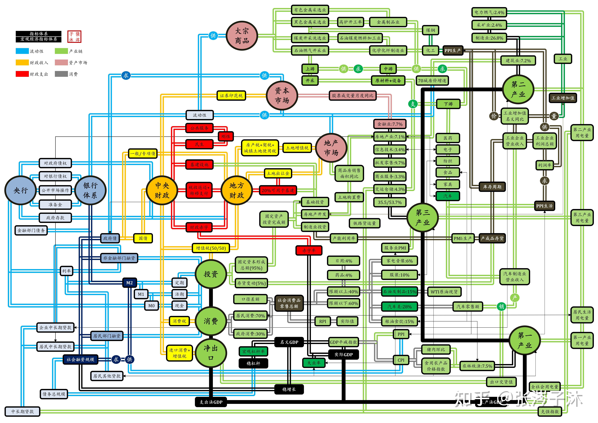

# 宏观经济学之“道”

## 1 宏观经济学研究什么？

## 2 经济学家是如何思考的？

## 3 如何搭建分析框架

参考引用：如何建立自己的宏观经济分析框架？

<https://www.zhihu.com/question/46135259/answer/2367963781>

宏观经济分析框架其实有很多，关键看你要分析什么问题，比如你是侧重经济增长和周期，还是侧重生产与分配。

### 主体关系

### 经济指标

