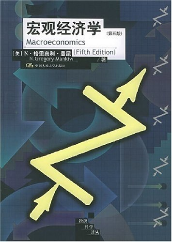

### 基础框架

作者: N·格里高利·曼昆

出版社: 中国人民大学出版社

## 导言

## 第 1 章 宏观经济学之“道”

### 1 宏观经济学研究什么？

### 2 经济学家是如何思考的？

### 3 如何搭建分析框架

## 第 2 章 宏观经济学的数据指标

### 1 国内生产总值

### 2 消费物价指数

### 3 失业率

### 4 经济统计数据到经济模型

## 第 2 篇 古典理论：长期中的经济

## 第 3 章 国民收入

### 1 是什么决定了产品与服务的总生产？

### 2 国民收入如何分配给生产要素？

### 3 什么因素决定产品与服务需求？

### 4 什么因素使产品与服务的供求均衡？

## 第 4 章 货币与通货膨胀

### 1 什么是货币？

### 2 货币数量论

### 3 金（银）币铸造税：从发行货币得到的收益

### 4 通货膨胀与利率

### 5 名义利率与货币需求

### 6 通货膨胀的社会成本

### 7 恶性通货膨胀

### 8 结论：古典二分法

### 附录：卡甘模型：现在与未来的货币如何影响物价水平

## 第 5 章 开放的经济

## 第 6 章 失业

## 第 3 篇 增长理论：超长期中的经济

## 第 7 章 经济增长 I

## 第 8 章 经济增长 II

## 第 4 篇 经济周期理论：短期中的经济

## 第 9 章 经济波动导论

## 第 10 章 总需求 I

## 第 11 章 总需求 II

## 第 12 章 开放经济中的总需求

## 第 13 章 总供给

## 第 5 篇 宏观经济政策争论

## 第 14 章 稳定政策

## 第 15 章 政府债务

## 第 6 篇 再论支撑宏观经济学的微观经济学

## 第 16 章 消费

## 第 17 章 投资

## 第 18 章 货币供给与货币需求

## 第 19 章 经济周期理论的进展

## 结束语 我们知道什么，我们不知道什么
