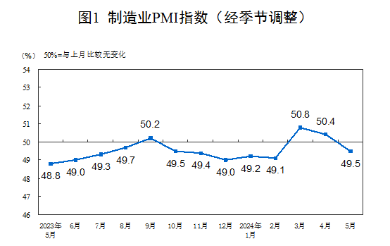

# PMI

### 2024 年 5 月

2024年5月中国采购经理指数运行情况

链接：<https://www.stats.gov.cn/sj/zxfb/202405/t20240530_1956234.html>

知乎：<https://www.zhihu.com/question/657748872/answer/3518977549>

（一）、趋势

5月份，制造业采购经理指数（PMI）为49.5%，比上月下降0.9个百分点，制造业景气水平有所回落。

（二）、分析