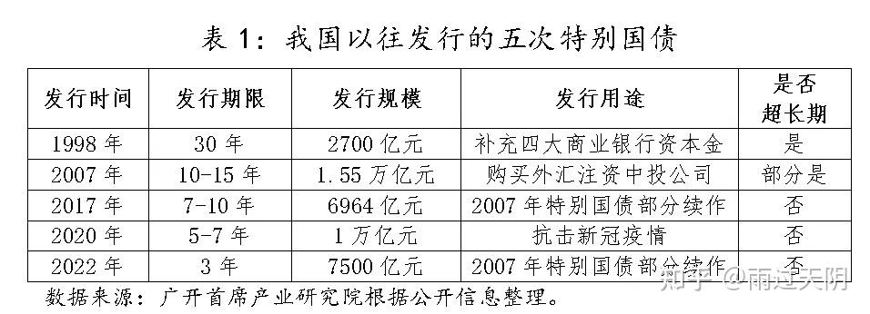

# 2024年中国经济

## 517房地产新政

::: warning 央行发文取消全国首套房和二套房商贷利率下限，下调公积金贷款利率 0.25 个百分点，会带来哪些影响？

<https://www.zhihu.com/question/656294274>

:::
### 行政发文

央行：取消全国层面首套住房和二套住房商业性个人住房贷款利率政策下限

中国人民银行发布关于调整商业性个人住房贷款利率政策的通知：

一、取消全国层面首套住房和二套住房商业性个人住房贷款利率政策下限。

二、中国人民银行各省级分行按照因城施策原则，指导各省级市场利率定价自律机制，根据辖区内各城市房地产市场形势及当地政府调控要求，自主确定是否设定辖区内各城市商业性个人住房贷款利率下限及下限水平（如有）。

三、银行业金融机构应根据各省级市场利率定价自律机制确定的利率下限（如有），结合本机构经营状况、客户风险状况等因素，合理确定每笔贷款的具体利率水平。

央行：下调个人住房公积金贷款利率

中国人民银行发布关于下调个人住房公积金贷款利率的通知，自2024年5月18日起，下调个人住房公积金贷款利率0.25个百分点，5年以下（含5年）和5年以上首套个人住房公积金贷款利率分别调整为2.35%和2.85%，5年以下（含5年）和5年以上第二套个人住房公积金贷款利率分别调整为不低于2.775%和3.325%。

### 分析解读

- 走向更极致杠杆

### 政策成效

::: warning 楼市新政「四箭齐发」后，交易热度上升明显，有中介「累得腿打飘」，接下来楼市走向如何？

<https://www.zhihu.com/question/656681643/answer/3507392333>

:::

::: warning 如何看待2024年上海527新出的房地产新政？

<https://www.zhihu.com/question/657353062/answer/3512377549>

:::

## 4月社融20年来首次下降

::: warning 4 月M2同比增长7.2%，前四个月社融增量12.73万亿元，人民币存款增加7.32万亿元，如何解读？

<https://www.zhihu.com/question/655682451/answer/3496218687>

::: 

## 发行长期特别国债

建国之后，总共发行过三次。

- 1998年为了推动金融体制改革。

- 2007为了管理外汇市场。

- 2020年为了防疫救灾。

从普通债，到专项债，到特别国债，到超长期国债，到超长期特别国债，到永续债。事物的发展按照日拱一卒、切香肠、温水煮青蛙、循序渐进的方式进行，这样可以大大减少痛苦。苟日新，日日新，又日新，日新月异，不知不觉，有一天，你会发现自己躺在了钱堆上，缺钱花。

::: warning 政府工作报告指出，拟连续几年发行超长期特别国债，今年先发行 1 万亿元，释放了哪些信号？
<https://www.zhihu.com/question/647110399/answer/3419550009>
:::

::: warning 财政部将于 17 日招标首发 400 亿元人民币 30 年期特别国债，哪些信息值得关注？
<https://www.zhihu.com/question/655852253/answer/3497846514>
:::

## 央行直接购买国债

::: warning 为什么央行可以在二级市场购买国债，而不能在一级市场?
<https://www.zhihu.com/question/385654178/answer/3484673366>
:::
