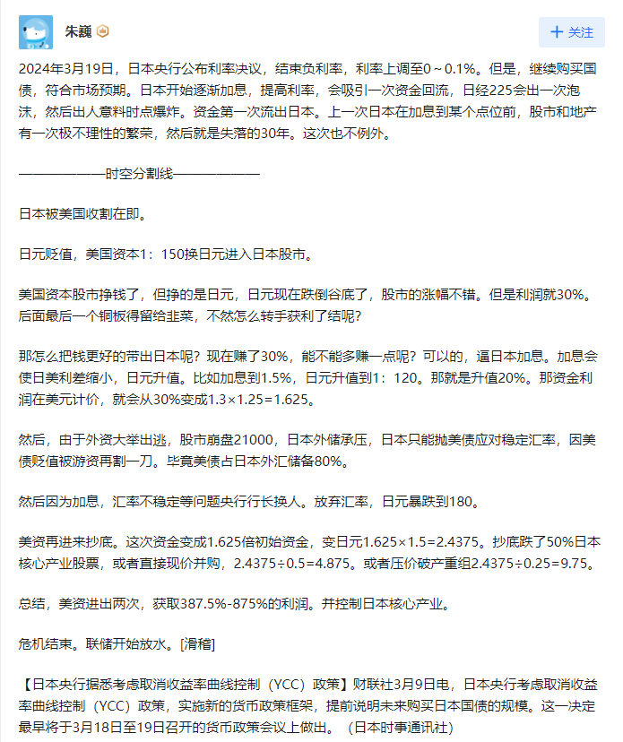

# 2024.03.19 日本央行加息

日本央行将利率设定 0%-0.1% 区间，自 2007 年以来首次加息，负利率时代终结，透露哪些信息？

<https://www.zhihu.com/question/649178755/answer/3435994593>

主角：

- 日本央行
- 东京地检特搜部

## 市场反应

### 汇率不升反跌？

日本央行 17 年来首次加息，为何日元汇率反而跌破 150 关口？

<https://www.zhihu.com/question/649226711/answer/3437071944>

## 主要观点

### 收割论

:::warning 疑惑点：1：150 进入股市？
现在是日本股市高位汇率低位，美国完成高位出货，离场的时候当然不希望日元跌太多喽，跌多了换美元少，必须给美爹撑住汇率，股市美爹快出清了，赶紧开始跌，美元快速离场慢慢就冲击日元汇率，等撑不住了股汇双杀，跌出个黄金坑，美爹再顺势降息，扮演救世主，谈谈不平等条约，骨折价买回来，完成完美的收割。吃干抹净，最后连锅都给你端了。

作者：沉默驴子
链接：https://www.zhihu.com/question/649226711/answer/3436959460
来源：知乎
著作权归作者所有。商业转载请联系作者获得授权，非商业转载请注明出处。
:::

:::tip 结论

- 结合巴菲特购买日本股票的新闻，以及 23 24 年日经指数的大涨，美国资本应该早已经进入日本股市
  :::

### 危机论

这是日本经济的标志性政策，当然也未必是很多人预想的经济从失去的三十年转出，反而是非常危险的信号。 —— 知乎王克丹

### 美日结合论

::: info 观点： <https://www.bilibili.com/video/BV1tz421o7gU/> 评论区（palmebaum）
美联储加息是张开血盆大口吸取全世界的美元流向美国，那日元加息则是配合美国又开了一个吸钱的口子，但美元日元汇率的倒挂，导致美国并没有损失，因为是从汇率对比中得到补偿，现在的情形就像美日是两个涡轮，而且可以相互对流，吸取全世界的资金，如果我这个认识正确的话，那美国那边的高利率可能真的还会持续，因为有了日本这个口子，资金的流转空间更大了，结合俄罗斯的恐怖袭击，俄乌那边如果升级，那欧洲的汇率对美元一定是疲软的，欧洲的资金可能会进一步流向美国（或是不是我们这里不好说），现在美国人最不想的就是美元汇率下降，要求美元坚挺，尽管手里有着天量的美元，但是其实外面流通的美元是有限的，最想干的就是世界全部的美元都回到美国，现在又加了个日本，日本一边加息，一边量化宽松，搞财政赤字化，美日两个国家开动印钞机印钞票。而我们赚的美元不是印刷出来的，是我们的血汗钱啊。难就难在这里了，什么时候建立我们自己大范围的资金流动体系，能不受美元影响，至少不受他们恶意的影响，我们的日子会好过不少。

:::

## 我的观点

### 加息或将持续半年

未来日元加息将维持一段时间，保持日经涨，日元跌，期间，美元资本完成高位出货
