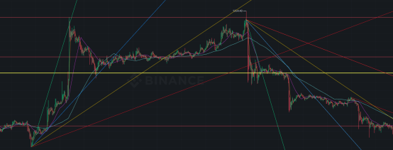
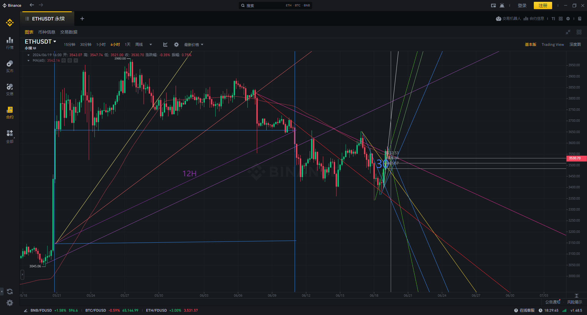
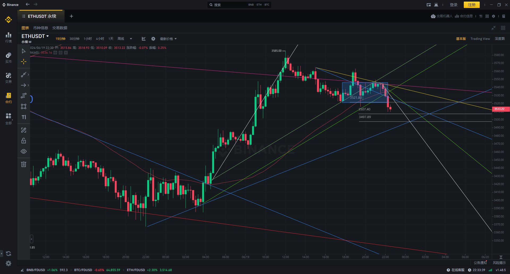
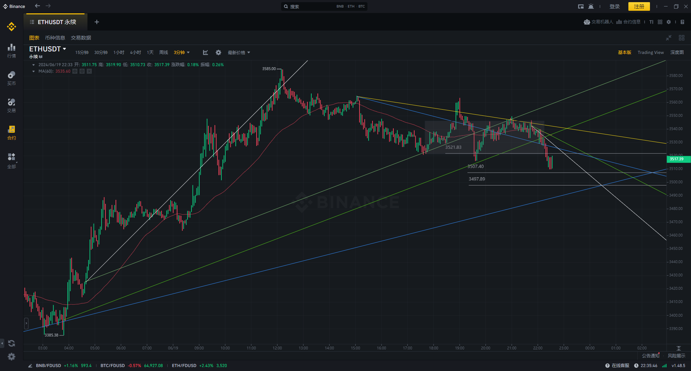

# 币圈交易系统

## 一、行情判断

### 趋势和震荡

#### 趋势的级别和联系

高度120$

- 绿线：4级线	趋势幅度：120-150$ 	k = 60 / 8      ($/h)
- 蓝线：3级线	趋势幅度：100-120$	k = 60 / 12 = 5 ($/h)
- 黄线：2级线	趋势幅度：60-90$ 		k = 60 / 20 = 3 ($/h)
- 红线：1级线	趋势幅度：30-60$		k = 60 / 36     ($/h)
- 紫线：0级线  趋势幅度：10-20$      k = 3 / 3  = 1 ($/h)

## 二、交易策略

## 三、风险控制

## 四、资金管理

## 五、市场测试

### 20240619-

#### 4H

#### 15M转跌

子周期

