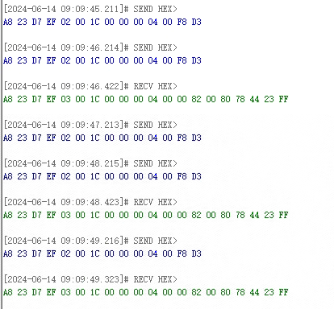

# 串行通信协议

串行通信协议是让计算机和其他设备之间进行数据交换的一种标准。通过这些协议，设备可以按照预定的格式和速率发送和接收数据。

## RS232

## RS485

RS-485 是一个物理层标准，定义了电气特性和信号传输方式；要实现实际的数据通信，还需要在其上构建适合具体应用的高层协议（如 modbus、BACnet 等），这些协议定义了数据包的结构、地址格式、错误检测和纠正机制等。

基本概念

（1）差分信号：

RS-485 使用差分信号传输数据，这意味着信号通过两条线（A 和 B）传输，电压差决定了逻辑状态。这种方式比单端信号抗干扰能力更强。

（2）多点通信：

RS-485 支持多达 32 个设备在同一总线上进行通信，允许多个发送器和接收器共享同一个双绞线对。


（3）全双工和半双工模式：

RS-485 可以工作在全双工（使用四根线，两对进行独立的发送和接收）和半双工（使用两根线，同一对进行发送和接收）的模式。

### 物理层特性

传输线：通常使用带屏蔽的双绞线电缆，推荐使用 120 欧姆的终端电阻来匹配电缆阻抗，防止信号反射。

连接器：常见的 RS-485 连接器类型包括 DB-9、DB-25 和 5 针插头等。

### 电气特性

电压范围：RS-485 的差分电压范围为+12V 到-7V，保证在长距离传输时仍能保持可靠的信号质量。

传输距离：在较低波特率下（如 9600 bps），RS-485 可以传输超过 1200 米（4000 英尺）。但随着波特率增加，传输距离会减少。

波特率：典型的波特率范围从几百 bps 到 10Mbps，但实际应用中常见的波特率为 9600 bps 到 115200 bps。

### 连接方式

总线型结构：RS-485 采用总线型拓扑结构，所有设备并联在一条主线上。

- 图中红色线为 485 总线(一个协议转换器只能引出一条总线)
- 绿线为测点线


- 错误示范：星形连接
- 正确做法：手拉手连接


### 常见问题及解决方案

（1）接线错误：检查 AB 线是否接反，线路是否断开

（2）波特率错误：检查设备是否使用正确的波特率，或检查连接器是否正确连接

（3）地址冲突：确保每个设备的地址都是唯一的，避免重复使用。

（4）电压过低或过高：检查连接器、电缆和终端电阻的连接是否正确，并确保设备在正确的电压范围内工作。

（5）信号丢失或损坏：检查连接器、电缆和终端电阻的连接是否正确，并确保设备在正确的电压范围内工作。



（6）信号反射：使用 120 欧 终端电阻来匹配传输线的阻抗。


（7）噪声干扰：使用屏蔽双绞线电缆，并确保良好的接地。

（8）总线冲突：在多主设备系统中，使用仲裁机制或协议来避免冲突。

## UART

UART（Universal Asynchronous Receive Transmitter，通用异步收发传输器）：也就是我们经常所说的串口，基本都用于调试。

::: warning 注意

- A 和 B 通信 A.TX 要接 B.RX，A.RX 要接 B.TX（A 用 TX 发 B 当然要用 RX 来收了！）

- 主机和从机至少要接三根线，RX、TX 和 GND。TX 用于发送数据，RX 用于接受数据（收发不是一根线，所以是全双工方式）。
  :::

如果 A 是 PC 机，B 是单片机，A 和 B 之间还要接一块电平转换芯片，用于将 TTL/CMOS（单片机电平）转换为 RS232（PC 机电平）。因为 TTL/CMOS 电平范围是 0~1.8/2.5/3.3/5V(不同单片机范围不同)，高电压表示 1，低电压表示 0。而 RS232 逻辑电平范围-12V~12V，-5~-12 表示高电平，+5~+12V 表示低电平。

### 原理及特征

#### 异步通信

UART 是异步通信的一种形式，即发送和接收端设备之间不共享时钟信号。相反，每个数据帧的开始和结束由起始位和停止位标识。

#### 数据帧结构

::: info UART 数据帧组成

- 起始位（Start Bit）：始终为逻辑低电平（0），表示数据帧的开始。
- 数据位（Data Bits）：可以是 5、6、7 或 8 位，代表要传输的实际数据。
- 可选的校验位（Parity Bit）：用于错误检测，可以是奇校验、偶校验或无校验。校验位根据数据位的奇偶性来确定其值。
- 停止位（Stop Bit）：一个或多个逻辑高电平（1），用于表示数据帧的结束。

:::

以下是 UART 数据帧的常见结构：

```bash
起始位  数据位  可选的校验位  停止位
---------------------------------
|   |      |         |     |
|ST | D0-D7|   P     |  SP |
---------------------------------

```

::: warning 注意
UART 串口通信每次只能发一个字节
:::

#### 传输流程

- 发送端：将数据按照设置的数据位数和校验位进行编码，并在每个数据帧前加上起始位和结尾处加上停止位。
- 接收端：侦听传输线上的数据，根据波特率同步时钟，解码数据位、校验位和停止位，以恢复发送的原始数据。

#### 波特率

UART 的通信速率由波特率（Baud Rate）定义，波特率是指每秒传输的符号（比特）数。常见的波特率包括 9600、19200、115200 等。发送和接收双方必须以相同的波特率进行配置，以确保数据的正确传输。

::: info 波特率计算公式
波特率 = 发送频率 / 波特率分频系数

9600 波特率指的是每秒可以传输 9600 个二进制位，也就是 9600/8 个英文字母的数据量，也就是 1200 个字节，大约 1.2KB。


:::

## IIC

I²C（Inter-Integrated Circuit，也称为 I2C 或 IIC,译作集成电路总线）是一种常见的串行通信协议，用于在微控制器和外围设备之间进行低速、短距离的数据传输。

### 物理层

I2C 是多主从架构，每个设备都有唯一的地址，一个主设备理论上可以接 127 个从设备，设备的 SDA 并接在一起，SCl 并接在一起。


I2C 总线内部都是采用漏极开路驱动，示意图如图，栅极给电压时 mos 导通，输出低电平，栅极给 0 时 mos 关断输出呈高阻态，那么这里就无法输出高电平。


加上上拉电阻后（一般在 4.7k~10k）可以实现高低电平的输出：开关断开时电阻趋于无穷，电流为 0，电源电压为输出电压，即输出高电平；开关闭合，输出低电平。只要有一个设备拉低总线电平，总线的电平就会被拉低，这就是线与功能，便于数据的传输和仲裁。


#### 主从模式

- 主设备（Master）：主设备发起通信，生成时钟信号，并负责发送起始条件和停止条件。
- 从设备（Slave）：从设备响应主设备的请求，进行数据接收或发送。

::: warning 注意
多主机会产生总线裁决问题。当多个主机同时想占用总线时，企图启动总线传输数据，就叫做总线竞争。I2C 通过总线仲裁，以决定哪台主机控制总线
:::

#### 双线通信

- SCL（Serial Clock Line）：时钟信号线，由主设备生成，用于同步数据传输。
- SDA（Serial Data Line）：数据线，用于在设备之间传输数据。SCL 和 SDA 都是开漏（Open-Drain）驱动，需要上拉电阻。

### 协议层

#### 数据帧结构

I2C 数据的传输也遵循一定的格式。它有开始和停止条件，中间进行 8bit 的数据传输，没有奇偶校验，并且在一个开始条件和停止条件可之间可以传要多少数据有多少数据。提醒一下，我们的总线默认保持高电平。


- 开始条件：在时钟线保持高电平时，数据线从高电平转为低电平，即检测到一个下降沿，会形成一个开始条件；
- 停止条件：时钟保持高电平时，数据线从低电平转为高电平形成一个停止条件。
- 进行数据传输前也就是紧跟开始条件后，我们要传送地址字节，前 7 位是从设备地址（这也是为什么一个主机理论上最多能接 127 个从机，2^7-1），第八位是读/写标志位。每 8bit 传输- 完成，第九位是应答位。如果是主设备发送数据，就是从设备应答，如果是主设备读取数据，就是主设备应答。

#### 寄存器

控制寄存器控制开始停止条件，每传输完一个字节会进入内部中断，状态寄存器记录单片机的工作状态。作为主机时，分频器寄存器配合内部时钟设置 I2C 的波特率；地址寄存器是从机地址编址；最后是数据寄存器。

## SPI

参考链接：<https://blog.csdn.net/handy34/article/details/137791972>

SPI（Serial Peripheral Interface，串行外设接口）是由摩托罗拉公司开发的一种全双工、同步的串行通信协议，用于在微控制器、嵌入式系统和外部设备之间进行数据传输。SPI 被广泛应用于数字集成电路之间的通信，特别适用于连接多个外设。该总线大量用在与 EEPROM、ADC、FRAM 和显示驱动器之类的慢速外设器件通信。

### 总线结构

#### 主从模式

SPI 通信中存在一个主设备（Master）和一个或多个从设备（Slave）。主设备负责控制通信时序，并发起数据传输；从设备则被动地响应主设备的命令并进行数据传输。

#### 信号线

::: info SPI 信号线

- SCLK（Serial Clock）：主设备生成的时钟信号，用于同步数据传输。
- MOSI（Master Output Slave Input）：主设备输出的数据信号，传输给从设备。
- MISO（Master Input Slave Output）：从设备输出的数据信号，传输给主设备。
- SS（Slave Select）：主设备使用该信号选择要与之通信的从设备。
  :::

#### 数据传输

SPI 使用全双工传输方式，也就是可以同时进行数据的发送和接收。主设备通过 MOSI 发送数据到从设备的 MISO，同时从设备也可以通过 MISO 发送数据给主设备。

#### 时序特点

SPI 采用的是同步时钟，数据传输时钟极性和相位可以通过配置进行调整。

### 数据传输流程

- 主设备选择要与之通信的从设备，通过拉低相应的 SS 信号将其选为活动设备。
- 主设备通过 SCLK 产生时钟信号，确定数据传输的时序。
- 主设备向 MOSI 发送数据，从设备通过 MISO 接收数据。
- 主设备和从设备在每个时钟周期中交换一个完整的数据位。数据位的传输顺序可以由主设备或从设备决定。
- 数据传输完成后，主设备通过拉高 SS 信号将从设备取消选中。

## USB

## CAN
