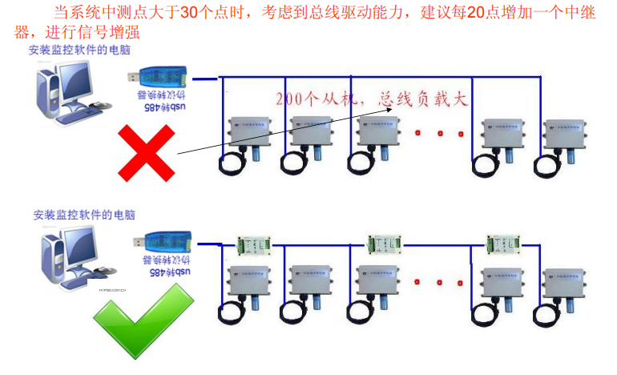
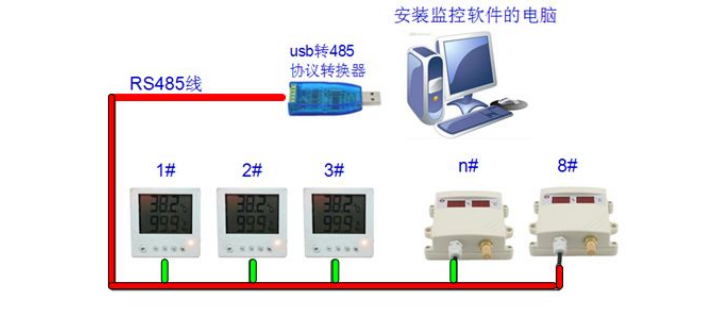
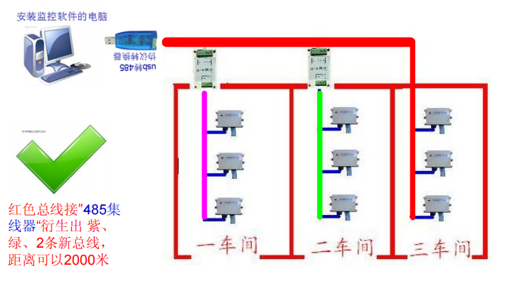
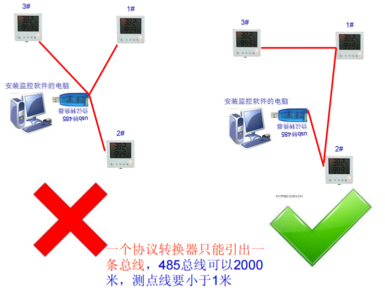
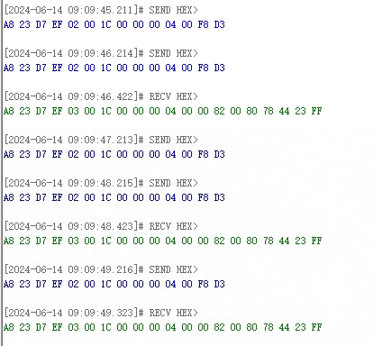
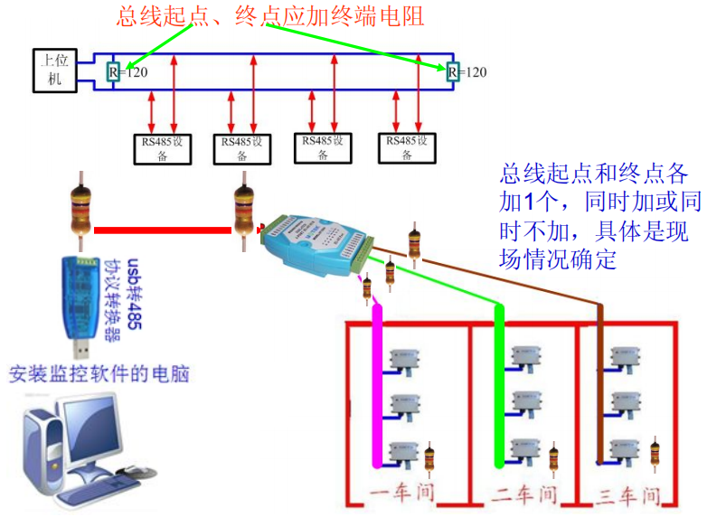
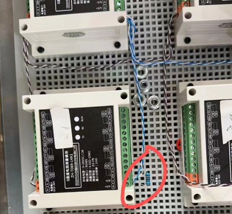

# 通信原理

### ModBus

ModBus 是工业领域标准通信协议，1979 年由莫迪康开发的应用层报文传输协议，包括 ASCII、RTU、TCP 等。TCP 和 RTU 比 ASCII 常见，其中 TCP 的使用频率更高一些。

#### 基本概念

MODBUS 是 OSI 模型第 7 层上的应用层报文传输协议，它在连接至不同类型总线或网络的设备之间提供客户机/服务器通信。

MODBUS 支持主从通信模式（Master-Slave），是一个请求/应答协议，并且提供功能码规定的服务。MODBUS 功能码是 MODBUS 请求/应答 PDU 的元素。

互联网组织能够使 TCP/IP 栈上的保留系统端口 502 访问 MODBUS。

#### Modbus 帧结构

（1）地址域

- 标识连接到网络上的从设备的地址。
- 地址范围从 1 到 247，0 用于广播。

（2）功能码

- 标识要执行的操作类型，如读、写等。

（3）数据域

- 包含具体的命令数据，如寄存器地址和数据值。
- 数据长度和格式取决于功能码和具体操作。

（4）错误检查域

- 用于检测数据传输中的错误。
- Modbus RTU 使用 CRC（循环冗余校验），Modbus ASCII 使用 LRC（纵向冗余校验）。

#### Modbus RTU

- 数据格式：二进制
- 传输介质：RS-232、RS-485 等
- 帧结构：起始位、地址域、功能码、数据域、CRC 校验

#### Modbus TCP

- 数据格式：二进制
- 传输介质：以太网
- 帧结构：MBAP 报头、功能码、数据域

#### Modbus ASCII

- 数据格式：ASCII 字符
- 传输介质：RS-232、RS-485 等
- 帧结构：起始字符、地址域、功能码、数据域、LRC 校验、结束字符

#### 存储区(寄存器)

<!--  -->

<table><thead><tr><th style="text-align: left;">

寄存器种类

</th><th style="text-align: left;">

数据类型

</th><th style="text-align: left;">

访问类型

</th><th style="text-align: left;">

功能码

</th></tr></thead><tbody><tr><td style="text-align: left;">

线圈

</td><td style="text-align: left;">

位

</td><td style="text-align: left;">

读写

</td><td style="text-align: left;">

01H  05H  0FH

</td></tr><tr><td style="text-align: left;">

离散输入

</td><td style="text-align: left;">

位

</td><td style="text-align: left;">

读写(主站只读)

</td><td style="text-align: left;">

02H

</td></tr><tr><td style="text-align: left;">

保持寄存器

</td><td style="text-align: left;">

字

</td><td style="text-align: left;">

读写

</td><td style="text-align: left;">

04H

</td></tr><tr><td style="text-align: left;">

输入寄存器

</td><td style="text-align: left;">

字

</td><td style="text-align: left;">

读写(主站只读)

</td><td style="text-align: left;">

03H  06H  10H

</td></tr></tbody></table>

#### 功能码

### RS485

RS-485 是一个物理层标准，定义了电气特性和信号传输方式；要实现实际的数据通信，还需要在其上构建适合具体应用的高层协议（如 modbus、BACnet 等），这些协议定义了数据包的结构、地址格式、错误检测和纠正机制等。

#### 基本概念

（1）差分信号：

RS-485 使用差分信号传输数据，这意味着信号通过两条线（A 和 B）传输，电压差决定了逻辑状态。这种方式比单端信号抗干扰能力更强。

（2）多点通信：

RS-485 支持多达 32 个设备在同一总线上进行通信，允许多个发送器和接收器共享同一个双绞线对。

（3）全双工和半双工模式：

RS-485 可以工作在全双工（使用四根线，两对进行独立的发送和接收）和半双工（使用两根线，同一对进行发送和接收）的模式。

#### 物理层特性

传输线：通常使用带屏蔽的双绞线电缆，推荐使用 120 欧姆的终端电阻来匹配电缆阻抗，防止信号反射。

连接器：常见的 RS-485 连接器类型包括 DB-9、DB-25 和 5 针插头等。

#### 电气特性

电压范围：RS-485 的差分电压范围为+12V 到-7V，保证在长距离传输时仍能保持可靠的信号质量。

传输距离：在较低波特率下（如 9600 bps），RS-485 可以传输超过 1200 米（4000 英尺）。但随着波特率增加，传输距离会减少。

波特率：典型的波特率范围从几百 bps 到 10Mbps，但实际应用中常见的波特率为 9600 bps 到 115200 bps。

#### 连接方式

总线型结构：RS-485 采用总线型拓扑结构，所有设备并联在一条主线上。

- 图中红色线为 485 总线(一个协议转换器只能引出一条总线)
- 绿线为测点线

- 错误示范：星形连接
- 正确做法：手拉手连接

#### 常见问题及解决方案

（1）接线错误：检查 AB 线是否接反，线路是否断开

（2）波特率错误：检查设备是否使用正确的波特率，或检查连接器是否正确连接

（3）地址冲突：确保每个设备的地址都是唯一的，避免重复使用。

（4）电压过低或过高：检查连接器、电缆和终端电阻的连接是否正确，并确保设备在正确的电压范围内工作。

（5）信号丢失或损坏：检查连接器、电缆和终端电阻的连接是否正确，并确保设备在正确的电压范围内工作。

（6）信号反射：使用 120 欧 终端电阻来匹配传输线的阻抗。

（7）噪声干扰：使用屏蔽双绞线电缆，并确保良好的接地。

（8）总线冲突：在多主设备系统中，使用仲裁机制或协议来避免冲突。
