# 计算机组成原理

## 计算机体系与结构

### 冯·诺伊曼体系

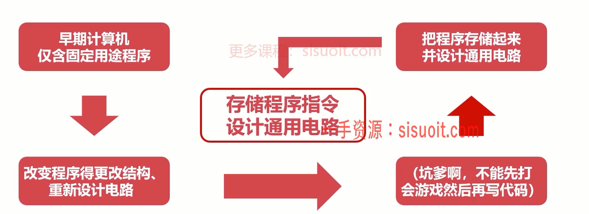

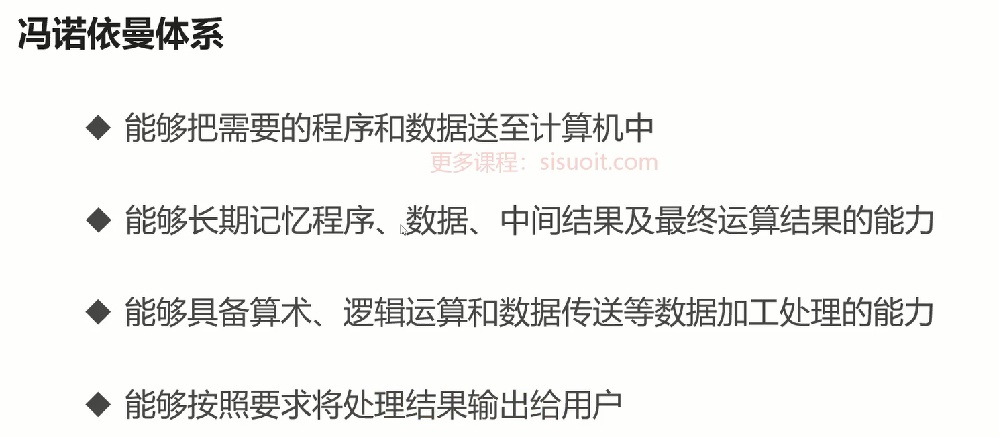

- 存储器
- 控制器
- 运算器
- 输入设备
- 输出设备

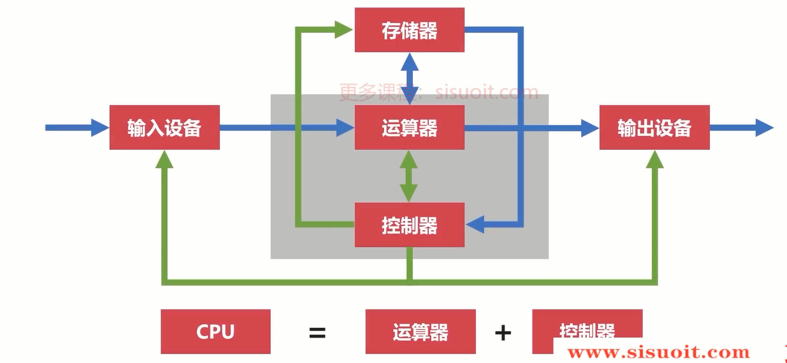

冯诺伊曼瓶颈

### 现代计算机结构

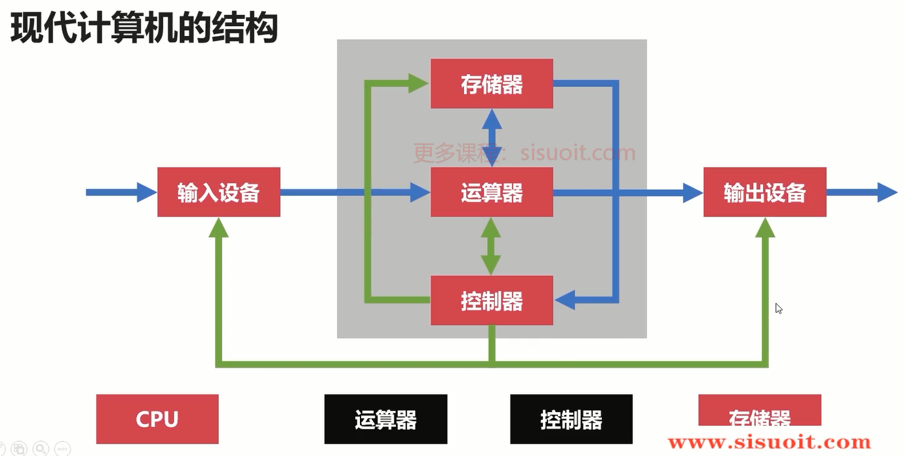

## 计算机的层次与编程语言

### 程序翻译与程序解释

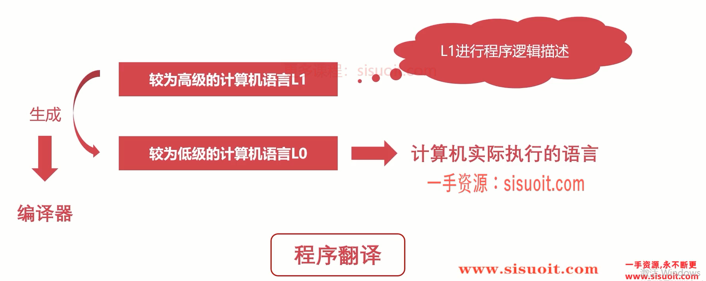

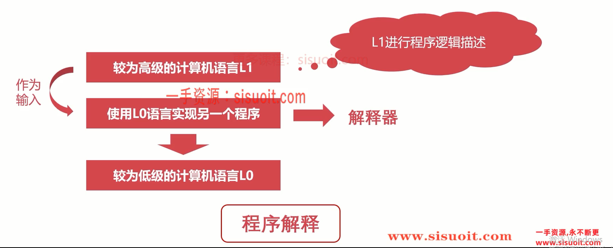

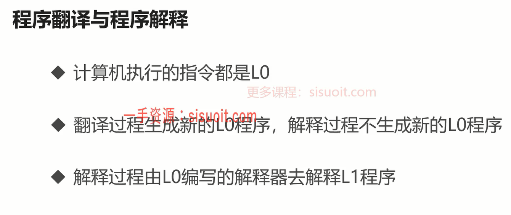

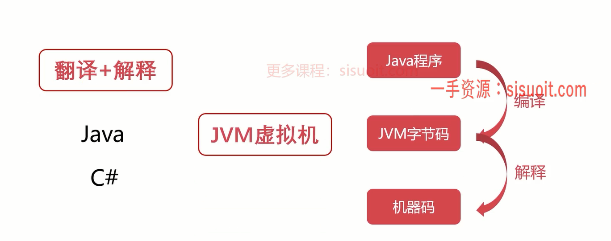

### 层次划分

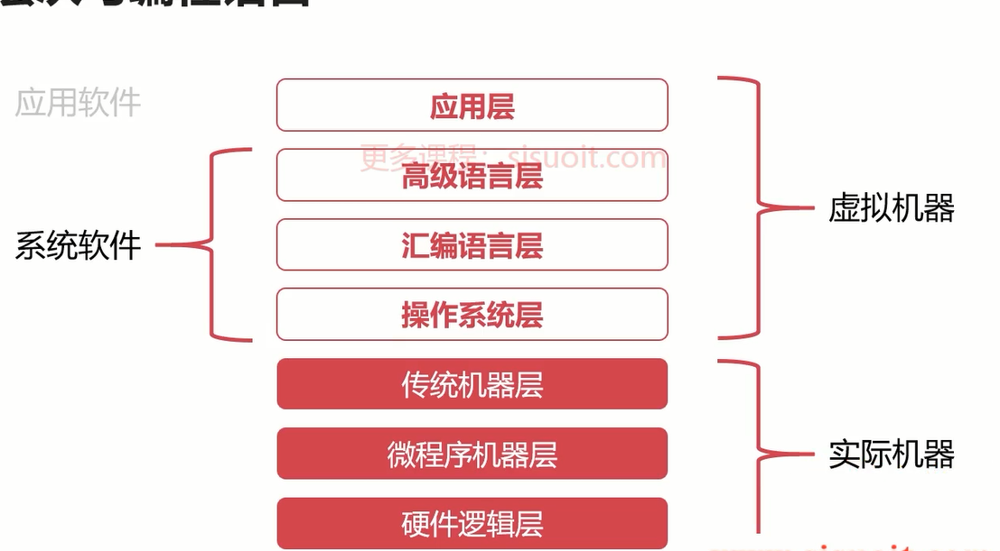

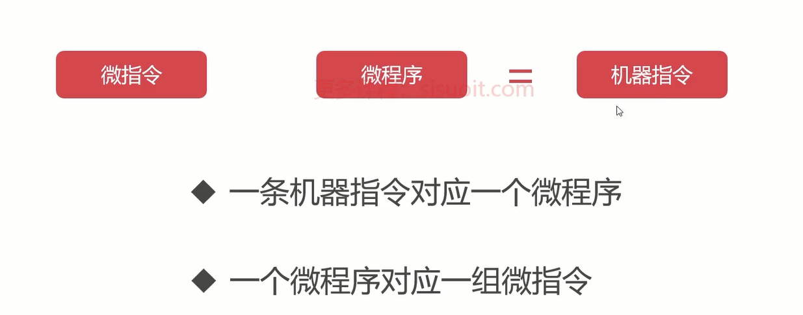

## 计算单位

### 容量单位

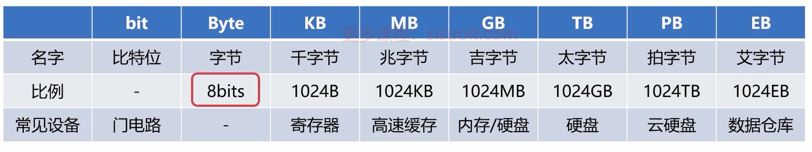

1024 = 2^10

### 速度单位

（1）网络速度

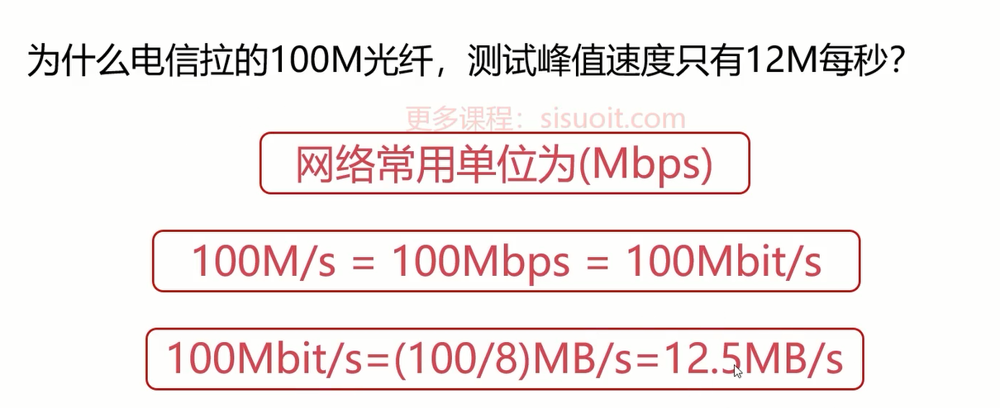

（2）CPU 速度

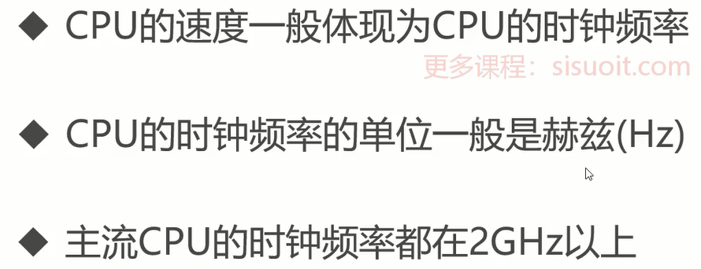

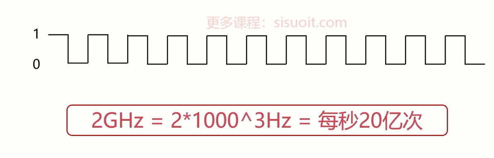

## 字符与编码集

### ASCII

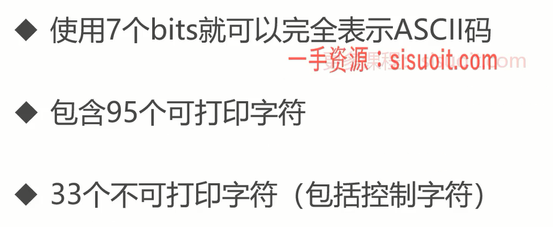

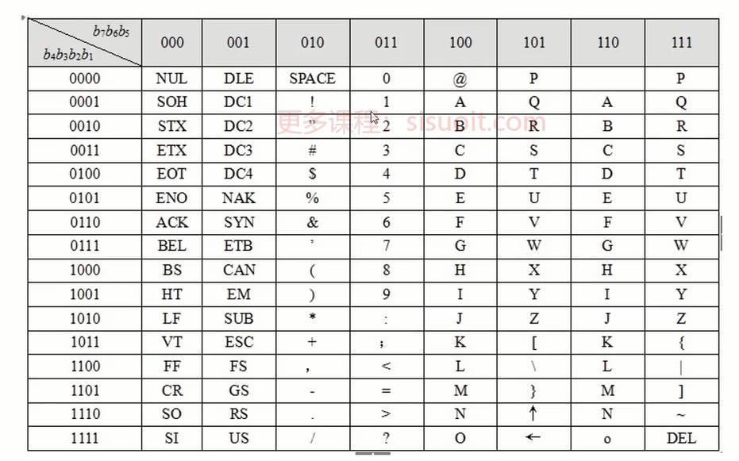

### Extended ASCII

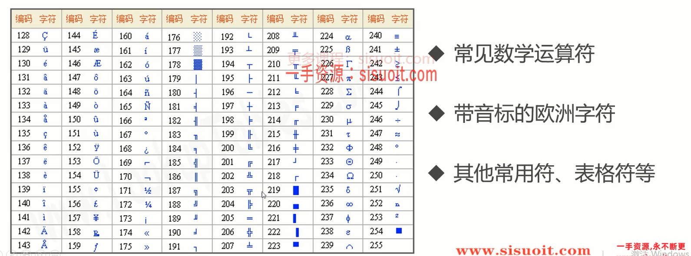

### GB2312

### GBK

### Unicode

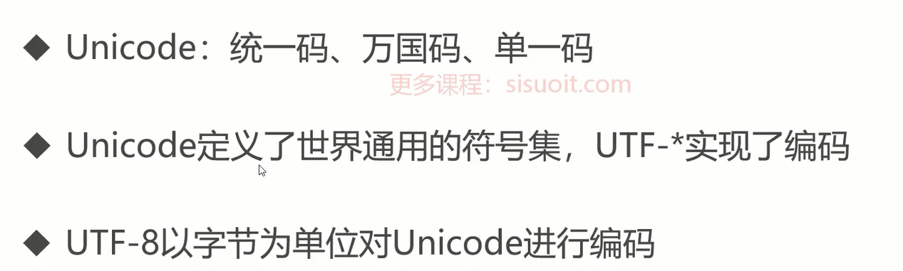
