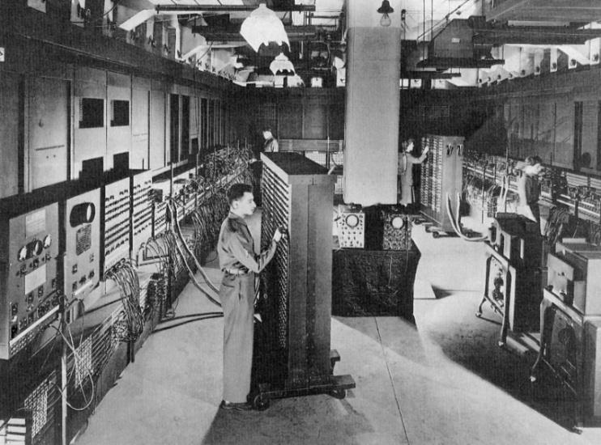
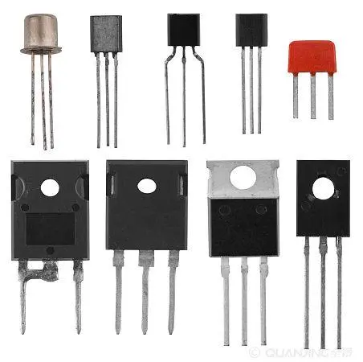
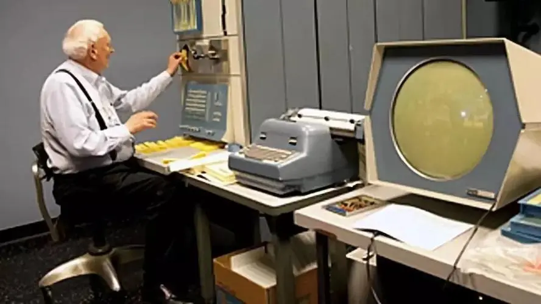
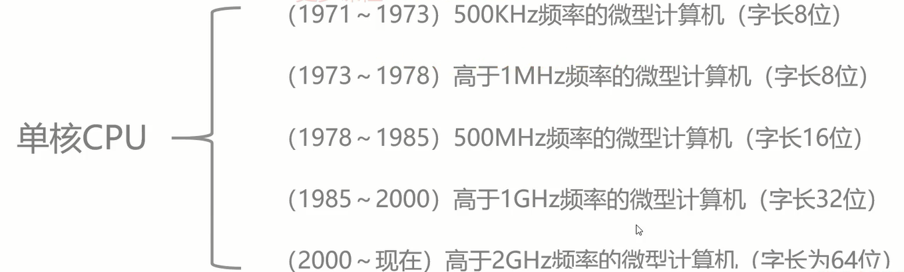
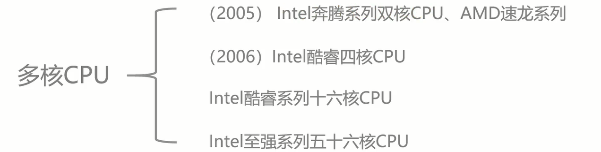

# 计算机

## 学习教程

视频教程：<https://coding.imooc.com/class/355.html>

## 发展简史

1946-1957：电子管计算机

1957-1964：晶体管计算机

1694-1980：集成电路计算机

1980-至今：超大规模集成电路计算机

### 电子管计算机

埃尼阿克

### 晶体管计算机

PDP-1 计算机：

### 集成电路计算机

IBM

### 超大规模集成电路计算机

CPU

### 未来计算机

（1）生物计算机

（2）量子计算机\*

## 计算机分类

### 超级计算机

### 大型计算机

### 迷你计算机（服务器）

### 工作站

### 微型计算机

## 微型计算机

### 摩尔定律

### 单核 CPU

### 多核 CPU

