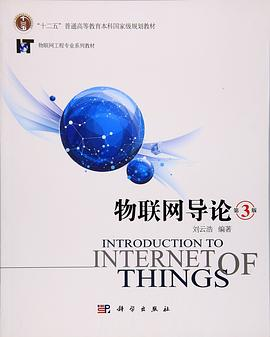
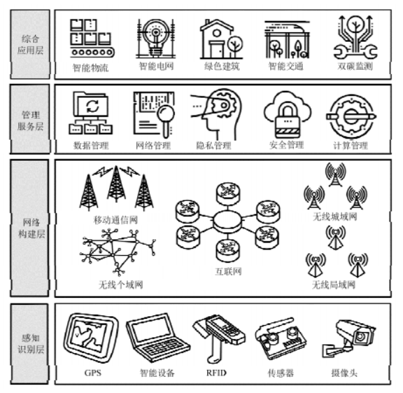
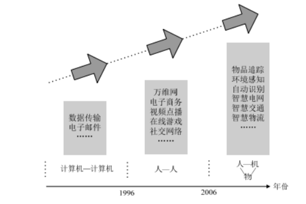

# 物联网概述

物理世界的联网需求和信息世界的扩展需求催生出了一类新型网络——物联网（Internet of Things，IoT）

物联网通过对物理世界进行信息化、网络化，实现对传统上分离的物理世界和信息世界的互联和整合。物联网的核心在于物与物之间广泛而普遍的互联。

物联网是基于互联网、传统电信网等信息承载体，让所有能够被独立寻址的普通物理对象实现互联互通的网络。它具有普通对象设备化、自治终端互联化和普适服务智能化 3 个重要特征。

### 发展与起源

物联网理念最早出现在比尔·盖茨于 1995 年撰写的《未来之路》一书。

### 核心技术

根据信息生成、传输、处理和应用的原则，可以把物联网分为 4 层，即感知识别层、网络构建层、管理服务层和综合应用层。

- 感知识别层。感知识别是物联网的核心技术，其作用是从物理世界获取信息，
  直接连接物理世界和信息世界。

- 网络构建层。这层的主要作用是把下层（感知识别层）数据接入互联网，供上
  层服务使用。

- 管理服务层。在高性能计算和海量存储技术的支撑下，管理服务层将大规模数
  据高效、可靠地组织起来，为上层行业应用提供智能的支撑平台。

- 综合应用层。互联网从最初用来实现计算机之间的通信，进而发展到连接以人
  为主体的用户，现在正朝着万物互联这一目标前进。

### 主要特点

### 发展趋势

- 非侵入、高精度和多模态感知更加成熟
