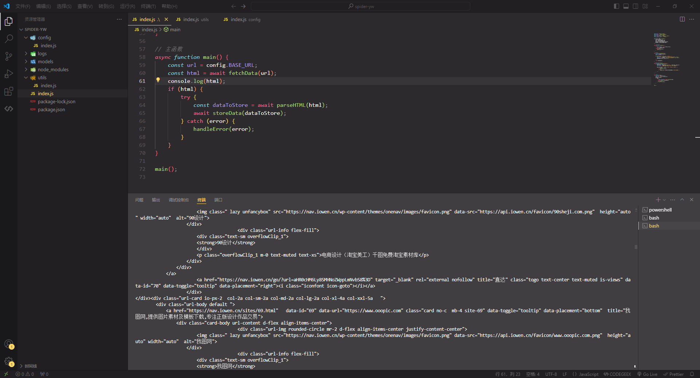
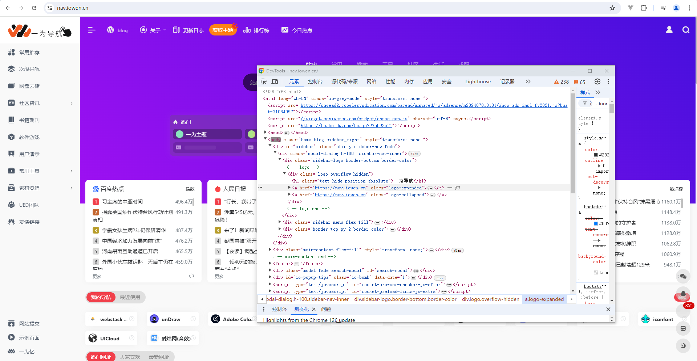
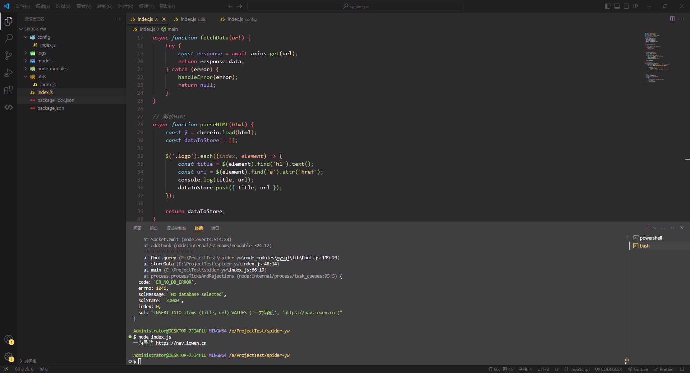
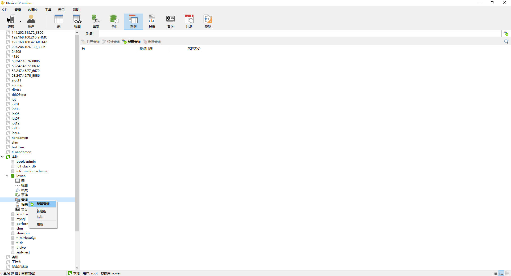
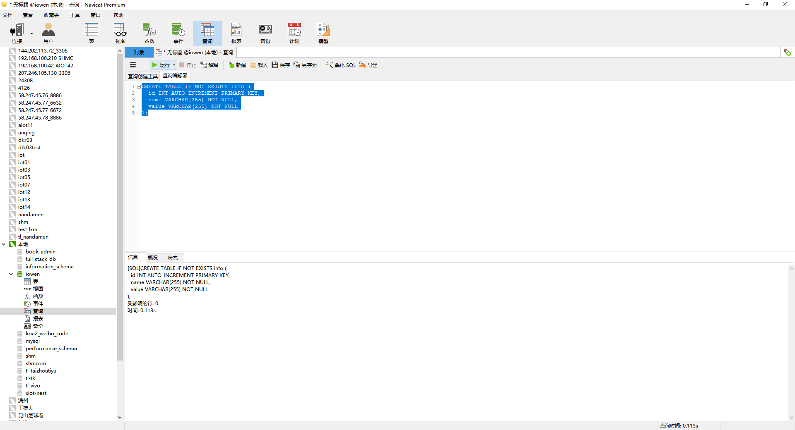
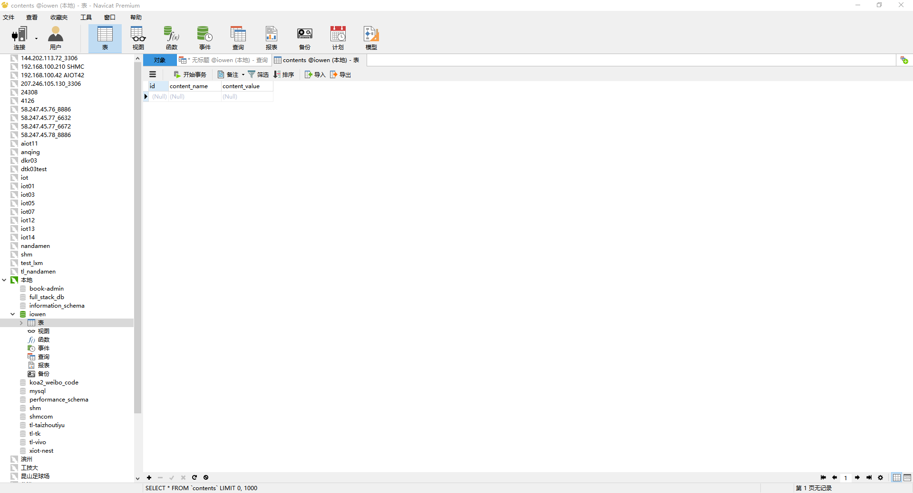
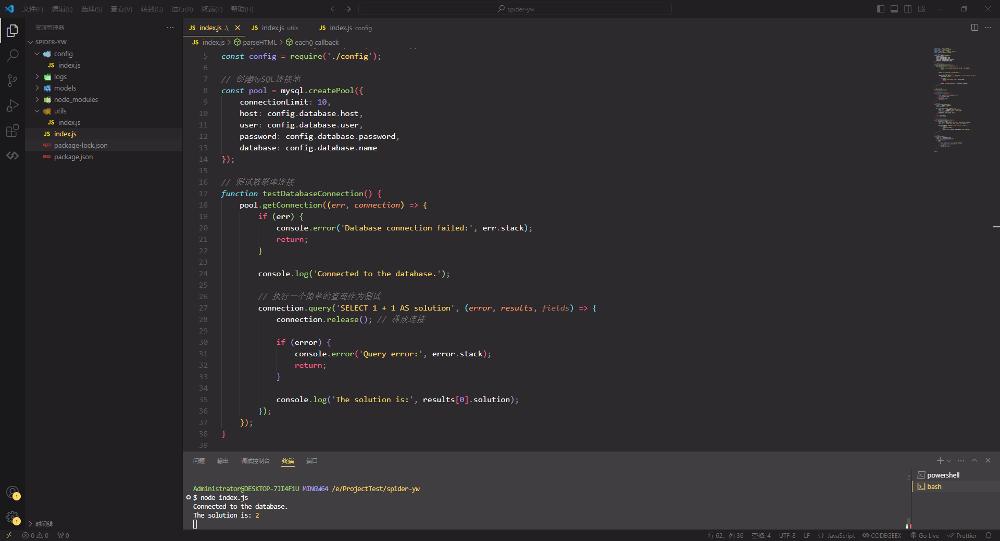

# 内容爬取

## 项目结构

```bash
# 初始化目录
npm init -y

# 安装依赖
npm i cheerio axios myslq
```

（一）index.js

```js

```

（二）config

```js
// ./config/index.js
module.exports = {
  BASE_URL: "https://nav.iowen.cn/", // 目标网站URL
  database: {
    host: "localhost", // MySQL主机
    user: "root", // MySQL用户名
    password: "123456", // MySQL密码
    database: "iowen", // MySQL数据库名称
  },
};
```

（三）utils

```js
// ./utils/index.js
function handleError(error) {
  console.error("Error occurred:", error);
  // 可以添加其他错误处理逻辑
}

module.exports = {
  handleError,
  // 可以添加其他实用函数
};
```

## 代码流程测试

::: info 主要内容

- 获取网页内容
- 解析 html
- 数据存储

:::

### 获取网页内容



### 解析 html





### 数据存储

（1）创建数据库表
在 MySQL 中，你需要创建一个适合存储爬取数据的表。

```sql
CREATE TABLE IF NOT EXISTS items (
  id INT AUTO_INCREMENT PRIMARY KEY,
  title VARCHAR(255) NOT NULL,
  url VARCHAR(255) NOT NULL
);
```







（2）数据库连接测试

```js
// 测试数据库连接
function testDatabaseConnection() {
  pool.getConnection((err, connection) => {
    if (err) {
      console.error("Database connection failed:", err.stack);
      return;
    }

    console.log("Connected to the database.");

    // 执行一个简单的查询作为测试
    connection.query("SELECT 1 + 1 AS solution", (error, results, fields) => {
      connection.release(); // 释放连接

      if (error) {
        console.error("Query error:", error.stack);
        return;
      }

      console.log("The solution is:", results[0].solution);
    });
  });
}
```


