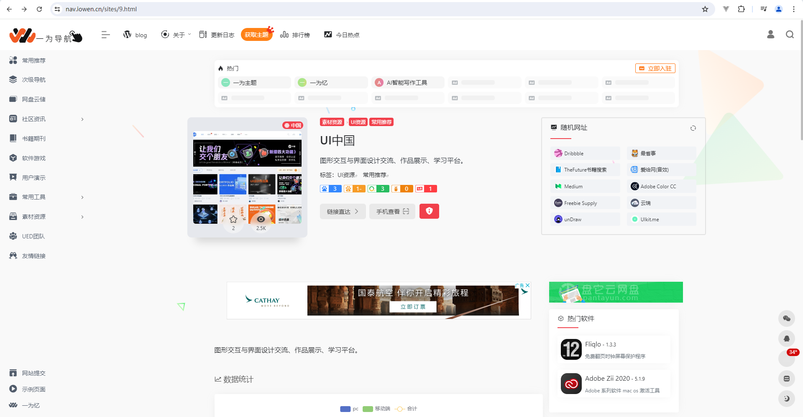
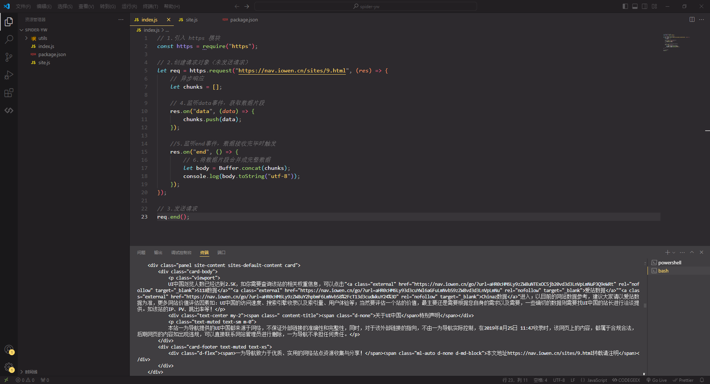

# 项目规划

## 需求分析

- 1. 爬取数据
- 2. 数据存储

## 爬取内容

- 分类
- 书签
- 网址

## 方案设计

### 爬取流程

根据目标网站的结构和内容类型，设计爬取流程：

- 网页请求：使用 HTTP 请求库（如 Axios）获取网页内容。
- 内容解析：使用 Cheerio 等工具解析 HTML 内容，提取所需的信息（分类、书签、博客链接等）。
- 数据存储：将解析得到的数据存储到数据库中。可以选择使用 MongoDB、MySQL 等数据库存储数据。

### 目录结构

- config 配置文件
- models 数据库
- utils 工具函数
- logs 日志文件

## 技术栈

- 1. Node
- 2. Cheerio
- 3. Axios
- 4. Mysql

### 爬虫测试





```js
// 1.引入 https 模块
const https = require("https");

// 2.创建请求对象（未发送请求）
let req = https.request("https://nav.iowen.cn/sites/9.html", (res) => {
  // 异步响应
  let chunks = [];

  // 4.监听data事件，获取数据片段
  res.on("data", (data) => {
    chunks.push(data);
  });

  //5.监听end事件，数据接收完毕时触发
  res.on("end", () => {
    // 6.将数据片段合并成完整数据
    let body = Buffer.concat(chunks);
    console.log(body.toString("utf-8"));
  });
});

// 3.发送请求
req.end();
```
