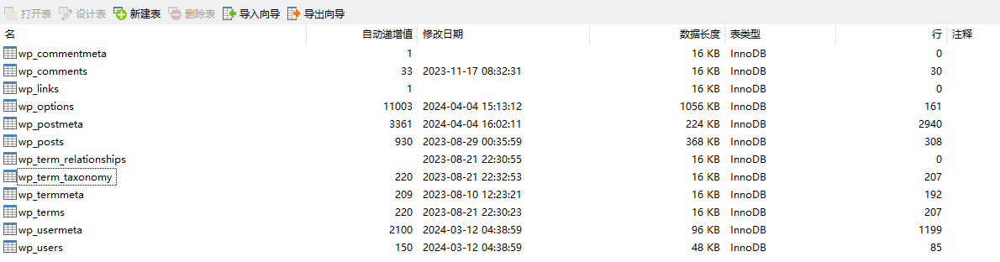

# 混沌领域

初始化后端开发环境

设计和开发物联网数据接收和处理系统

设计和实现数据存储和管理系统（如数据库）

实现物联网设备和后端服务器之间的通信协议（如 MQTT）

### 数据表

### wordpress



#### 文章评论

wp_commentmeta

wp_comments

#### 链接信息

wp_links

#### 文章信息

wp_options

wp_postmeta

wp_posts

#### 分类信息

wp_terms

wp_term_relationships

wp_term_taxonomy

wp_termmeta

#### 用户信息

wp_usermeta：用户自定义字段表

```sh
umeta_id：用户自定义字段ID
user_id：用户ID
meta_key：用户自定义字段名称
meta_value：用户自定义字段值
```

常用键值对

```sh
nickname：用户昵称
first_name：用户名
last_name：用户姓
description：用户描述
rich_editing：是否启用富文本编辑器
comment_shortcuts：是否启用评论快捷键
admin_color：后台管理界面颜色
use_ssl：是否启用SSL
show_admin_bar_front：是否在前台显示管理栏
locale：用户语言设置
wp_user_level：用户等级
dismissed_wp_pointers：已关闭的提示信息
show_welcome_panel：是否显示欢迎面板
session_tokens：会话令牌
session_expiration：会话过期时间
session_expiration_dategmt：会话过期时间（GMT）
wp_capabilities：用户权限
wp_user_settings：用户设置
wp_user-settings-time：用户设置时间
wp_dashboard_quick_press_last_post_id：上次发布文章ID
```

wp_users：用户基本信息表

```sh
ID：用户ID
user_login：用户登录名
user_pass：用户密码
user_nicename：用户昵称
user_email：用户邮箱
user_url：用户个人网站
user_registered：用户注册时间
user_activation_key：用户激活码
// 用户邀请码
user_status：用户状态
display_name：用户显示名称
// spam：是否为垃圾评论
```
