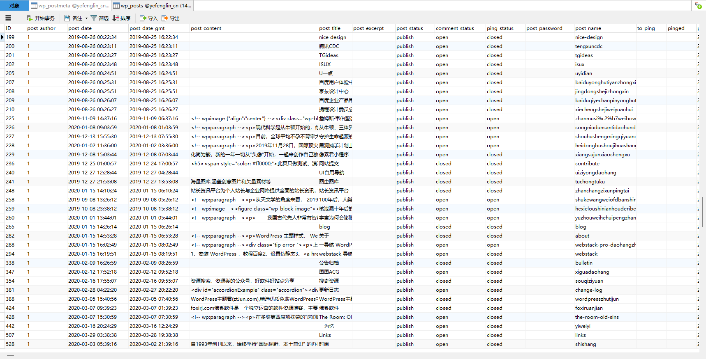
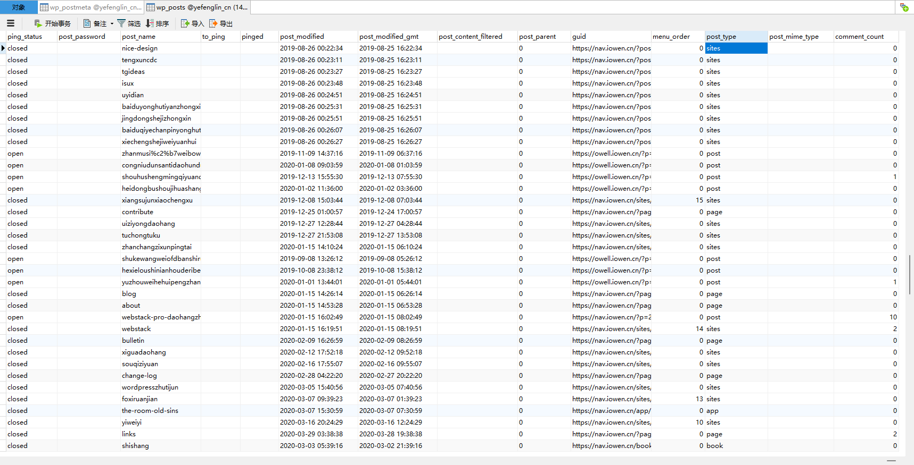

# 数据库结构设计

## 核心结构

### 用户

#### zt_user

```sh
ID：用户ID
user_login：用户登录名
user_pass：用户密码
user_nicename：用户昵称
user_email：用户邮箱
user_url：用户个人网站
user_registered：用户注册时间
user_activation_key：用户激活码
// 用户邀请码
user_status：用户状态
display_name：用户显示名称
// spam：是否为垃圾评论
```

#### zt_usermeta

####

### 内容

#### 主要类型

- 博客
- 文章
- 文库
- 期刊
- 问答
- 方案
- 网址
- 人物
- 特殊：收藏夹


#### zt_content

| 列名        |      功能      |  
| ------------- | :----------- |
| ID | 内容的唯一标识符（主键）。|
| content_author | 内容的作者ID（与 wp_users 表的 ID 列关联）。|
| content_date | 内容的发布日期和时间。|
| content_date_gmt | 内容在格林威治标准时间的发布日期和时间（用于时区转换）。|
| content_body | 内容的主体（通常是文本或HTML）。|
| content_title | 内容的标题。|
| content_excerpt | 内容的摘要或简短描述（如果不设置，则可能是自动生成的）。|
| content_status | 内容的状态（例如 "publish"、"pending"、"draft" 等）。|
| comment_status | 内容的评论状态（例如 "open" 或 "closed"）。|
| ping_status | 内容的pingback/trackback状态（是否允许其他博客链接到此内容）。|
| content_password | 内容的密码（如果设置了密码保护）。|
| content_name | 内容的slug（URL中用于识别内容的部分）。|
| to_ping | 一个包含需要被ping的URL的空格分隔列表（通常较少使用）。|
| pinged | 一个包含已经被ping的URL的空格分隔列表（通常较少使用）。|
| content_modified | 内容最后一次被修改的日期和时间。|
| content_modified_gmt | 内容在格林威治标准时间最后一次被修改的日期和时间。|
| content_content_filtered | 过滤后的内容内容（通常用于插件或主题，以在显示之前对内容进行处理）。|
| content_parent | 如果内容是另一个内容的子级（例如页面层次结构中的子页面），则此列包含父内容的ID。|
| guid | 内容的全局唯一标识符（GUID），通常用于RSS提要和其他外部服务。|
| menu_order | 页面的顺序（在具有层次结构的页面中，用于定义页面在导航菜单中的顺序）。|
| content_type | 内容的类型（例如 "post"、"page"、"attachment" 等）。|
| content_mime_type | 对于附件，此列包含MIME类型（例如 "image/jpeg"）。|
| comment_count | 内容的评论数（缓存值，可能不准确）|


#### zt_contentmeta

### 评论

### 分类

### 标签

## 项目参考

### wordpress


#### 文章评论

wp_commentmeta

wp_comments

#### 链接信息

wp_links

功能：用于存储友情链接（Blogroll）信息，这是旧版本 WordPress 或某些链接管理插件使用的功能。

#### 帖子信息

wp_options

功能：用于存储 WordPress 系统的各种设置和选项，如站点 URL、管理员电子邮件地址、时区设置等。此外，还用于存储插件和主题的配置信息。

wp_postmeta

wp_posts

功能：用于存储所有的文章、页面、自定义帖子类型的数据。这包括帖子的内容、标题、发布时间、作者、状态等。





```sh
ID - 帖子的唯一标识符（主键）。
post_author - 帖子的作者ID（与 wp_users 表的 ID 列关联）。
post_date - 帖子的发布日期和时间。
post_date_gmt - 帖子在格林威治标准时间的发布日期和时间（用于时区转换）。
post_content - 帖子的内容（通常是文本或HTML）。
post_title - 帖子的标题。
post_excerpt - 帖子的摘要或简短描述（如果不设置，则可能是自动生成的）。
post_status - 帖子的状态（例如 "publish"、"pending"、"draft" 等）。
comment_status - 帖子的评论状态（例如 "open" 或 "closed"）。
ping_status - 帖子的pingback/trackback状态（是否允许其他博客链接到此帖子）。
post_password - 帖子的密码（如果设置了密码保护）。
post_name - 帖子的slug（URL中用于识别帖子的部分）。
to_ping - 一个包含需要被ping的URL的空格分隔列表（通常较少使用）。
pinged - 一个包含已经被ping的URL的空格分隔列表（通常较少使用）。
post_modified - 帖子最后一次被修改的日期和时间。
post_modified_gmt - 帖子在格林威治标准时间最后一次被修改的日期和时间。
post_content_filtered - 过滤后的帖子内容（通常用于插件或主题，以在显示之前对内容进行处理）。
post_parent - 如果帖子是另一个帖子的子级（例如页面层次结构中的子页面），则此列包含父帖子的ID。
guid - 帖子的全局唯一标识符（GUID），通常用于RSS提要和其他外部服务。
menu_order - 页面的顺序（在具有层次结构的页面中，用于定义页面在导航菜单中的顺序）。
post_type - 帖子的类型（例如 "post"、"page"、"attachment" 等）。
post_mime_type - 对于附件，此列包含MIME类型（例如 "image/jpeg"）。
comment_count - 帖子的评论数（缓存值，可能不准确）
```

#### 分类信息

wp_terms

功能：用于存储分类目录、标签、自定义分类法的术语。这些术语用于组织和管理网站的内容。

wp_term_relationships

功能：用于存储每个文章、页面或其他内容与特定分类或标签之间的关系。这有助于确定哪些内容属于哪个分类或标签。

wp_term_taxonomy

功能：用于存储每个分类或标签的分类法（taxonomy）信息。分类法是一种将术语（如标签和分类）组织成层次结构或平面的方式。

wp_termmeta

#### 用户信息

wp_usermeta：用户自定义字段表

```sh
umeta_id：用户自定义字段ID
user_id：用户ID
meta_key：用户自定义字段名称
meta_value：用户自定义字段值
```

常用键值对

```sh
nickname：用户昵称
first_name：用户名
last_name：用户姓
description：用户描述
rich_editing：是否启用富文本编辑器
comment_shortcuts：是否启用评论快捷键
admin_color：后台管理界面颜色
use_ssl：是否启用SSL
show_admin_bar_front：是否在前台显示管理栏
locale：用户语言设置
wp_user_level：用户等级
dismissed_wp_pointers：已关闭的提示信息
show_welcome_panel：是否显示欢迎面板
session_tokens：会话令牌
session_expiration：会话过期时间
session_expiration_dategmt：会话过期时间（GMT）
wp_capabilities：用户权限
wp_user_settings：用户设置
wp_user-settings-time：用户设置时间
wp_dashboard_quick_press_last_post_id：上次发布文章ID
```

wp_users：用户基本信息表

功能：用于存储用户的基本信息，包括用户名、密码（通常经过哈希处理）、电子邮件、用户角色等。

字段示例：ID、user_login、user_pass、user_email、user_role 等。

```sh
ID：用户ID
user_login：用户登录名
user_pass：用户密码
user_nicename：用户昵称
user_email：用户邮箱
user_url：用户个人网站
user_registered：用户注册时间
user_activation_key：用户激活码
// 用户邀请码
user_status：用户状态
display_name：用户显示名称
// spam：是否为垃圾评论
```
